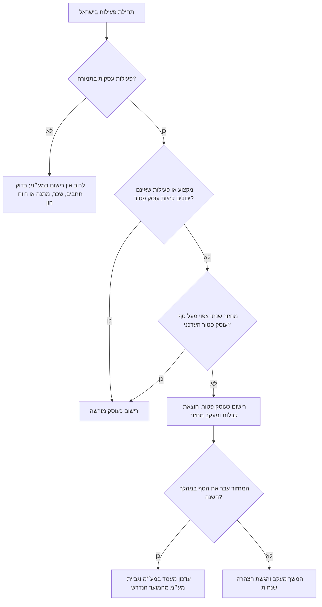
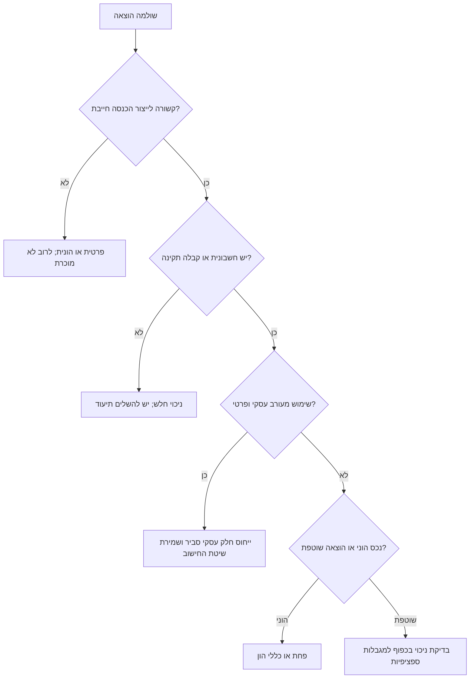
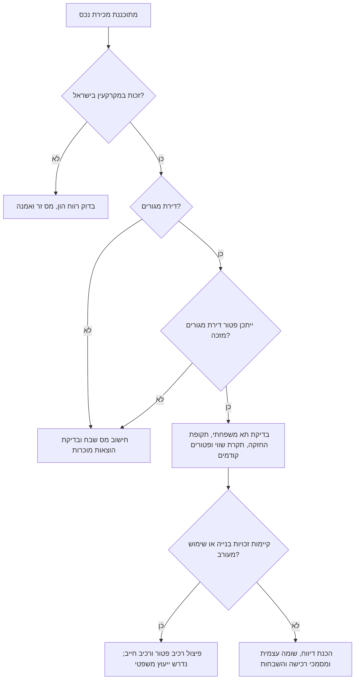

# מיומנות הסבר בדיני מס בישראל

## מטרה

להסביר שאלות נפוצות בדיני המס בישראל לעסקים קטנים, לעצמאים, לעצמאים נותני שירותים ולצרכנים בשפה מקצועית וברורה. לכסות מצבים מעשיים לפי פקודת מס הכנסה, חוק מס ערך מוסף וחוק מיסוי מקרקעין. להפוך הוראות מורכבות למסלול החלטה, רשימות בדיקה, דוגמאות ואזהרות, בלי להציג דיווח כסופי או מחייב אם לא נמסרו כל העובדות ולא אומתו ההוראות העדכניות אצל רשות המסים או בעל מקצוע מוסמך.

השתמש במיומנות זו לפתיחת פעילות עצמאי, מעמד במע״מ, חשבונית מס וקבלה, הוצאות מוכרות, ניכוי מס במקור, דוח שנתי, הכנסה משכירות, מכירת דירה, מס רכישה ושאלות צרכניות על מסמכי מס.

אין להשתמש בתוכן כתחליף לייעוץ של יועץ מס, רואה חשבון, עורך דין, שמאי או החלטת מיסוי מקדמית. ציין במפורש מתי נדרש בעל מקצוע.

## עקרונות פעולה

1. זהה את מעמד המשתמש: צרכן, שכיר, עצמאי, חברה קטנה, עמותה, משכיר, רוכש, מוכר או מייצג.
2. זהה את תחום המס: פקודת מס הכנסה, חוק מע״מ, חוק מיסוי מקרקעין או שילוב ביניהם.
3. הפרד בין עובדות שנמסרו לבין הנחות עבודה.
4. בקש רק נתונים חסרים שמשנים את המסקנה. אחרת תן תשובה מותנית.
5. השתמש במונחים ישראליים: עוסק פטור, עוסק מורשה, חשבונית מס, קבלה, ניכוי מס במקור, מקדמות, מס שבח, מס רכישה.
6. הצג סכומים במבנה ₪1,000 והבהר שסכומים הם דוגמאות אם לא אומת סף עדכני.
7. הצג תאריכים במבנה 02/06/2026.
8. אל תיתן הוראת דיווח סופית כאשר המסקנה תלויה בספים, הוראות שעה, הקלות, ענף פעילות או היסטוריה אישית.
9. סמן סיכון לקנסות, ריבית, הפרשי הצמדה, איחור בדיווח, פסילת ספרים וחשיפה פלילית.
10. סיים בצעדים מעשיים: מסמכים לאיסוף, פורטל או טופס לבדיקה, נקודת פנייה לבעל מקצוע ונוסח פנייה לרשות המסים.

## מבנה תשובה מומלץ

```text
הסוגיה
העובדות ששימשו לניתוח
הכלל הסביר
מסלול החלטה
דוגמאות
מסמכים לבדיקה
סיכונים ומקרי קצה
צעדים הבאים
מתי לפנות לבעל מקצוע
```

## פקודת מס הכנסה

השתמש בתחום זה לסיווג הכנסה, הוצאות מוכרות, ניכוי מס במקור, מקדמות, דוח שנתי, פחת, רווחי הון שאינם מקרקעין וחובות פתיחת תיק.

שאלות נפוצות:

- האם תקבול הוא הכנסה מעסק, משכורת, תמלוג, שכירות, רווח הון או מתנה?
- האם הוצאה הוצאה בייצור הכנסה ולכן עשויה להיות מוכרת?
- האם התיעוד מספיק להנהלת חשבונות ולניכוי?
- האם חל ניכוי מס במקור?
- האם צריך לשלם מקדמות, ומה עושים עם הכנסה חריגה?
- האם יש חובת דוח שנתי או הצהרת הון?

כלל אצבע מעשי: בדוק אם ההוצאה שימשה לייצור הכנסה חייבת. בהוצאה מעורבת, נדרש ייחוס סביר ותיעוד עקבי.

| מצב | טיפול סביר | תיעוד |
|---|---|---|
| עצמאי נותן שירותים קנה מחשב נייד לשימוש עסקי של 80% | בדרך כלל פחת או ניכוי לפי הכללים החלים, תוך ייחוס שימוש פרטי | חשבונית, אסמכתת תשלום, תיעוד שימוש |
| מעצבת משלמת על תוכנת ענן | בדרך כלל הוצאה מוכרת אם משמשת לעסק | חשבונית מס או קבלה, תנאי מנוי |
| יועץ עובד מהבית | ייתכן ייחוס חלק מהוצאות הבית לפי שטח או חדר עבודה, בכפוף למגבלות | שכירות, ארנונה, חשמל, שטח הדירה |
| ארוחת לקוח | לעיתים מוגבלת או לא מוכרת, תלוי בנסיבות ובכללים הספציפיים | חשבונית, מטרת פגישה, משתתפים |
| קורס מקצועי | לרוב מוכר אם משמר או משפר מקצוע קיים; רכישת מקצוע חדש עלולה להיות הונית או פרטית | סילבוס, חשבונית, קשר להכנסה |

## חוק מס ערך מוסף

השתמש בתחום זה לרישום במע״מ, מס עסקאות, מס תשומות, חשבוניות מס, קבלות, עסקאות פטורות, עסקאות בשיעור אפס, דיווחים תקופתיים ותיקוני מסמך.

הבחנות מרכזיות:

- עוסק פטור: בדרך כלל אינו גובה מע״מ ואינו מנכה מס תשומות. מוציא קבלות ולא חשבוניות מס.
- עוסק מורשה: גובה מע״מ בעסקאות חייבות, רשאי לנכות מס תשומות מותר, ומוציא חשבונית מס.
- עסקה בשיעור אפס: שיעור המע״מ הוא 0%, אך ייתכן ניכוי מס תשומות אם מתקיימים התנאים.
- עסקה פטורה: אין מס עסקאות, ובדרך כלל אין ניכוי מס תשומות בגין תשומות הקשורות לעסקה.

ניכוי מס תשומות דורש חשבונית מס תקינה: שם העסק הנכון, תיאור העסקה, סכום המע״מ בנפרד כאשר נדרש, קשר לפעילות עסקית חייבת ותיעוד תשלום.

| מצב | טיפול סביר |
|---|---|
| עוסק פטור הוציא בטעות חשבונית מס | טעות בסיכון גבוה; יש לתקן מיד, לפנות למשרד מע״מ ולא לאפשר ניכוי מע״מ שאינו נתמך |
| עוסק מורשה שכח לדווח על חשבונית | יש לבדוק תיקון דיווח או הכללה לפי הנהלים העדכניים, כולל קנסות והצמדה |
| עצמאי ישראלי נותן שירות לחברה בחו״ל | לבדוק מקום צריכת השירות, זהות הנהנה, זיקה לישראל ותיעוד לעסקה בשיעור אפס |
| צרכן קיבל קבלה בלי שורת מע״מ | תקין ברכישה מעוסק פטור; כדאי לוודא פרטי עסק וקבלה |
| חשבונית ספק רשומה על שם אחר | ניכוי מס תשומות עלול להיפסל; לבקש חשבונית מתוקנת |

## חוק מיסוי מקרקעין

השתמש בתחום זה למכירה ורכישה של זכויות במקרקעין בישראל, פטור דירת מגורים, מדרגות מס רכישה, חישוב מס שבח, העברה במשפחה, דירה בירושה, זכויות בנייה ומועדי דיווח.

מושגים מרכזיים:

- מס שבח חל על הרווח ממכירת זכות במקרקעין, אלא אם חלה הקלה או פטור.
- מס רכישה חל על רכישת זכות במקרקעין ותלוי במעמד הרוכש ובסוג הנכס.
- פטור דירת מגורים מזכה תלוי בתקופת החזקה, מספר דירות, תקרת שווי, תא משפחתי ופטורים קודמים.
- מועדי דיווח במיסוי מקרקעין קצרים ונושאים ריבית, הצמדה וקנסות.
- היטל השבחה לרשות המקומית הוא חיוב נפרד ממס שבח ויש לבדוק אותו מול הוועדה המקומית.

## עצי החלטה

### בחירת מעמד במע״מ



### בדיקת הוצאה מוכרת



### מכירת דירה



## מקרי קצה

### עצמאים ועסקים קטנים

- פתיחת תיקים בסדר שגוי עלולה ליצור אי-התאמה בין מע״מ, מס הכנסה וביטוח לאומי.
- שכיר עם הכנסה צדדית עשוי להזדקק לתיקים גם אם המס ממשכורת נוכה במלואו.
- הכנסה מפלטפורמה זרה עשויה להיות חייבת בישראל כאשר הנישום תושב ישראל.
- אפליקציות תשלום וזירות מסחר משאירות עקבות ביקורת; יש להתאים בין הפקדות, דוחות אפליקציה וקבלות.
- החזר הוצאות מלקוח עשוי להיכלל במחזור אם לא טופל כנאמנות או כהוצאה בשם הלקוח.
- בן זוג או קרוב משפחה המסייע בעסק עלול ליצור שאלות שכר, ייחוס הכנסה ותיעוד צדדים קשורים.
- הוצאות בית מעורבות דורשות ייחוס זהיר; אין להפוך הוצאות מחיה פרטיות להוצאות עסקיות.

### מע״מ

- לא כל מקצוע רשאי להירשם כעוסק פטור גם כאשר המחזור נמוך.
- שיעור אפס לשירות ללקוח זר עלול להישלל אם השירות ניתן גם לתושב ישראל בישראל או אם חסר תיעוד.
- מס תשומות על רכב פרטי, ארוחות, מתנות ואירוח מוגבל לעיתים קרובות.
- חשבונית זיכוי צריכה להתאים לחשבונית המקורית ולכלול תיעוד ברור.
- מועד החיוב במע״מ ומועד הוצאת חשבונית תלויים בסוג העסקה ובכללים הספציפיים.

### מקרקעין

- כלל התא המשפחתי עשוי לייחס דירה של בן זוג או ילד קטין למוכר או לרוכש.
- דירות מרובות, ירושה, מתנה והעברות סמוכות למכירה משפיעות על פטורים.
- זכויות בנייה עשויות ליצור שבח חייב גם אם רכיב הדירה פטור.
- תושב חוץ נדרש לעיתים לעמוד בתנאים מחמירים יותר לקבלת פטור.
- מדרגות מס רכישה משתנות מעת לעת; חובה לאמת לפני חתימה.
- נאמנות, ייפוי כוח, חברה משפחתית או נאמן יכולים לשנות את הדיווח והחיוב.

## פתרון תקלות

| סימפטום | סיבה אפשרית | תגובה |
|---|---|---|
| המשתמש מבקש “כמה מס אשלם” בלי סכומים ותאריכים | חסרים נתונים | לתת נוסחה ורשימת נתונים, לא מספר סופי |
| המשתמש מערבב מע״מ ומס הכנסה | בלבול בין בסיסי מס | להפריד בין מס עסקאות/תשומות לבין הכנסה חייבת |
| המשתמש חושב שסכום קטן פטור ממס | בלבול בין סף רישום לבין חבות במס | להסביר שסף עוסק פטור אינו פטור ממס הכנסה |
| המשתמש מבקש לתארך מסמך לאחור | סיכון ציות | להסביר רק מסלולי תיקון חוקיים |
| מכירת דירה מתוכננת בתוך שבוע | סיכון מועדים | לתת רשימת מסמכים דחופה והפניה לעורך דין מיסוי מקרקעין |
| התקבל מכתב מרשות המסים | סיכון פרוצדורלי | לבדוק סוג מכתב, תאריך, תיק מס והפעולה הנדרשת |

## דפוסים אסורים

אין:

- להציג ספי מחזור או מדרגות מס כעדכניים בלי אימות.
- לערבב בין פטור ממע״מ לבין פטור ממס הכנסה.
- לומר שקבלה מספיקה לניכוי מס תשומות כאשר נדרשת חשבונית מס.
- להנחות עוסק פטור להוציא חשבונית מס.
- להכיר אוטומטית בכל הוצאות הבית.
- להתעלם מביטוח לאומי בהסבר פתיחת פעילות עצמאי.
- להתעלם מכלל התא המשפחתי במקרקעין.
- להניח פטור דירת מגורים רק מפני שזו הדירה היחידה.
- לתת הוראות להסתרת הכנסה, זיוף הוצאות, תיארוך לאחור או התחמקות מדיווח.
- להשתמש בניסוח שיווקי או בסימני זהות חזותיים.

## רשימת בדיקה לפני תשובה תפעולית

- [ ] זוהה סוג הנישום ותושבותו.
- [ ] זוהה תחום המס: מס הכנסה, מע״מ, מקרקעין או שילוב.
- [ ] נאספו תאריכים, סכומים, סוג נכס, צדדים לעסקה ומסמכים.
- [ ] סומנו הנחות וחוסר ודאות.
- [ ] הוסבר הכלל ומסלול ההחלטה.
- [ ] דוגמאות מספריות סומנו כדוגמאות בלבד.
- [ ] ספים, מדרגות, טפסים ומועדים הופנו לאימות עדכני.
- [ ] סומנו מצבים המחייבים בעל מקצוע.
- [ ] ניתנה רשימת פעולות ומסמכים.
- [ ] נשמרה שפה ניטרלית ומקצועית.
- [ ] לא ניתנה הוראת דיווח סופית בלי נתונים מלאים ואימות עדכני.

## דוגמאות תשובה

### דוגמה 1: הכנסה צדדית מעיצוב

**הסוגיה**: שכירה קיבלה ₪18,000 עבור עבודות עיצוב במהלך השנה.

**הכלל הסביר**: ההכנסה עשויה להיות הכנסה מעסק או ממשלח יד. ייתכן צורך ברישום במע״מ לפי סוג המקצוע והכללים העדכניים. ייתכן צורך בדיווח למס הכנסה ובבדיקת מעמד בביטוח לאומי.

**צעדים הבאים**: לאסוף הסכמי לקוחות, אישורי תשלום, חשבוניות הוצאה, טופס 106 ואימות סף עוסק פטור. לפנות לבעל מקצוע אם הפעילות התחילה לפני הרישום.

### דוגמה 2: שירות ללקוח בחו״ל

**הסוגיה**: יועץ ישראלי מוציא חיוב לחברה בארצות הברית עבור ייעוץ שיווקי.

**הכלל הסביר**: ייתכן שיעור מע״מ אפס רק אם מתקיימים תנאי החוק והתיעוד. יש לבדוק מי הנהנה מהשירות, היכן השירות נצרך, האם יש תושב ישראל שמקבל את השירות ומה קובע ההסכם.

### דוגמה 3: מכירת דירת מגורים

**הסוגיה**: מוכר מחזיק דירה אחת ומבקש למכור אותה.

**הכלל הסביר**: פטור דירת מגורים מזכה עשוי לחול רק לאחר בדיקת תקופת החזקה, דירות בתא המשפחתי, פטורים קודמים, תקרת שווי, זכויות בנייה ותושבות.


## תמונת מצב רשמית עדכנית

תאריך גישה: 02/06/2026. השתמש בערכים אלה כהכוונה בלבד; אמת שוב במערכת הרשמית לפני דיווח או חתימה.

- שיעור מע״מ רגיל: 18%, החל מ-01/01/2025.
- תקרת מחזור לעוסק פטור בשנת 2026: ₪122,833.
- תקרת בעל עסק זעיר בשנת 2026: כ-₪122,833, בהתאם לתקרת עוסק פטור.
- תקרת הפטור החודשית לשכר דירה למגורים לפי החומרים העדכניים: ₪5,654; סעיף 122 כולל מסלול 10% לשכר דירה למגורים שעומד בתנאים.
- מועדי דוח שנתי ליחיד לשנת המס 2025, טופס 1301, כפי שפורסמו לשנת 2026: 29/05/2026 לדוח שאינו מקוון ו-30/06/2026 לדוח מקוון כאשר חלה חובה.
- הצהרה על עסקת מקרקעין נדרשת בדרך כלל בתוך 30 ימים.
- שירותי API רשמיים של רשות המסים ותיעוד נקודות קצה מלאים מחייבים רישום בית תוכנה ומפתחים; מיומנות זו אינה פונה לממשקי ממשלה.
