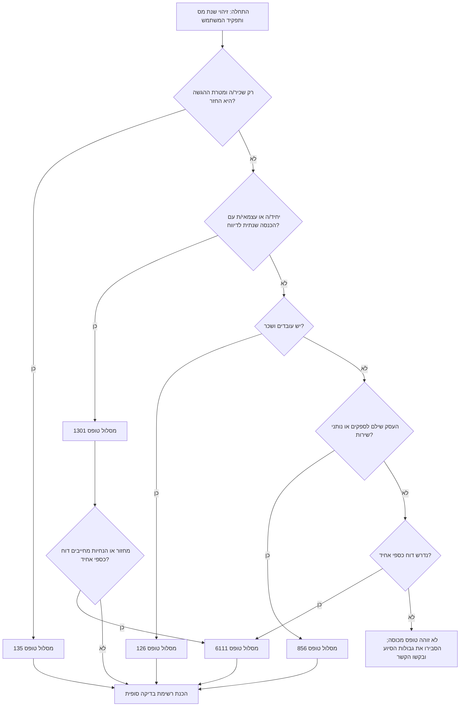

# מסייע להכנת דוחות מס בישראל

## מטרה

להנחות משתמשים בישראל בהכנת נתונים ודוחות עבור:

- **טופס 1301** — דוח שנתי ליחיד, עצמאים ופרילנסרים.
- **טופס 135** — דוח שנתי מקוצר, נפוץ אצל שכירים שמבקשים החזר מס.
- **טופס 126** — דוח שנתי של מעסיק על שכר וניכויים.
- **טופס 856** — דוח שנתי על תשלומים לספקים ולנותני שירותים שאינם עובדים.
- **טופס 6111** — דוח כספי אחיד, כאשר חלה חובת צירוף לדוח השנתי.

השתמשו בתהליך מעשי: זיהוי הטופס, איסוף אסמכתאות, מיפוי סכומים לשדות, בדיקת טעויות נפוצות, תזכורות למועדי הגשה והכנת רשימת בדיקה. אין להגיש במקום המשתמש, להבטיח החזר, או להחליף רואה חשבון, יועץ מס או עורך דין.

## כללי עבודה

1. **ציינו קודם את שנת המס.** מועדים, תקרות, טפסים והנחיות משתנים לפי שנה.
2. **הפרידו בין הכנה לבין הגשה.** הכינו נתונים ורשימות בדיקה; ההגשה הסופית תיעשה במערכות הרשמיות של רשות המסים או באמצעות מייצג מורשה.
3. **כתבו סכומים ותאריכים בפורמט ישראלי.** לדוגמה: `₪12,345` ו-`31/05/2026`.
4. **סמנו אי-ודאות.** כאשר תקרה, מועד או כלל תלויים בשנת ההגשה, ציינו שחובה לאמת מול ההנחיות הרשמיות לפני הגשה.
5. **שמרו על פרטיות.** אין לבקש מספרי זהות מלאים, פרטי בנק, מסמכים רפואיים או קבצי שכר מלאים אם מספיקים סכומים מסכמים או קבצים מושחרים.
6. **השתמשו בלשון פעולה.** למשל: “אספו טופס 106”, “השוו ניכוי מס במקור”, “בדקו אישורי ספקים”.

## תבנית פתיחה

כאשר משתמש מבקש עזרה בהגשת דוח, אספו רק את הנתונים המינימליים לבחירת מסלול:

```text
מסרו:
1. שנת מס, למשל 2025.
2. מצב: שכיר/ה, עצמאי/ת, מעסיק, עסק שמשלם לספקים, או עסק שחייב בדוח כספי.
3. מטרה: דוח שנתי, בקשת החזר, דוח מעסיק, דוח ספקים או הכנת טופס 6111.
4. מסמכים קיימים: טופס 106, מאזן בוחן, קבלות, אישורי ניכוי מס במקור של ספקים, קובץ שכר או יצוא מתוכנת הנהלת חשבונות.
5. האם ההגשה עצמית או באמצעות מייצג.
```

אם הנתונים כבר נמסרו, המשיכו מיד לתהליך המתאים.

## עץ החלטה



## בחירת טופס

| מצב | טופס עיקרי | טריגר מרכזי | משתמש טיפוסי | אין להשתמש כאשר |
|---|---:|---|---|---|
| דוח שנתי ליחיד | 1301 | הכנסה מעסק, שכירות, רווח הון, הכנסה מחו"ל, חובת דיווח או דוח שנתי מלא | עצמאי, פרילנסר, משכיר, משקיע | רק שכיר המבקש החזר ואין חובת דוח מלא |
| בקשת החזר לשכיר | 135 | שכיר מבקש החזר ואינו חייב בדוח מלא | עובד שהחליף עבודות, לא קיבל נקודות זיכוי או תרם למוסד מוכר | הכנסה מעסק, הכנסה מחו"ל, רווחי הון מורכבים או חובת דוח מלא |
| דוח מעסיק שנתי | 126 | שולמו משכורות ונוכה מס/ביטוח לאומי | עסק קטן עם עובדים | תשלומים לספקים בלבד |
| דוח תשלומים לספקים | 856 | העסק שילם למקבלי תשלום שאינם עובדים וחלים כללי ניכוי במקור | עסק שמשלם לפרילנסרים, משכירים, מרצים או קבלני משנה | שכר לעובדים |
| דוח כספי אחיד | 6111 | חובת דיווח כספי לפי הנחיות רשות המסים, לעיתים לפי מחזור, סוג ישות או סוג דוח | עצמאי או חברה עם הנהלת חשבונות | צרכן שמבקש החזר בלבד |

## מודל תזכורות למועדים

השתמשו בשנת ההגשה שאחרי שנת המס, אלא אם ההנחיות הרשמיות קובעות אחרת. מדובר במועדי תכנון ולא בייעוץ משפטי.

| טופס | כלל תכנון למועד | תזכורות | הערות |
|---|---|---|---|
| 1301 | לשנת המס 2025 השתמשו ב-29/05/2026 להגשה שאינה מקוונת וב-30/06/2026 להגשה מקוונת; בשנים אחרות השתמשו בפרסום הרשמי לאותה שנה | 60, 30, 14 ו-7 ימים לפני; התראה ביום המועד | אל תשתמשו בארכת מייצגים כללית בלי לוח ארכות רשמי ומאומת |
| 135 | תביעות החזר מוגבלות בזמן; חישוב מעשי נפוץ: 31-12 שש שנים לאחר שנת המס, אלא אם נקבע אחרת | 90, 60, 30 ו-7 ימים לפני מועד ההתיישנות | מתאים לבקשות החזר של שכירים |
| 126 | בסיס כללי: 30/04 אחרי שנת המס; לשנת המס 2025 השתמשו במועד המוארך 31/05/2026 ואמתו את תנאי האישור המקוון | 60, 30, 14 ו-7 ימים לפני | יש לאמת את מועד השידור ואת סטטוס מערכת האישורים לשנת הדיווח |
| 856 | בסיס כללי: 30/04 אחרי שנת המס; לשנת המס 2025 השתמשו במועד המוארך 31/05/2026 ואמתו את תנאי האישור המקוון | 60, 30, 14 ו-7 ימים לפני | יש לאמת מבנה קובץ, אישורי ניכוי במקור וסטטוס מערכת האישורים |
| 6111 | מוגש יחד עם הדוח השנתי הרלוונטי | כמו טופס 1301 או דוח חברה | יש לוודא חובת הגשה וקודי מיפוי |

### דוגמת תזכורת

לשנת המס 2025, קבעו את מועד התכנון לטופס 1301 מקוון ל-**30/06/2026**. קבעו תזכורות ל-**01/05/2026**, **31/05/2026**, **16/06/2026**, **23/06/2026** ול-**30/06/2026**. לנישום שמותר לו להגיש שלא באופן מקוון, קבעו **29/05/2026** אלא אם פורסמה הוראה רשמית מאוחרת יותר. לטפסים 126 ו-856 לשנת המס 2025, קבעו **31/05/2026** ואמתו אם חלים כללי תקופת חסד לאישור מקוון.

## עזרה לפי שדות

### טופס 1301 — דוח שנתי ליחיד

| קבוצת שדות | מה לאסוף | איך להשתמש | מקרים רגישים |
|---|---|---|---|
| פרטים אישיים | תעודת זהות, מצב משפחתי, פרטי בן/בת זוג, ילדים, כתובת, חשבון בנק להחזר | התאמת זהות ונקודות זיכוי | נישואין/גירושין במהלך השנה, פרידה, משמורת משותפת |
| הכנסת עבודה | טופס 106 מכל מעסיק | סיכום שכר חייב, שווי הטבות, מס שנוכה והפקדות | שני מעסיקים, דמי אבטלה, חל"ת, מילואים, הטבות מניות |
| הכנסה מעסק | דוח רווח והפסד, ספר תקבולים, יצוא מתוכנה, כרטסת הוצאות | דיווח הכנסות, הוצאות מוכרות ורווח נקי | הוצאות מעורבות, משרד ביתי, רכב, בסיס מזומן מול מצטבר |
| הכנסה משכירות | חוזי שכירות, הפקדות, סך שנתי, הוצאות | בחירת מסלול פטור/10%/שולי כאשר רלוונטי | שכירות חלקית, מספר דירות, קרוב משפחה, נכס בחו"ל |
| רווחי הון | טופס 867, דוחות ברוקר, פירוט מכירות | דיווח רווחים, הפסדים, מס זר וניכוי במקור | ברוקר זר, קיזוז הפסדים, קריפטו מחוץ למסגרת זו |
| הכנסות ונכסים מחו"ל | שכר, דיבידנדים, חשבונות בנק, מס זר | סיווג הכנסה ותמיכה בזיכוי מס זר | תושבות מס, אמנה, חובת גילוי |
| ניכויים וזיכויים | פנסיה, ביטוח חיים, תרומות מוכרות, נקודות זיכוי | הפחתת מס וחישוב זיכויים | קבלה לא על שם הנישום, חסר אישור סעיף 46, גיל ילד שגוי |
| מקדמות וניכוי במקור | מקדמות מס הכנסה, אישורי ניכוי, מס ששולם על שכירות/רווח הון | זיכוי מול חבות סופית | תשלום שויך לשנה שגויה, חלוקה שגויה בין בני זוג |

### טופס 135 — דוח מקוצר להחזר מס לשכירים

| קבוצת שדות | מה לאסוף | איך להשתמש | מקרים רגישים |
|---|---|---|---|
| פרטי עובד | תעודת זהות, כתובת, חשבון בנק | זיהוי מבקש ההחזר | חשבון סגור, כתובת לא מעודכנת |
| הכנסת עבודה | טופס 106 מכל מעסיק | חיבור שכר שנתי ומס שנוכה | חסר טופס 106, עבודות חופפות |
| סיבת החזר | תרומות, אבטלה, לידה/הורות, תואר, ילדים, פנסיה/ביטוח חיים | הסבר מדוע הניכוי בפועל גבוה מהמס הסופי | זיכוי שכבר ניתן בתלוש, תביעה כפולה עם בן/בת זוג |
| אסמכתאות | קבלות, אישורים, מסמכי ביטוח לאומי, אישורי תיאום מס | צירוף הוכחות | מוסד תרומות לא מוכר, אישור חסר |
| תקופת התיישנות | שנת מס ותאריך הגשה | בדיקת אפשרות ההחזר | שנה ישנה סמוכה למועד האחרון |

### טופס 126 — דוח מעסיק שנתי

| קבוצת שדות | מה לאסוף | איך להשתמש | מקרים רגישים |
|---|---|---|---|
| זיהוי מעסיק | תיק ניכויים, שם, כתובת | התאמת קובץ השכר למעסיק | כמה קבצי שכר, סניפים |
| זיהוי עובד | תעודת זהות, שם, חודשי עבודה | בניית רשומות עובדים | עובדים זרים, תיקון מספר זהות, עובד בכמה תפקידים |
| שכר והטבות | שכר ברוטו, שווי רכב/הטבות, רכיבים פטורים | התאמה לכרטסת שכר וטופסי 106 | שווי רכב, מתנות, תשלום רטרואקטיבי |
| ניכויים | מס הכנסה, ביטוח לאומי, מס בריאות, פנסיה, קרן השתלמות | התאמה לתשלומים ולדיווחים חודשיים | תיקון שלילי, עובד שעזב, חופשת לידה |
| התאמה לטופס 106 | אישורים שנתיים לעובדים | ודאו שהסכומים זהים | טופס 106 הופק לפני תיקון סופי |

### טופס 856 — דוח תשלומים לספקים

| קבוצת שדות | מה לאסוף | איך להשתמש | מקרים רגישים |
|---|---|---|---|
| זיהוי ספק | ח.פ./עוסק/ת"ז, שם, כתובת | פתיחת רשומת מקבל תשלום | שינוי ישות משפטית, ספק זר |
| סוג תשלום | שירותים, שכירות, תמלוגים, הרצאה, קבלן משנה, אחר | בחירת סיווג נכון | חשבונית מעורבת טובין ושירותים |
| סכומי תשלום | סך שנתי לפני ניכוי במקור | התאמה לכרטסות ולתשלומים | זיכויים, החזרים, סכום כולל מע"מ מול ללא מע"מ |
| שיעור ניכוי | אישור ניכוי במקור או שיעור ברירת מחדל | בדיקת סכום הניכוי | אישור שפג תוקף, פטור חלקי לפי תקופה |
| מס שנוכה | סכום שנוכה והועבר | התאמה לתשלומי ניכויים | נוכה ולא שולם, הפרשי עיגול |
| אסמכתאות | אישורי ספקים, כרטסות, קבצי תשלום | תמיכה בביקורת | חסר אישור לתשלום מהותי |

### טופס 6111 — דוח כספי אחיד

| קבוצת שדות | מה לאסוף | איך להשתמש | מקרים רגישים |
|---|---|---|---|
| תקופה וישות | שנת מס, מזהה ישות, בסיס דיווח | קביעת היקף הדוח | שנת פעילות קצרה, פתיחה/סגירה באמצע שנה |
| רווח והפסד | הכנסות, קניות, שכר, שכירות, פחת, מימון | מיפוי לקודי רשות המסים | הוצאות פרטיות, קנסות לא מוכרים, משיכות בעלים |
| מאזן | מזומן, לקוחות, מלאי, רכוש קבוע, ספקים, הלוואות, הון | מיפוי יתרות סגירה | מזומן שלילי, לקוחות לא מותאמים, חשבון בנק פרטי |
| התאמות מס | הוצאות לא מוכרות, פחת, הפסדים מועברים | גישור בין רווח חשבונאי להכנסה חייבת | חסר לוח פחת, הפסד מועבר לא מאושר |
| התאמות בין דוחות | מאזן בוחן, כרטסות, טופס 1301/1214 | ודאו עקביות בין הטפסים | פער מול דוחות מע"מ, פער מול טופס 126 |

## דוגמאות מעשיות

### דוגמה 1 — שכירה המבקשת החזר

העובדת עבדה אצל שני מעסיקים בשנת 2025, לא ביצעה תיאום מס, תרמה ₪1,200 למוסד מוכר, ונוכה לה מס עודף. השתמשו בטופס 135 אם אין חובת דוח מלא. אספו שני טפסי 106, קבלת תרומה עם אישור לפי סעיף 46, אישור חשבון בנק ואישורי ביטוח לאומי אם יש. השוו את המס שנוכה למס השנתי לאחר זיכויים.

### דוגמה 2 — פרילנסר עם עסק קטן

עוסק פטור הרוויח ₪85,000 מייעוץ והיו לו ₪12,000 הוצאות מוכרות. אין עובדים ואין חובת ניכוי מס במקור לספקים. השתמשו בטופס 1301. צרפו דוח רווח והפסד. בדקו אם טופס 6111 נדרש לשנת הדיווח; אין להניח פטור רק כי מדובר בעוסק פטור.

### דוגמה 3 — מעסיק קטן

סטודיו שילם שכר לשלושה עובדים והפיק תלושים חודשיים. השתמשו בטופס 126. התאימו כרטסת שכר, תשלומי ניכויים חודשיים, דיווחי ביטוח לאומי וטופסי 106. ודאו מספרי זהות וסכומים שנתיים לפני שידור.

### דוגמה 4 — עסק שמשלם לפרילנסרים

סוכנות שיווק שילמה לעשרה מעצבים עצמאיים. השתמשו בטופס 856 אם חלים כללי דיווח וניכוי במקור. אספו אישורי ניכוי מס במקור, סכומי תשלום ברוטו, טיפול במע"מ ומס שנוכה. סמנו אישורים שפג תוקפם.

### דוגמה 5 — פער בטופס 6111

הנהלת החשבונות מציגה הכנסות ₪1,250,000, דיווחי מע"מ מציגים ₪1,270,000, ויצוא טופס 6111 מציג ₪1,245,000. עצרו לפני הגשה. בדקו זיכויים, הפרשי עיתוי, הכנסות פטורות ופקודות יומן ידניות.

## מקרים מיוחדים

- **בני זוג עם עסקים נפרדים:** בדקו אם הדיווח מאוחד וכיצד מחלקים הכנסות וזיכויים.
- **עולה חדש או תושב חוזר ותיק:** זהו פטורים, הקלות דיווח ותאריכי סיום; אין להניח שכל הכנסה מחו"ל פטורה.
- **ברוקר זר:** בקשו דוחות שנתיים, רווחים ממומשים, דיבידנדים, ניכוי מס ושיטת המרת מטבע.
- **הכנסה משכירות:** השוו מסלול פטור, 10% ומס שולי; בחנו השפעה על ניכויים ומס יסף.
- **כמה מעסיקים:** ייתכן שלא בוצע תיאום מס; טופס 135 עשוי להספיק אם מדובר בהחזר בלבד.
- **פתיחת עסק באמצע שנה:** דווחו לפי נתוני אמת לשנת המס; אל תבצעו חישוב שנתי אלא אם ההנחיות מחייבות.
- **משיכות בעלים:** אין לרשום משיכות פרטיות כהוצאה עסקית.
- **אישור ניכוי במקור שפג באמצע שנה:** פצלו תשלומים לפי תוקף האישור.
- **תיקון שכר אחרי טופס 106:** עדכנו את טופס 126 והפיקו מסמכי עובד מתוקנים לפי הצורך.
- **מיפוי קודי 6111 לא ברור:** השתמשו במיפוי מאושר של תוכנת הנהלת החשבונות או רואה החשבון; אל תנחשו קודים.

## בדיקות לפני סיכום

1. שנת המס מפורשת.
2. בחירת הטופס מתאימה לעובדות.
3. רשימת המסמכים מלאה.
4. מועדים מסומנים כמועדי תכנון עד אימות רשמי.
5. כל הסכומים בש"ח ומתאימים בין מקורות.
6. עזרה לפי שדות כוללת מסמכים וטעויות נפוצות.
7. נתונים חסרים מופיעים כרשימת פעולה.
8. מידע רגיש ממוזער או מושחר.
9. ערוץ ההגשה רשמי או באמצעות מייצג.
10. גבולות הסיוע ברורים.

## טעויות שכדאי למנוע

- אל תבטיחו “החזר מובטח”.
- אל תשתמשו בתקרות בלי שנת מס.
- אל תבקשו צילום תעודת זהות מלא אם אין צורך.
- אל תערבבו דיווחי מע"מ תקופתיים עם דוחות מס הכנסה.
- אל תשתמשו בטופס 135 במקום טופס 1301 כאשר קיימת הכנסה מעסק, מחו"ל או רווח הון מורכב.
- אל תדווחו ספקים בטופס 126 או עובדים בטופס 856.
- אל תתעלמו מטופס 6111 רק כי העסק קטן; בדקו את ההנחיות לשנת הדיווח.
- אל תגישו מאזן בוחן שאינו מתאים לדוחות מע"מ, שכר ובנק.
- אל תבצעו גירוד מסך במערכות רשות המסים; השתמשו ביצוא רשמי, תוכנה מאושרת או הזנה ידנית.

## פתרון תקלות מהיר

| סימפטום | סיבה אפשרית | פעולה |
|---|---|---|
| המערכת דוחה מספר מזהה | ספרת ביקורת שגויה, סוג ישות שגוי, אפס מוביל חסר | הזינו בדיוק לפי הרישום ובדקו ספרת ביקורת |
| ההחזר נמוך מהצפוי | הזיכוי כבר נוצל, הכנסה חסרה, ניכוי בפועל נמוך | חשבו מחדש לפי טופס 106 וכללי הזיכוי |
| טופס 126 לא מתאים לשכר | תלוש רטרואקטיבי, תיקון לעובד שעזב, הטבות חסרות | התאימו חודש-חודש מול קובץ השכר |
| פער בניכוי בטופס 856 | אישור פג תוקף, סכום כולל מע"מ, תשלום מפוצל | התאימו כרטסות ואישורים לפי תאריכים |
| טופס 6111 אינו מאוזן | מאזן לא נסגר, יתרות פתיחה שגויות, מיפוי חשבון שגוי | בצעו סגירת שנה ויצוא מחדש |
| חסר טופס 106 | עיכוב אצל מעסיק או מעסיק שנסגר | בקשו העתק; תלושים ישמשו אסמכתא זמנית בלבד |
| חשש לאיחור | מועד לא אומת או ארכת מייצג לא קיימת | אמתו מועד רשמי והגישו בקשת ארכה אם קיימת אפשרות |

## רשימת מוכנות לפרסום

- אין לשמור מידע אישי אלא אם המשתמש ביקש ליצור קובץ.
- השחירו מספרי זהות בדוגמאות ובלוגים.
- שמרו טבלת הנחות מועדים לפי גרסה.
- שמרו טבלת שדות לפי גרסה.
- דרשו שנת מס לפני חישובים.
- הריצו את בדיקות pytest לפני פרסום.
- כללו עזרה בעברית ובאנגלית לכל טופס מכוסה.
- כללו רשימת מסמכי מקור לכל טופס.
- הוסיפו “יש לאמת מול ההנחיות הרשמיות” לכל דוח שנוצר.
- אין לכלול מיתוג, לוגואים, תגי מחבר או קריאות הפצה.
- שמרו על תלות מינימלית וניתנת לביקורת.
- תמכו בעבודה לא מקוונת; אין להסתמך על ממשקי API לא רשמיים.
