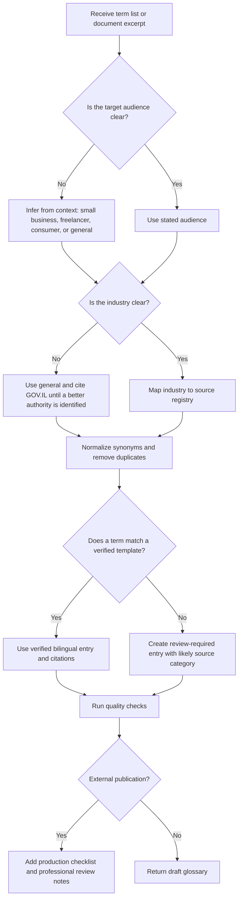

# Terminology Glossary Builder

## Purpose

Create bilingual English-Hebrew glossaries of industry terms for Israeli small businesses, freelancers, and consumers. Produce clear definitions, cite Israeli authoritative sources, flag review risks, and localize dates and currency for Israeli use.

Use this skill when a user needs a glossary for invoices, consumer-facing policies, onboarding documents, product pages, supplier terms, privacy notices, accessibility pages, import files, or financial explanations.

## Core output requirements

1. Identify the industry and audience.
2. Normalize duplicates and synonyms in English and Hebrew.
3. Select Israeli authoritative sources before drafting definitions.
4. Provide English term, Hebrew term, English definition, Hebrew definition, sources, usage notes, and warnings.
5. Use DD/MM/YYYY for Israeli dates and ₪ for shekel amounts.
6. Mark uncertain translations as requiring professional review.
7. Avoid presenting legal, tax, accounting, or standards information as final advice.

## Recommended source hierarchy

| Need | Primary source | Secondary source |
|---|---|---|
| VAT, invoices, withholding tax, business tax categories | Israel Tax Authority | GOV.IL, data.gov.il |
| National Insurance duties | National Insurance Institute | GOV.IL |
| Self-employed pension duties | Ministry of Finance | National Insurance Institute, Ministry of Labor when employment context appears |
| Consumer cancellation, warranties, fair trade | Consumer Protection and Fair Trade Authority | GOV.IL |
| Privacy policy, database obligations | Privacy Protection Authority | Ministry of Justice publications |
| Accessibility statement | Commission for Equal Rights of Persons with Disabilities | GOV.IL |
| Company extract, private company status | Corporations Authority | data.gov.il |
| Standards, standard mark, import compliance | Standards Institution of Israel | GOV.IL, Tax Authority customs pages |
| Banking restrictions and basic banking terms | Bank of Israel | GOV.IL |
| Securities and prospectus terms | Israel Securities Authority | Corporate filings where relevant |

## Decision tree



## Concrete example: freelance tax glossary

Input terms:

```text
עוסק פטור, עוסק מורשה, ניכוי מס במקור, דמי ביטוח לאומי, הפרשות לפנסיה
```

Recommended settings:

```python
from terminology_glossary_builder import GlossaryBuilder

builder = GlossaryBuilder()
result = builder.build_glossary(
    ["עוסק פטור", "עוסק מורשה", "ניכוי מס במקור", "דמי ביטוח לאומי", "הפרשות לפנסיה"],
    industry="freelance",
    audience="freelancer",
    environment="sandbox",
)
print(builder.to_markdown(result, localization="he"))
```

Expected behavior:

- Cite the Tax Authority for VAT registration and withholding tax.
- Cite the National Insurance Institute for National Insurance contributions.
- Cite the Ministry of Finance for self-employed pension obligations and the Ministry of Labor for employment terms.
- Warn that thresholds, rates, and eligibility rules are date-sensitive.

## Concrete example: consumer-facing retail glossary

Input terms:

```text
Consumer cancellation, Warranty certificate, VAT, Standard mark
```

Expected behavior:

- Define cancellation rights without inventing exact deadlines unless the current source has been checked.
- Use `ביטול עסקה צרכנית`, `תעודת אחריות`, `מס ערך מוסף (מע"מ)`, and `תו תקן`.
- Cite the Consumer Protection and Fair Trade Authority, Tax Authority, and Standards Institution of Israel.
- Use `₪` only with a validity date such as `03/06/2026`.

## Edge cases

### Term exists in English but not in Hebrew

Return the English term, provide `נדרש תרגום מקצועי` as the Hebrew term, cite the closest Israeli authority for the industry, and add a warning that review is required before external use.

### Hebrew term has multiple meanings

For example, `אישור` may refer to approval, certificate, permit, or confirmation. Select the meaning only after industry and document context are known. Otherwise, include a review warning.

### Numeric thresholds

Do not hard-code VAT rates, turnover ceilings, cancellation fees, or filing thresholds unless the user provides a dated source or a current authoritative source is checked. Always state the validity date in DD/MM/YYYY.

### Imported goods

Map customs and import terms to Tax Authority customs resources, GOV.IL import guidance, and standards sources. Separate import duties, VAT, product standards, and labeling obligations.

### Consumer and business audiences overlap

A store owner may need a business glossary for internal use and a consumer glossary for public pages. Keep professional accounting terms separate from consumer rights terms.

## Anti-patterns

| Anti-pattern | Correction |
|---|---|
| Translate literally without checking Israeli usage. | Use accepted Israeli professional terms first. |
| Cite generic blogs for statutory terms. | Use Israeli public authorities and regulators. |
| Treat `קבלה` and `חשבונית מס` as the same document. | Explain the difference and cite the Tax Authority. |
| Publish ₪ amounts without a date. | Attach DD/MM/YYYY validity date or remove the amount. |
| Hide uncertainty. | Add explicit review warnings for unknown or ambiguous terms. |
| Mix American legal terminology into Israeli consumer rights. | Use Israeli consumer protection terminology. |

## Production checklist

- Confirm every term has at least one Israeli authoritative source.
- Confirm every Hebrew term is a real professional term, not a transliteration when a Hebrew term exists.
- Confirm no Hebrew technical prose contains nikud.
- Confirm every date uses DD/MM/YYYY.
- Confirm every shekel amount uses ₪ and includes a validity date.
- Confirm warnings appear for date-sensitive tax, accounting, consumer, standards, or legal terms.
- Confirm external publication receives professional review when the glossary affects contracts, invoices, compliance pages, or consumer rights.
- Confirm source links open and point to the relevant authority.
- Confirm exported CSV preserves UTF-8.

## Troubleshooting summary

| Symptom | Likely cause | Fix |
|---|---|---|
| Unknown term shows review warning. | Term is not in the built-in library. | Add a template or cite a source manually. |
| Hebrew output looks unnatural. | Literal translation or missing industry context. | Select a specific industry and prefer accepted Israeli terminology. |
| CLI export cannot find id. | The wrong store path was used. | Pass the same `--store` path used by `create`. |
| Pytest cannot import the package. | Package not installed editable. | Run `pip install -e .` from the package root. |
| CSV opens with broken Hebrew in a spreadsheet. | Encoding detection issue. | Import as UTF-8 or use JSON/Markdown. |

## Command reference

```bash
tgb build "VAT" "Receipt" --industry tax --format markdown
tgb create "VAT" "Receipt" --industry tax --env sandbox --store ./glossaries.json
tgb export gls_example123 --store ./glossaries.json --format json
tgb sources --json
tgb validate
```

## Safety and review stance

Provide educational glossary content and cite authoritative sources. Do not replace legal, tax, accounting, standards, privacy, or financial advice. Mark uncertain content for professional review.

## Web-validated 2026 reference values

Use these values only when a glossary needs a concrete example and include the stated date. Recheck before external publication.

| Term | Validated wording or value | Date to show |
|---|---|---|
| Value Added Tax (VAT) | Standard Israeli VAT rate: 18% | Effective 01/01/2025; checked 03/06/2026 |
| Exempt dealer | 2026 annual turnover ceiling: 122,833 ₪, subject to occupation exceptions | Checked 03/06/2026 |
| Invoice allocation number | Above 10,000 ₪ from 01/01/2026; above 5,000 ₪ from 01/06/2026 | Checked 03/06/2026 |
| National Insurance contributions | Self-employed adult before retirement age: 7.7% lower band, 18% regular band | Effective 01/01/2026; checked 03/06/2026 |
| Pension contributions | Self-employed pension duty uses 4.45% and 12.55% tiers | Checked 03/06/2026 |
| Consumer cancellation fee | Common cap: 5% or 100 ₪, whichever is lower, where the category allows a fee | Checked 03/06/2026 |
| Database registration or notice | Use the broader term because Amendment 13 narrowed registration and added notice duties | Amendment effective 14/08/2025; checked 03/06/2026 |

For privacy glossaries, do not label every database as requiring registration. Use `Database registration or notice` and add an applicability warning.
