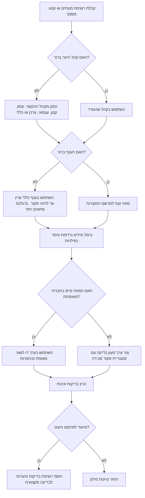

# בונה מילוני מונחים

## מטרה

צור מילוני מונחים דו לשוניים בעברית ובאנגלית עבור עסקים קטנים, עצמאים וצרכנים בישראל. ספק הגדרות ברורות, הפניות למקורות ישראליים מוסמכים, סימון סיכוני בדיקה, ותצורה מקומית של תאריכים וסכומים.

השתמש במיומנות זו עבור חשבוניות, מסמכי הצטרפות, דפי מוצר, תנאי ספקים, מדיניות פרטיות, הצהרות נגישות, מסמכי יבוא, הסברי בנקאות, והדרכות לצרכנים.

## כללי פלט מרכזיים

1. זהה ענף וקהל יעד.
2. נרמל כפילויות ומילים נרדפות בעברית ובאנגלית.
3. בחר מקורות ישראליים מוסמכים לפני ניסוח הגדרות.
4. הצג מונח בעברית, מונח באנגלית, הגדרה בעברית, הגדרה באנגלית, מקורות, הערות שימוש ואזהרות.
5. השתמש בתאריכים בפורמט DD/MM/YYYY ובסימן ₪ לסכומים בשקלים.
6. סמן תרגום לא ודאי כטעון בדיקה מקצועית.
7. אל תציג מידע משפטי, מיסוי, חשבונאי או תקני כייעוץ סופי.

## מדרג מקורות מומלץ

| צורך | מקור ראשי | מקור משלים |
|---|---|---|
| מע"מ, חשבוניות, ניכוי מס במקור, סיווגי עוסקים | רשות המסים בישראל | GOV.IL, data.gov.il |
| דמי ביטוח לאומי | המוסד לביטוח לאומי | GOV.IL |
| חובת פנסיה לעצמאים | משרד האוצר | המוסד לביטוח לאומי, משרד העבודה בהקשר של יחסי עבודה |
| ביטול עסקה, אחריות, סחר הוגן | הרשות להגנת הצרכן ולסחר הוגן | GOV.IL |
| מדיניות פרטיות ומאגרי מידע | הרשות להגנת הפרטיות | פרסומי משרד המשפטים |
| הצהרת נגישות | נציבות שוויון זכויות לאנשים עם מוגבלות | GOV.IL |
| נסח חברה ומעמד חברה פרטית | רשות התאגידים | data.gov.il |
| תקינה, תו תקן ויבוא | מכון התקנים הישראלי | GOV.IL, רשות המסים בתחום המכס |
| חשבונות מוגבלים ומונחי בנקאות | בנק ישראל | GOV.IL |
| תשקיף וניירות ערך | רשות ניירות ערך | דיווחים תאגידיים לפי הצורך |

## עץ החלטה



## דוגמה: מילון מס לעצמאי

קלט:

```text
עוסק פטור, עוסק מורשה, ניכוי מס במקור, דמי ביטוח לאומי, הפרשות לפנסיה
```

הגדרות מומלצות:

```python
from terminology_glossary_builder import GlossaryBuilder

builder = GlossaryBuilder()
result = builder.build_glossary(
    ["עוסק פטור", "עוסק מורשה", "ניכוי מס במקור", "דמי ביטוח לאומי", "הפרשות לפנסיה"],
    industry="freelance",
    audience="freelancer",
    environment="sandbox",
)
print(builder.to_markdown(result, localization="he"))
```

התנהגות נדרשת:

- הפנה לרשות המסים עבור רישום במע"מ וניכוי מס במקור.
- הפנה למוסד לביטוח לאומי עבור דמי ביטוח לאומי.
- הפנה למשרד האוצר עבור חובת פנסיה לעצמאים ולמשרד העבודה עבור מונחי עבודה.
- סמן תקרות, שיעורים וזכאות כנתונים תלויי תאריך.

## דוגמה: מילון קמעונאי לצרכנים

קלט:

```text
ביטול עסקה צרכנית, תעודת אחריות, מס ערך מוסף, תו תקן
```

התנהגות נדרשת:

- הגדר זכויות ביטול בלי להמציא מועדים מספריים אם המקור העדכני לא נבדק.
- השתמש במונחים המקצועיים `ביטול עסקה צרכנית`, `תעודת אחריות`, `מס ערך מוסף (מע"מ)`, `תו תקן`.
- הפנה לרשות להגנת הצרכן ולסחר הוגן, לרשות המסים ולמכון התקנים הישראלי.
- השתמש בסימן ₪ רק עם תאריך תוקף כגון `03/06/2026`.

## מקרי קצה

### מונח באנגלית ללא מונח עברי מאומת

הצג את המונח באנגלית, הצג `נדרש תרגום מקצועי` כמונח בעברית, הפנה לרשות הישראלית הקרובה ביותר לענף, והוסף אזהרה לפני שימוש חיצוני.

### מונח עברי דו משמעי

לדוגמה, `אישור` יכול להיות אישור פעולה, תעודה, היתר או אסמכתה. בחר משמעות רק לאחר זיהוי ענף והקשר מסמך. אחרת, הוסף אזהרת בדיקה.

### סכומים ותקרות

אל תקבע שיעורי מע"מ, תקרות מחזור, דמי ביטול או ספי דיווח ללא מקור מתוארך. ציין תמיד תאריך תוקף בפורמט DD/MM/YYYY.

### טובין מיובאים

מפה מונחי מכס ויבוא לרשות המסים בתחום המכס, להנחיות GOV.IL ולמקורות תקינה. הפרד בין מכס, מע"מ, תקני מוצר וחובות סימון.

### חפיפה בין צרכן לעסק

בעל חנות עשוי להזדקק למילון מקצועי פנימי ולמילון ציבורי לצרכנים. הפרד בין מונחי חשבונאות מקצועיים לבין זכויות צרכניות.

## דפוסים שגויים

| דפוס שגוי | תיקון |
|---|---|
| תרגום מילולי ללא בדיקת שימוש ישראלי. | העדף מונחים מקצועיים מקובלים בישראל. |
| הסתמכות על בלוגים למונחים סטטוטוריים. | השתמש ברשויות ציבוריות וברגולטורים בישראל. |
| הצגת `קבלה` ו`חשבונית מס` כאותו מסמך. | הסבר את ההבדל והפנה לרשות המסים. |
| פרסום סכומי ₪ ללא תאריך. | הוסף תאריך תוקף בפורמט DD/MM/YYYY או הסר את הסכום. |
| הסתרת אי ודאות. | הוסף אזהרת בדיקה למונחים לא מוכרים או דו משמעיים. |
| שימוש במונחי משפט אמריקאיים בדיני צרכנות בישראל. | השתמש במינוח ישראלי מתחום הגנת הצרכן. |

## רשימת בדיקות לפני פרסום

- ודא שלכל מונח יש לפחות מקור ישראלי מוסמך אחד.
- ודא שכל מונח עברי הוא מונח מקצועי אמיתי ולא תעתיק כאשר קיים מונח עברי מקובל.
- ודא שאין ניקוד בפרוזה טכנית בעברית.
- ודא שכל התאריכים בפורמט DD/MM/YYYY.
- ודא שכל סכום בשקלים מופיע עם ₪ ועם תאריך תוקף.
- ודא שקיימות אזהרות למונחי מס, חשבונאות, צרכנות, תקינה או משפט שתלויים בזמן.
- ודא שמסמך חיצוני עובר בדיקה מקצועית כאשר הוא משפיע על חוזים, חשבוניות, עמידה בדרישות או זכויות צרכנים.
- ודא שקישורי המקורות נפתחים ומובילים לרשות המתאימה.
- ודא שיצוא CSV נשמר בקידוד UTF-8.

## פתרון תקלות מקוצר

| תסמין | גורם סביר | תיקון |
|---|---|---|
| מונח לא מוכר מציג אזהרת בדיקה. | המונח אינו קיים בספריית התבניות. | הוסף תבנית או צרף מקור מוסמך ידנית. |
| עברית נשמעת לא טבעית. | תרגום מילולי או היעדר הקשר ענפי. | בחר ענף מדויק והעדף מונחים ישראליים מקובלים. |
| יצוא לפי מזהה נכשל. | נעשה שימוש בנתיב אחסון שונה. | העבר את אותו `--store` ששימש בפקודת `create`. |
| בדיקות אינן מייבאות את החבילה. | החבילה לא הותקנה במצב עריכה. | הרץ `pip install -e .` מתיקיית החבילה. |
| עברית בקובץ CSV נראית משובשת. | זיהוי קידוד שגוי בגיליון. | יבא כ-UTF-8 או השתמש ב-JSON או Markdown. |

## פקודות שימושיות

```bash
tgb build "מע\"מ" "קבלה" --industry tax --hebrew --format markdown
tgb create "עוסק פטור" "ניכוי מס במקור" --industry freelance --env sandbox --store ./glossaries.json
tgb export gls_example123 --store ./glossaries.json --format json
tgb sources --json
tgb validate
```

## גבולות אחריות

ספק תוכן מילוני לימודי עם הפניות למקורות מוסמכים. אל תחליף ייעוץ משפטי, ייעוץ מס, ייעוץ חשבונאי, תקני, פרטיות או פיננסי. סמן תוכן לא ודאי כטעון בדיקה מקצועית.

## ערכים מאומתים לשנת 2026

השתמש בערכים אלה רק כאשר נדרש מספר קונקרטי במילון, וציין את התאריך. בצע בדיקה חוזרת לפני פרסום חיצוני.

| מונח | ניסוח או ערך מאומת | תאריך להצגה |
|---|---|---|
| מס ערך מוסף (מע"מ) | שיעור המע"מ הכללי בישראל: 18% | בתוקף מ-01/01/2025; נבדק ב-03/06/2026 |
| עוסק פטור | תקרת מחזור שנתית לשנת 2026: 122,833 ₪, בכפוף לחריגי עיסוק | נבדק ב-03/06/2026 |
| מספר הקצאה לחשבונית | מעל 10,000 ₪ מ-01/01/2026; מעל 5,000 ₪ מ-01/06/2026 | נבדק ב-03/06/2026 |
| דמי ביטוח לאומי | עצמאי מגיל 18 ועד גיל פרישה: 7.7% במדרגה הנמוכה, 18% במדרגה הרגילה | בתוקף מ-01/01/2026; נבדק ב-03/06/2026 |
| הפרשות לפנסיה | חובת פנסיה לעצמאים משתמשת במדרגות 4.45% ו-12.55% | נבדק ב-03/06/2026 |
| דמי ביטול עסקה | תקרה נפוצה: 5% או 100 ₪, לפי הנמוך, כאשר סוג העסקה מאפשר גביית דמי ביטול | נבדק ב-03/06/2026 |
| רישום או הודעה על מאגר מידע | השתמש במונח הרחב כי תיקון 13 צמצם רישום והוסיף חובות הודעה | בתוקף מ-14/08/2025; נבדק ב-03/06/2026 |

במילוני פרטיות, אל תקבע שכל מאגר חייב ברישום. השתמש במונח `רישום או הודעה על מאגר מידע` והוסף אזהרת תחולה.
