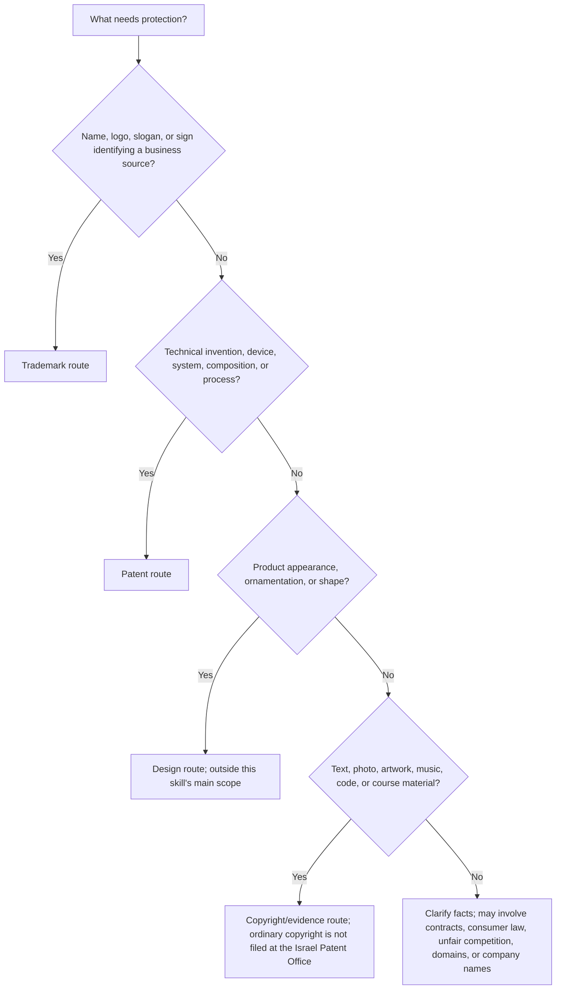
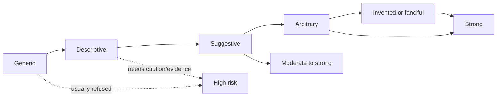
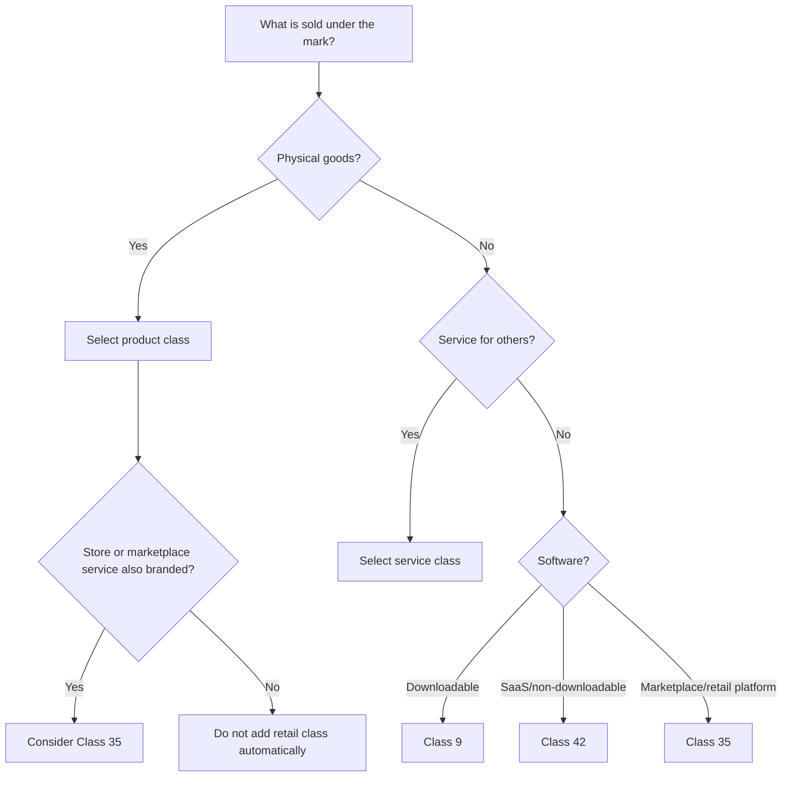
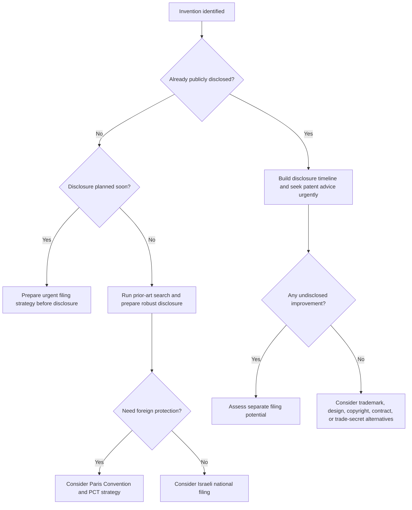

# Trademark & Patent Filing Helper

## Purpose

Guide Israeli small businesses, freelancers, startups, importers, creators, and consumers through preparation for trademark and patent applications filed with the Israel Patent Office, רשות הפטנטים. Use this skill to collect facts, choose the correct intellectual-property route, prepare filing-ready information, detect risk, organize evidence, and avoid common mistakes before using the official online systems.

This skill does not replace advice from a licensed Israeli patent attorney, trademark attorney, or lawyer. Use professional advice for high-value brands, inventions with commercial value, international filings, oppositions, refusals, infringement disputes, public disclosures, ownership uncertainty, regulated fields, and urgent deadlines.

## Operating rules

- Use neutral imperative language.
- Ask for missing facts before drafting filing text.
- Distinguish trademarks, patents, designs, copyright, company names, business names, domains, and social handles.
- Never promise registration, allowance, validity, enforcement success, or a specific official deadline.
- Direct the user to verify current official forms, fees, deadlines, portal requirements, and classification wording before filing.
- Warn patent users not to disclose the invention publicly before a filing strategy is confirmed.
- Keep trademark owners, patent applicants, inventors, employers, clients, and contractors separate.
- Preserve evidence: invoices, receipts, screenshots, labels, packaging, prototypes, lab notes, dated export files, drawings, and correspondence.

## Fast route decision tree



## Trademark route

### What a trademark protects

A trademark protects a sign that identifies the commercial source of goods or services. A sign may be a word, name, logo, slogan, letters, numbers, color combination, three-dimensional shape, sound, or another source identifier if registrable under Israeli law and practice.

Examples:

| User | Possible filing | Likely classes |
|---|---|---|
| Café in Haifa | Word mark for café name | 43 for café/restaurant; 30 if packaged cookies or coffee are sold |
| Freelance product designer | Brand name | 42 for design/technology; 35 for business consulting only if actually offered |
| Online jewelry seller | Word mark and logo | 14 for jewelry; 35 for online retail services if the store brand is used as a retail service |
| Fitness trainer | Program name | 41 for training; 44 only for real health/wellness services |
| Cosmetics importer | Product-line name | 3 for cosmetics; 35 for retail/import service branding where relevant |
| SaaS startup | Platform name | 42 for SaaS; 9 only for downloadable software; 35 for marketplace/business services if real |

### Trademark intake checklist

Collect:

1. Exact applicant name:
   - Individual: full legal name.
   - Israeli company: exact company name and company number.
   - Licensed dealer or sole trader: confirm whether the individual or a company owns the mark.
2. Address, country, email, and representative details if any.
3. Exact mark:
   - Word mark.
   - Logo/stylized mark.
   - Combined word and logo.
   - Slogan.
   - Non-traditional mark.
4. Script and language: Hebrew, English, Arabic, Latin transliteration, or other.
5. Meaning, translation, and transliteration. State when the word is invented.
6. Goods/services sold or planned in good faith.
7. Nice Classification classes and exact wording.
8. First use in Israel and abroad.
9. Priority claim based on earlier foreign filing, if any.
10. Known similar marks, competitors, company names, domains, and social handles.
11. Regulated field indicators: finance, payment, insurance, medical, cannabis, alcohol, defense, security, gambling, crypto, or children’s products.
12. Evidence of use: labels, website screenshots, receipts, ads, packaging, app listings, invoices, and photos.

### Distinctiveness ladder



Examples:

- Generic: "Coffee Shop" for café services. Avoid filing as the main brand.
- Descriptive: "Fast Tax Refunds" for tax refund assistance. Expect registrability problems.
- Suggestive: "Cloud Orchard" for backup software. Stronger because imagination is needed.
- Arbitrary: "Pomegranate" for cybersecurity software. Strong if no sector meaning.
- Invented: "Zavilo" for clothing. Usually strong if no confusingly similar mark exists.

### Trademark search workflow

1. Search the Israel Patent Office trademark database for the exact wording.
2. Search spelling variants, plurals, and spacing variants.
3. Search Hebrew/English/Arabic transliterations:
   - שקד, Shaked, Shakked.
   - NOVA, נובה, נובא.
4. Search visually and conceptually similar marks when a logo is involved.
5. Search direct Nice classes and adjacent classes that consumers may associate with the same source.
6. Search Google, app stores, Israeli company records, domain names, marketplaces, and social networks.
7. Save a search log with date, source, query, result, status, screenshot, and risk note.

### Selecting classes



Practical examples:

- Handmade candles: Class 4 for candles and scented candles; Class 35 only for a real retail-store service.
- UX freelancer: Class 42 for user interface design and software design consulting; Class 41 only for paid workshops; Class 35 only for business consulting.
- Restaurant with bottled sauce: Class 43 for restaurant services; Class 30 for sauces and packaged food.
- Cosmetics importer: Class 3 for cosmetics; Class 35 if the store/retail service itself is branded.
- SaaS accounting platform: Class 42 for SaaS; Class 9 for downloadable app; Class 35 or 36 only if actual business/financial services are offered.

### Trademark drafting template

```text
Applicant:
Applicant type:
Mark:
Mark type:
Language/script:
Translation/transliteration:
Meaning:
Classes and goods/services:
First use:
Priority claim:
Evidence:
Known similar marks:
Risks:
Recommended filing notes:
```

### Trademark output example: invented mark

```text
Mark: ZAVILO
Applicant: Example Ltd., Israeli company no. 515000000
Type: word mark
Meaning: invented word with no known meaning in Hebrew or English
Class 25: clothing; shirts; hats
Class 35: online retail store services featuring clothing
Notes: file the word mark first because it protects the wording independent of the current design. Consider a separate logo filing only if the logo has independent commercial value.
Risk: green, subject to official search and examination.
```

### Trademark output example: descriptive mark

```text
Mark: FAST TAX REFUNDS
Services: tax refund assistance for employees
Risk: red. The wording directly describes fast tax refund services.
Options:
1. Choose a more distinctive mark.
2. File a distinctive composite/logo only with realistic expectations.
3. Prepare acquired-distinctiveness evidence if substantial Israeli use exists.
4. Avoid claiming exclusive rights in ordinary descriptive wording.
```

### Common trademark objections

| Objection | Meaning | Response strategy |
|---|---|---|
| Lack of distinctiveness | The sign does not identify one commercial source | Narrow wording, argue suggestiveness, submit evidence, or choose a stronger mark |
| Descriptiveness | The sign describes quality, purpose, ingredient, geography, or target user | Argue indirect meaning, amend wording, disclaim descriptive matter where appropriate, or rebrand |
| Similar earlier mark | Consumers may be confused | Compare sight, sound, meaning, goods/services, channels, consumers, and coexistence evidence |
| Vague goods/services | The wording is unclear or too broad | Replace with accepted Nice-style terms |
| Formal defect | Missing applicant data, translation, image, fee, priority document, or authorization | Correct promptly and calendar deadlines |

## Patent route

### What a patent protects

A patent can protect a new, useful, non-obvious technical invention. It protects technical features and claim scope, not a brand, general idea, business plan, aesthetic preference, or marketing concept.

Good patent candidates may include:

- Water-saving irrigation valve with a new pressure-control mechanism.
- Cybersecurity detection method with concrete technical implementation.
- Medical device configuration.
- Manufacturing process that improves yield or energy use.
- Mechanical adapter with a new locking structure.
- Database or encryption optimization with measurable technical effect.

Weak patent candidates usually include:

- Restaurant concept.
- Course method.
- App idea without technical detail.
- Pricing model.
- Business model.
- Logo, name, slogan, or packaging text.
- Product look without technical function.

### Confidentiality warning

Do not publicly disclose the invention before professional review. Public disclosure may include a website, crowdfunding page, investor deck without confidentiality terms, YouTube/TikTok demo, conference poster, trade show display, sale, offer for sale, GitHub repository, app-store release, article, thesis, or public pitch.

Different countries handle novelty and grace periods differently. Treat public disclosure before filing as dangerous.

### Patent intake checklist

Collect:

1. Title of invention.
2. Inventor names and roles.
3. Applicant/owner: individual, company, employer, client, university, hospital, or other entity.
4. Employment, contractor, founder, funding, university, or assignment agreements.
5. Technical field.
6. Technical problem.
7. Existing solutions and their limits.
8. Detailed solution:
   - Components.
   - Steps.
   - Materials.
   - Circuits.
   - Sensors/controllers.
   - Data flow.
   - Software architecture.
   - Parameters and thresholds.
9. Novel technical features.
10. Advantages and measurable results.
11. Alternative embodiments.
12. Drawings and reference numerals.
13. Prototype status and test data.
14. Public disclosure history.
15. Planned disclosures.
16. Known prior art.
17. Countries of commercial interest.
18. Budget and urgency.

### Patent filing-route decision tree



### Patent specification preparation

A patent filing package usually includes:

- Title.
- Field.
- Background.
- Summary.
- Brief description of drawings.
- Detailed description.
- Claims.
- Abstract.
- Drawings.
- Sequence listing where relevant.
- Formal applicant/inventor documents.
- Priority documents if applicable.

### Claim drafting basics

Claims define the legal boundary. Use a patent professional for commercial inventions. For intake:

- Identify the minimum technical combination that appears new.
- Use consistent technical terms.
- Support every claim in the description.
- Add dependent variations.
- Avoid marketing language.
- Avoid purely result-based claiming.
- Include alternatives when they are real and enabled.

Weak intake sentence:

```text
A smart device that saves water better than existing products.
```

Improved intake sentence:

```text
A valve assembly comprising a housing having an inlet and an outlet; a pressure sensor positioned downstream of the inlet; a controllable restrictor configured to adjust a flow area; and a controller configured to reduce the flow area when measured downstream pressure exceeds a threshold associated with a selected irrigation zone.
```

### Prior-art search workflow

1. List core technical features.
2. Build English and Hebrew keywords.
3. Add synonyms, abbreviations, competitor product names, and standards terminology.
4. Search Google Patents, Espacenet, WIPO PATENTSCOPE, USPTO, academic papers, manuals, videos, and competitor pages.
5. Save search date, query, source, title, publication number, relevant figure/paragraph, and difference from the invention.
6. Create a feature chart before drafting claims.

### Patent edge cases

- Employee invention: review employment agreements and Israeli service-invention issues before naming the applicant.
- Contractor invention: review the services agreement and IP assignment clause.
- Founder invention: assign pre-incorporation IP to the company if the company should own the patent.
- Academic invention: contact the technology-transfer office before disclosure.
- Software invention: identify technical problem, technical architecture, and measurable technical effect.
- Medical invention: obtain professional review for claim format, regulatory interaction, and patentability.
- Public disclosure: record exact dates, audience, confidentiality terms, and disclosed material.

## Trademark versus patent examples

| Scenario | Main route | Reason |
|---|---|---|
| Name for a hummus restaurant | Trademark | Source identifier |
| Machine reducing tahini production waste | Patent | Technical device/process |
| Decorative bottle shape | Design; sometimes trademark | Product appearance |
| App name | Trademark | Brand |
| App encryption algorithm | Patent review | Technical implementation |
| Course name | Trademark | Service brand |
| Course content | Copyright/contract | Creative content |
| Product photos copied | Copyright/evidence | Creative materials |
| Competitor registered similar domain | Trademark/domain/legal review | Source confusion may matter |

## Guided interview

Ask in order:

1. What needs protection: name/logo/slogan, invention, product appearance, creative work, or something else?
2. Who should own the right?
3. For trademarks: what is the exact mark, what is sold under it, where is it used, and what similar marks are known?
4. For patents: what is the technical problem, what is the concrete solution, what is new, who invented it, and has it been disclosed?
5. What deadlines, launches, pitches, publications, or payment constraints exist?
6. What countries matter commercially?
7. What evidence is already available?

## Risk levels

- Green: distinctive mark or detailed technical invention, clear owner, no known public disclosure, focused goods/services.
- Yellow: descriptive elements, regulated field, broad classes, unclear ownership, planned disclosure, limited technical detail.
- Red: identical or very close earlier mark, clearly descriptive mark, wrong applicant, public patent disclosure, missing novelty, urgent deadline, active dispute.


## Live-source validation notes

Treat official fees, forms, portal behavior, and treaty materials as live operational facts. Verify them immediately before filing because the Israel Patent Office publishes annual fee updates and online-service pages. The current package intentionally avoids hardcoding ordinary Israeli filing fees in workflow logic.

As of the 03/06/2026 verification pass, the official trademark search site exposes fields such as Mark Number, International No, Words in the mark, Owner Name, Application Date, Registration Date, Mark Type, and Goods/Services Classification. Use these field names when explaining searches to users.

The current Nice Classification live WIPO page points to NCL(13-2026), with entry into force on 01/01/2026. When drafting goods and services, verify the exact current class heading and accepted wording against the current Nice publication and the Israel Patent Office classification guidance.

## Production checklist

Before final output:

- Confirm exact applicant name.
- Separate trademark owner from patent inventor.
- Confirm mark text, script, translation, and transliteration.
- Group goods/services by Nice class.
- Avoid speculative classes.
- Search Hebrew, English, Arabic, phonetic, and spelling variants.
- Show confidentiality warning for patents.
- Record disclosure timeline for inventions.
- Do not invent fees, deadlines, official statuses, or form limits.
- Flag official verification for current fee/form/portal requirements.
- Use clear filing packets and evidence folders.
- Escalate high-risk issues to professional review.

## Disclaimer / הבהרה

This skill is a preparation and automation aid only. It does not constitute tax, legal, financial, or other professional advice, and its output must be reviewed by a licensed professional (רו"ח / עו"ד / יועץ מס) before any filing, payment, or contractual use.

כלי זה מהווה שכבת הכנה ואוטומציה בלבד. אין בו ייעוץ מס, ייעוץ משפטי או ייעוץ מקצועי אחר, ויש לאמת כל פלט מול בעל מקצוע מורשה לפני הגשה, תשלום או שימוש חוזי.
