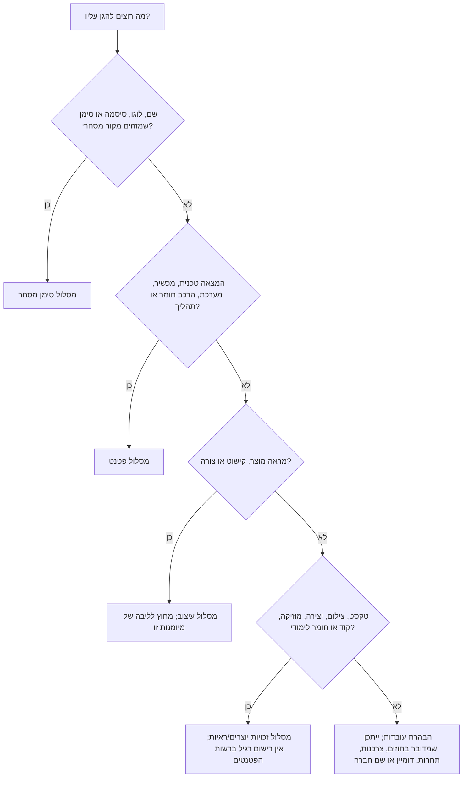
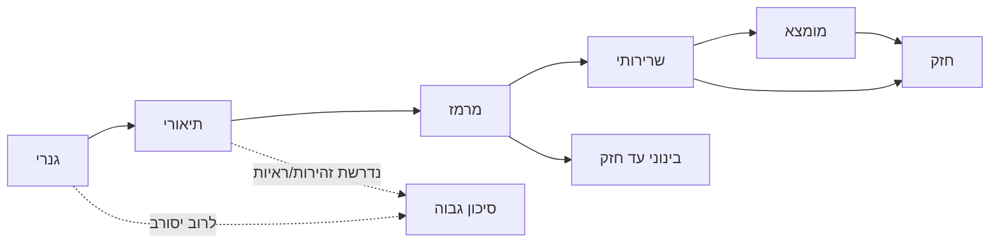

# מסייע להגשת סימני מסחר ופטנטים בישראל

## מטרה

להנחות עסקים קטנים, עצמאים, עצמאים נותני שירות, סטארטאפים, יבואנים, יוצרים וצרכנים בישראל בהכנה מעשית להגשת סימני מסחר ופטנטים ברשות הפטנטים. השתמשו במיומנות זו כדי לאסוף עובדות, לבחור מסלול קניין רוחני מתאים, להכין מידע להגשה, לזהות סיכונים, לארגן ראיות ולהימנע מטעויות נפוצות לפני שימוש במערכות המקוונות הרשמיות.

המידע אינו מחליף ייעוץ של עורך פטנטים, עורך דין או גורם מקצועי מוסמך. פנו לייעוץ מקצועי כאשר מדובר במותג בעל ערך, המצאה מסחרית, הגשה בינלאומית, התנגדות, סירוב, הפרה, גילוי פומבי, בעלות לא ברורה, תחום מוסדר או מועד קרוב.

## כללי עבודה

- השתמשו בלשון ניטרלית ומעשית.
- שאלו שאלות השלמה לפני ניסוח טקסט להגשה.
- הבחינו בין סימן מסחר, פטנט, עיצוב, זכויות יוצרים, שם חברה, שם עסק, דומיין ופרופיל ברשת חברתית.
- אל תבטיחו רישום, קיבול, תוקף, אכיפה או מועד רשמי מסוים.
- הפנו לבדיקה של טפסים, אגרות, מועדים, דרישות מערכת ונוסחי סיווג עדכניים באתר הרשמי לפני הגשה.
- הזהירו מפני גילוי פומבי של המצאה לפני קביעת אסטרטגיית הגשה.
- הפרידו בין בעל סימן, מבקש פטנט, ממציא, מעסיק, לקוח וקבלן.
- שמרו ראיות: חשבוניות, קבלות, צילומי מסך, תוויות, אריזות, אבטיפוס, מחברות מעבדה, קבצים מתוארכים, שרטוטים ותכתובות.

## עץ החלטה מהיר



## מסלול סימן מסחר

### מה סימן מסחר מגן עליו

סימן מסחר מגן על סימן שמזהה את המקור המסחרי של טובין או שירותים. הסימן יכול להיות מילה, שם, לוגו, סיסמה, אותיות, מספרים, שילוב צבעים, צורה תלת-ממדית, צליל או סימן אחר, אם הוא כשיר לרישום לפי הדין והפרקטיקה בישראל.

דוגמאות:

| משתמש | הגשה אפשרית | סוגים אפשריים |
|---|---|---|
| בית קפה בחיפה | שם בית הקפה | סוג 43 לשירותי בית קפה/מסעדה; סוג 30 אם נמכרים עוגיות או קפה ארוז |
| מעצבת מוצר עצמאית | שם מותג | סוג 42 לעיצוב וטכנולוגיה; סוג 35 רק אם יש ייעוץ עסקי אמיתי |
| חנות תכשיטים באינטרנט | שם ולוגו | סוג 14 לתכשיטים; סוג 35 לקמעונאות מקוונת אם החנות עצמה ממותגת |
| מאמן כושר | שם תוכנית | סוג 41 להדרכה ואימונים; סוג 44 רק לשירותי בריאות/טיפול אמיתיים |
| יבואן קוסמטיקה | שם סדרת מוצרים | סוג 3 לתמרוקים; סוג 35 לשירותי קמעונאות/יבוא כאשר רלוונטי |
| סטארטאפ SaaS | שם פלטפורמה | סוג 42 ל-SaaS; סוג 9 רק לתוכנה להורדה; סוג 35 לשירותי זירה/עסקים אם קיימים |

### רשימת איסוף נתונים לסימן מסחר

אספו:

1. שם משפטי מדויק של המבקש:
   - יחיד: שם מלא.
   - חברה ישראלית: שם חברה מלא ומספר חברה.
   - עוסק פטור או עוסק מורשה: בדקו אם האדם או חברה אחרת מחזיקים בזכויות.
2. כתובת, מדינה, דואר אלקטרוני ופרטי מייצג אם יש.
3. הסימן המדויק:
   - סימן מילולי.
   - לוגו או סימן מעוצב.
   - שילוב מילה ולוגו.
   - סיסמה.
   - סימן לא מסורתי.
4. כתב ושפה: עברית, אנגלית, ערבית, תעתיק לטיני או אחר.
5. משמעות, תרגום ותעתיק. ציינו כאשר המילה מומצאת.
6. טובין ושירותים שנמכרים או מתוכננים בתום לב.
7. סוגי סיווג ניס ונוסח מדויק.
8. תחילת שימוש בישראל ובחו"ל.
9. דין קדימה מבקשה זרה קודמת, אם קיים.
10. סימנים דומים ידועים, מתחרים, שמות חברה, דומיינים ופרופילים ברשתות חברתיות.
11. אינדיקציות לתחום מוסדר: פיננסים, תשלומים, ביטוח, רפואה, קנאביס, אלכוהול, ביטחון, אבטחה, הימורים, קריפטו או מוצרים לילדים.
12. ראיות שימוש: תוויות, צילומי אתר, קבלות, פרסומות, אריזות, עמודי יישומון, חשבוניות ותמונות.

### סולם אופי מבחין



דוגמאות:

- גנרי: "בית קפה" לשירותי בית קפה. הימנעו מהגשה כמותג מרכזי.
- תיאורי: "החזרי מס מהירים" לשירותי החזר מס. צפויים קשיי רישום.
- מרמז: "ענן פרדס" לשירותי גיבוי בענן. חזק יותר כי נדרש דמיון.
- שרירותי: "רימון" לתוכנת סייבר. עשוי להיות חזק אם אין משמעות ענפית.
- מומצא: "זבילו" לביגוד. לרוב חזק אם אין סימן דומה ומטעה.

### תהליך חיפוש לסימן מסחר

1. חפשו במאגר סימני המסחר של רשות הפטנטים את הנוסח המדויק.
2. חפשו וריאציות כתיב, רווחים, יחיד/רבים ושגיאות נפוצות.
3. חפשו תעתיקים בעברית, אנגלית וערבית:
   - שקד, Shaked, Shakked.
   - NOVA, נובה, נובא.
4. חפשו דמיון חזותי ורעיוני כאשר מדובר בלוגו.
5. חפשו סוגים ישירים וסוגים סמוכים שצרכן עשוי לשייך לאותו מקור.
6. חפשו בגוגל, חנויות יישומונים, רשם החברות, דומיינים, מרקטפלייסים ורשתות חברתיות.
7. שמרו יומן חיפוש עם תאריך בפורמט DD/MM/YYYY, מקור, שאילתה, תוצאה, סטטוס, צילום מסך והערת סיכון.

### בחירת סוגים

```mermaid
flowchart TD
    A[מה נמכר תחת הסימן?] --> B{טובין פיזיים?}
    B -->|כן| C[בחרו סוג מוצר]
    B -->|לא| D{שירות לאחרים?}
    D -->|כן| E[בחרו סוג שירות]
    D -->|לא| F{תוכנה?}
    F -->|להורדה| G[סוג 9]
    F -->|SaaS/לא להורדה| H[סוג 42]
    F -->|זירת מסחר/קמעונאות| I[סוג 35]
    C --> J{גם חנות או זירת מסחר ממותגת?}
    J -->|כן| K[שקלו סוג 35]
    J -->|לא| L[אל תוסיפו סוג קמעונאות אוטומטית]
```



דוגמאות מעשיות:

- נרות בעבודת יד: סוג 4 לנרות ונרות ריחניים; סוג 35 רק לשירות חנות אמיתי.
- יועצת UX: סוג 42 לעיצוב ממשקים וייעוץ תוכנה; סוג 41 רק לסדנאות בתשלום; סוג 35 רק לייעוץ עסקי.
- מסעדה עם רוטב בבקבוק: סוג 43 למסעדה; סוג 30 לרטבים ומזון ארוז.
- יבואן קוסמטיקה: סוג 3 לתמרוקים; סוג 35 אם פעילות החנות ממותגת כשירות.
- פלטפורמת הנהלת חשבונות SaaS: סוג 42 ל-SaaS; סוג 9 ליישומון להורדה; סוג 35 או 36 רק אם השירותים קיימים בפועל.

### תבנית ניסוח לסימן מסחר

```text
מבקש:
סוג מבקש:
סימן:
סוג סימן:
שפה/כתב:
תרגום/תעתיק:
משמעות:
סוגים וטובין/שירותים:
תחילת שימוש:
דין קדימה:
ראיות:
סימנים דומים ידועים:
סיכונים:
הערות להגשה:
```

### דוגמה: סימן מומצא

```text
סימן: ZAVILO
מבקש: דוגמה בע"מ, ח.פ. 515000000
סוג: סימן מילולי
משמעות: מילה מומצאת ללא משמעות ידועה בעברית או באנגלית
סוג 25: ביגוד; חולצות; כובעים
סוג 35: שירותי חנות קמעונאית מקוונת בתחום הביגוד
הערות: הגישו תחילה סימן מילולי כי הוא מגן על השם בלי תלות בעיצוב הנוכחי. שקלו הגשת לוגו נפרדת רק אם לעיצוב יש ערך מסחרי עצמאי.
סיכון: ירוק, בכפוף לחיפוש רשמי ובחינה.
```

### דוגמה: סימן תיאורי

```text
סימן: החזרי מס מהירים
שירותים: סיוע לשכירים בקבלת החזרי מס
סיכון: אדום. הנוסח מתאר ישירות שירות מהיר להחזרי מס.
אפשרויות:
1. לבחור סימן ייחודי יותר.
2. להגיש סימן מעוצב ייחודי בלבד בציפיות מציאותיות.
3. להכין ראיות לאופי מבחין נרכש אם יש שימוש משמעותי בישראל.
4. להימנע מטענה לבלעדיות במילים תיאוריות רגילות.
```

### הערות בוחן נפוצות

| הערה | משמעות | אסטרטגיית תגובה |
|---|---|---|
| היעדר אופי מבחין | הסימן אינו מזהה מקור מסחרי יחיד | צמצום ניסוח, טיעון מרמזות, ראיות שימוש או בחירת סימן חזק יותר |
| תיאוריות | הסימן מתאר איכות, מטרה, רכיב, גאוגרפיה או קהל יעד | טיעון למשמעות עקיפה, תיקון ניסוח, הסתייגות מאלמנט תיאורי או מיתוג מחדש |
| דמיון לסימן קודם | חשש להטעיית צרכנים | השוואת מראה, צליל, משמעות, טובין/שירותים, ערוצים, קהל וראיות לקיום מקביל |
| טובין/שירותים עמומים | הנוסח לא ברור או רחב מדי | החלפה במונחי סיווג ניס מקובלים |
| פגם פורמלי | חסרים פרטי מבקש, תרגום, תמונה, אגרה, מסמך דין קדימה או הרשאה | השלמה מהירה ומעקב אחר מועד |

## מסלול פטנט

### מה פטנט מגן עליו

פטנט עשוי להגן על המצאה טכנית חדשה, מועילה ובעלת התקדמות המצאתית. פטנט מגן על מאפיינים טכניים והיקף תביעות, לא על מותג, רעיון כללי, תוכנית עסקית, העדפה אסתטית או מסר שיווקי.

מועמדים טובים עשויים לכלול:

- שסתום השקיה שחוסך מים באמצעות מנגנון בקרת לחץ חדש.
- שיטת זיהוי בסייבר עם יישום טכני קונקרטי.
- תצורה של מכשור רפואי.
- תהליך ייצור שמשפר תפוקה או חוסך אנרגיה.
- מתאם מכני עם מנגנון נעילה חדש.
- אופטימיזציית מסד נתונים או הצפנה עם אפקט טכני מדיד.

מועמדים חלשים בדרך כלל:

- קונספט למסעדה.
- שיטת קורס.
- רעיון ליישומון ללא פירוט טכני.
- מודל תמחור.
- מודל עסקי.
- לוגו, שם, סיסמה או טקסט אריזה.
- מראה מוצר ללא פונקציה טכנית.

### אזהרת סודיות

אל תחשפו המצאה בפומבי לפני בדיקה מקצועית. גילוי פומבי עשוי לכלול אתר, מימון המונים, מצגת למשקיעים ללא סודיות, סרטון, פוסטר בכנס, תערוכה, מכירה, הצעה למכירה, GitHub פתוח, השקה בחנות יישומונים, מאמר, תזה או פיץ' פומבי.

כללי חידוש ותקופות חסד שונים בין מדינות. התייחסו לגילוי לפני הגשה כסיכון מהותי.

### רשימת איסוף נתונים לפטנט

אספו:

1. שם ההמצאה.
2. שמות הממציאים ותפקידיהם.
3. מבקש/בעלים: יחיד, חברה, מעסיק, לקוח, אוניברסיטה, בית חולים או גורם אחר.
4. הסכמי עבודה, קבלן, מייסדים, מימון, אוניברסיטה או המחאת זכויות.
5. תחום טכני.
6. בעיה טכנית.
7. פתרונות קיימים ומגבלותיהם.
8. פתרון מפורט:
   - רכיבים.
   - שלבים.
   - חומרים.
   - מעגלים.
   - חיישנים/בקרים.
   - זרימת נתונים.
   - ארכיטקטורת תוכנה.
   - פרמטרים וספים.
9. מאפיינים טכניים חדשים.
10. יתרונות ותוצאות מדידות.
11. מימושים חלופיים.
12. שרטוטים ומספרי הפניה.
13. מצב אבטיפוס ונתוני ניסוי.
14. היסטוריית גילוי פומבי.
15. גילויים מתוכננים.
16. ידע קודם ידוע.
17. מדינות בעלות חשיבות מסחרית.
18. תקציב ודחיפות.

### בחירת מסלול פטנט

```mermaid
flowchart TD
    A[זוהתה המצאה] --> B{כבר נחשפה בפומבי?}
    B -->|כן| C[בנו ציר זמן גילוי ופנו לייעוץ פטנטים בדחיפות]
    B -->|לא| D{מתוכנן גילוי קרוב?}
    D -->|כן| E[הכינו אסטרטגיית הגשה דחופה לפני גילוי]
    D -->|לא| F[בצעו חיפוש ידע קודם והכינו גילוי מפורט]
    F --> G{נדרשת הגנה בחו"ל?}
    G -->|כן| H[שקלו אמנת פריז ו-PCT]
    G -->|לא| I[שקלו הגשה לאומית בישראל]
    C --> J{קיים שיפור שלא נחשף?}
    J -->|כן| K[בדקו אפשרות להגשה נפרדת]
    J -->|לא| L[בדקו חלופות: סימן מסחר, עיצוב, זכויות יוצרים, חוזה או סוד מסחרי]
```

### רכיבי מפרט פטנט

חבילת פטנט כוללת בדרך כלל:

- שם ההמצאה.
- תחום ההמצאה.
- רקע.
- תקציר ההמצאה.
- תיאור קצר של השרטוטים.
- תיאור מפורט.
- תביעות.
- תקציר.
- שרטוטים.
- רשימת רצפים כאשר רלוונטי.
- מסמכים פורמליים של מבקש/ממציא.
- מסמכי דין קדימה אם יש.

### יסודות ניסוח תביעות

התביעות מגדירות את גבולות הזכות. בהמצאות מסחריות השתמשו באיש מקצוע. לצורך איסוף נתונים:

- זהו את הצירוף הטכני המינימלי שנראה חדש.
- השתמשו במונחים טכניים עקביים.
- תמכו בכל תביעה בתיאור.
- הוסיפו חלופות ותביעות תלויות.
- הימנעו משפה שיווקית.
- הימנעו מתביעה שמגדירה רק תוצאה.
- כללו חלופות אמיתיות שניתנות לביצוע.

ניסוח חלש:

```text
מכשיר חכם שחוסך מים טוב יותר ממוצרים קיימים.
```

ניסוח איסוף נתונים משופר:

```text
מכלול שסתום הכולל בית בעל כניסה ויציאה; חיישן לחץ הממוקם במורד הזרם מהכניסה; מגביל זרימה נשלט המותאם לשינוי שטח זרימה; ובקר המותאם לצמצם את שטח הזרימה כאשר לחץ נמדד במורד הזרם עולה מעל סף המשויך לאזור השקיה נבחר.
```

### חיפוש ידע קודם

1. רשמו את המאפיינים הטכניים המרכזיים.
2. בנו מילות מפתח בעברית ובאנגלית.
3. הוסיפו מילים נרדפות, קיצורים, שמות מוצר של מתחרים ומונחי תקינה.
4. חפשו ב-Google Patents, Espacenet, WIPO PATENTSCOPE, USPTO, מאמרים, מדריכים, סרטונים ואתרי מתחרים.
5. שמרו תאריך, שאילתה, מקור, כותרת, מספר פרסום, איור/פסקה רלוונטיים והבדל מההמצאה.
6. צרו טבלת מאפיינים לפני ניסוח תביעות.

### מקרי קצה

- המצאת עובד: בדקו הסכמי עבודה וסוגיות המצאת שירות לפני קביעת המבקש.
- המצאת קבלן: בדקו הסכם שירותים וסעיף העברת קניין רוחני.
- המצאת מייסדים: העבירו זכויות טרום-התאגדות לחברה אם החברה אמורה להיות הבעלים.
- המצאה אקדמית: פנו ליחידת מסחור ידע לפני גילוי.
- המצאת תוכנה: זהו בעיה טכנית, ארכיטקטורה טכנית ואפקט טכני מדיד.
- המצאה רפואית: קבלו בדיקה מקצועית לניסוח תביעות, רגולציה וכשירות.
- גילוי פומבי: תעדו תאריכים מדויקים, קהל, תנאי סודיות וחומר שנחשף.

## דוגמאות: סימן מסחר מול פטנט

| מצב | מסלול מרכזי | סיבה |
|---|---|---|
| שם לחומוסייה | סימן מסחר | מזהה מקור מסחרי |
| מכונה שמפחיתה פסולת בייצור טחינה | פטנט | מכשיר/תהליך טכני |
| צורת בקבוק דקורטיבית | עיצוב; לעיתים סימן מסחר | מראה מוצר |
| שם יישומון | סימן מסחר | מותג |
| אלגוריתם הצפנה ביישומון | בדיקת פטנט | יישום טכני |
| שם קורס | סימן מסחר | מותג שירות |
| תוכן קורס | זכויות יוצרים/חוזה | תוכן יצירתי |
| העתקת צילומי מוצר | זכויות יוצרים/ראיות | חומר יצירתי |
| דומיין דומה של מתחרה | סימן מסחר/דומיין/ייעוץ משפטי | ייתכן חשש להטעיה |

## ראיון מודרך

שאלו לפי הסדר:

1. מה צריך הגנה: שם/לוגו/סיסמה, המצאה, מראה מוצר, יצירה או משהו אחר?
2. מי צריך להיות בעל הזכות?
3. בסימן מסחר: מה הסימן המדויק, מה נמכר תחתיו, איפה נעשה שימוש ואילו סימנים דומים ידועים?
4. בפטנט: מה הבעיה הטכנית, מה הפתרון הקונקרטי, מה חדש, מי המציא והאם הייתה חשיפה?
5. אילו מועדים, השקות, פיצ'ים, פרסומים או מגבלות תשלום קיימים?
6. אילו מדינות חשובות מסחרית?
7. אילו ראיות כבר קיימות?

## רמות סיכון

- ירוק: סימן ייחודי או המצאה טכנית מפורטת, בעלים ברור, אין גילוי פומבי ידוע, טובין/שירותים ממוקדים.
- צהוב: אלמנטים תיאוריים, תחום מוסדר, סוגים רחבים, בעלות לא ברורה, גילוי מתוכנן, פירוט טכני מוגבל.
- אדום: סימן קודם זהה או קרוב מאוד, סימן תיאורי מובהק, מבקש שגוי, גילוי פומבי של המצאה, היעדר חידוש, מועד דחוף, סכסוך פעיל.

## רשימת בדיקה סופית

לפני פלט סופי:

- ודאו שם מבקש מדויק.
- הפרידו בין בעל סימן לבין ממציא פטנט.
- ודאו נוסח סימן, כתב, תרגום ותעתיק.
- קבצו טובין ושירותים לפי סיווג ניס.
- הימנעו מסוגים ספקולטיביים.
- חפשו וריאציות בעברית, אנגלית, ערבית, צליל וכתיב.
- הציגו אזהרת סודיות בפטנטים.
- תעדו ציר זמן גילוי להמצאות.
- אל תמציאו אגרות, מועדים, סטטוסים רשמיים או מגבלות טופס.
- סמנו דרישת בדיקה רשמית של אגרות, טפסים ודרישות מערכת.
- השתמשו בתיקיות הגשה ותיקיות ראיות מסודרות.
- הסלימו סוגיות בסיכון גבוה לייעוץ מקצועי.
- הציגו סכומים לדוגמה ב-₪ ותאריכים בפורמט DD/MM/YYYY.
