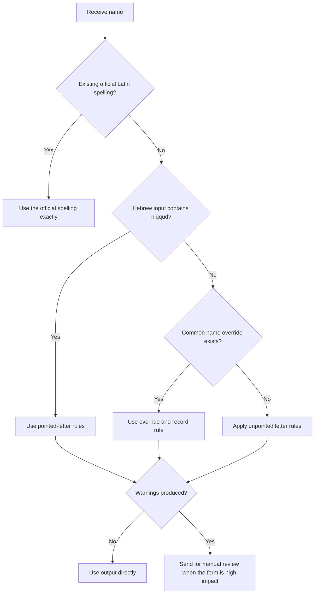
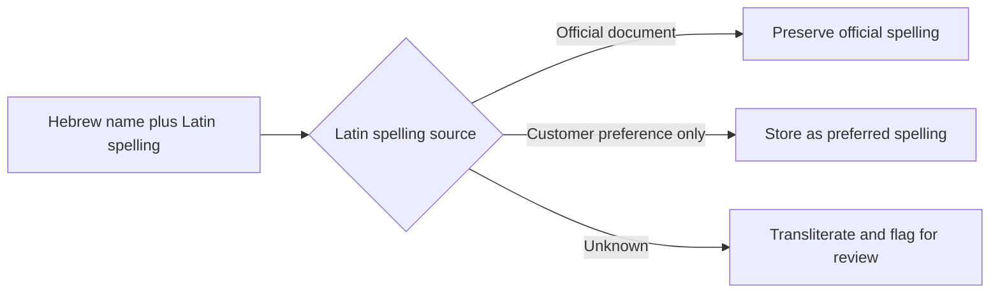
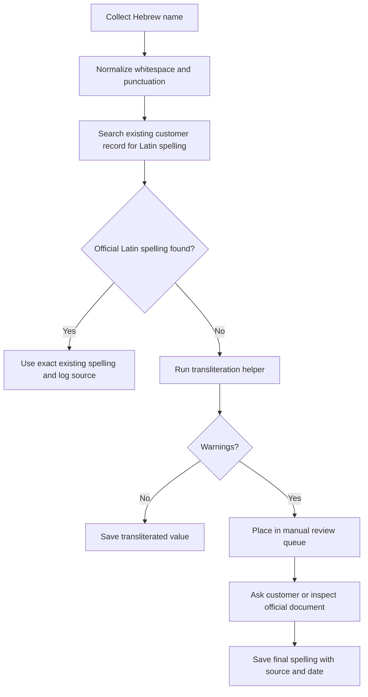

# Transliteration Helper

Use this skill to transliterate Hebrew names into Latin script for Israeli business records, customer onboarding, invoices, travel-related forms, CRM exports, delivery labels, bank/payments reconciliation, and bilingual documents. Use passport-aware conventions as the default target. Treat the Academy simple transliteration rules as one official reference point rather than a single mandatory spelling for every person. Treat unpointed Hebrew as ambiguous, and return a useful spelling while preserving warnings for manual review.

The skill is local-only. It does not call a government system, does not validate identity documents, and does not determine a legally binding spelling. Use official documents when a person already has a passport, visa, bank record, certificate, or signed contract in Latin script.

## Core outcome

Given a Hebrew name such as `דוד כהן`, return a Latin-script value such as `DAVID KOHEN`, plus warnings when the Hebrew source can support more than one reading.

Typical result object:

```json
{
  "original": "דוד כהן",
  "normalized": "דוד כהן",
  "latin": "DAVID KOHEN",
  "warnings": [],
  "tokens": []
}
```

For ambiguous input:

```json
{
  "original": "אבתיה",
  "normalized": "אבתיה",
  "latin": "ABTIA",
  "warnings": [
    "unpointed_hebrew_ambiguous_vowels",
    "unpointed_hebrew_dagesh_not_marked"
  ]
}
```

## Use cases for Israeli small businesses and consumers

Use the helper for:

- Customer records where the source name is Hebrew but a payment, shipping, booking, or international service requires Latin script.
- Freelancer invoices and receipts where a customer asks for an English version of a name.
- Bilingual price quotes, service agreements, purchase orders, and delivery documents.
- CSV cleanup before importing customers into CRM, e-commerce, invoicing, or scheduling systems.
- Internal review queues where names must be checked before forms are sent to banks, insurers, airlines, payment providers, or government portals.

Do not use the helper as a replacement for a passport, official certificate, attorney review, notary translation, or a ministry decision.

## Default policy

Use these defaults unless a workflow specifies otherwise:

| Setting | Default | Purpose |
|---|---:|---|
| Output case | `upper` | Fits many passport and form fields |
| Known-name overrides | Enabled | Restores missing vowels for common Israeli names |
| Mixed Hebrew/Latin input | Allowed with warning | Keeps existing customer spellings visible |
| Tzadi style | `z` | Matches common Israeli name rendering for צ; use `ts` when a workflow requires Academy-style simple transliteration |
| Local processing | Required | Avoids exposing customer data to external services |

## Decision tree



## Quick start

Run a single name:

```bash
python scripts/transliteration-helper-cli.py transliterate "דוד כהן"
# DAVID KOHEN
```

Return structured JSON:

```bash
python scripts/transliteration-helper-cli.py transliterate --format json --explain "בן־דוד"
```

Batch a text file:

```bash
python scripts/transliteration-helper-cli.py batch -i names.txt --format csv -o transliterated.csv
```

Use Python synchronously:

```python
from transliteration_helper_client import TransliterationClient

client = TransliterationClient()
result = client.transliterate("דוד כהן")
print(result.latin)
```

Use Python asynchronously:

```python
import asyncio
from transliteration_helper_client import TransliterationClient

async def main():
    client = TransliterationClient()
    result = await client.transliterate_async("שרה לוי")
    print(result.to_dict())

asyncio.run(main())
```

## Transliteration rules

### Hebrew letters

The unpointed default table is intentionally conservative. Hebrew without niqqud does not show vowels or dagesh, so the helper emits warnings when spelling cannot be determined with high confidence.

| Hebrew | Default Latin | Notes |
|---|---:|---|
| א | silent / A at word start | Use override or niqqud for exact vowel |
| ב | B | Dagesh is not marked in unpointed text |
| ג | G | `ג׳` becomes J |
| ד | D |  |
| ה | H / A at final position | Final ה often marks an A sound in names |
| ו | V / heuristic O | Ambiguous: V, O, U, or part of a vowel |
| ז | Z | `ז׳` becomes ZH |
| ח | H | Common Israeli result is H; keep official spelling when available |
| ט | T |  |
| י | Y / I heuristic | Initial י is usually Y; final/internal can be I |
| כ/ך | KH / K heuristic at start | Ambiguous without dagesh |
| ל | L |  |
| מ/ם | M |  |
| נ/ן | N |  |
| ס | S |  |
| ע | silent / A at word start | Use override or niqqud for exact vowel |
| פ/ף | F / P heuristic at start | Ambiguous without dagesh |
| צ/ץ | Z | Configure `--tzadi-style tz` or `ts` when required |
| ק | K |  |
| ר | R |  |
| ש | SH | Pointed ש becomes S |
| ת | T |  |

### Common-name overrides

Use overrides for names where unpointed Hebrew misses predictable vowels:

| Hebrew | Latin |
|---|---:|
| דוד | DAVID |
| שרה | SARA |
| משה | MOSHE |
| יוסף | YOSEF |
| יצחק | YIZHAK |
| חיים | HAIM |
| כהן | KOHEN |
| לוי | LEVI |
| בן-דוד | BEN-DAVID |
| ג׳ורג׳ | GEORGE |

Add project-specific overrides before sending high-impact forms. For example, a customer named `כהן` may already use `COHEN`; preserve that spelling when it appears on official records.

### Pointed Hebrew

When niqqud appears, prefer pointed-letter rules:

| Hebrew | Result | Why |
|---|---:|---|
| ברק | BARAK | ב uses B |
| ברק | VARAK | ב without dagesh uses V |
| שלום | SHALOM | shin dot gives SH; holam gives O |
| שרה | SARA | sin dot gives S |
| רות | RUT | shuruk gives U |

### Separators

Normalize these separators before transliteration:

| Source | Normalized |
|---|---:|
| Maqaf `־` | Hyphen `-` |
| En dash / em dash | Hyphen `-` |
| Multiple spaces | Single space |
| Hebrew geresh `׳` | Apostrophe `'` |
| Hebrew gershayim `״` | Double quote `"` |

Preserve hyphenated family names such as `בן-דוד`, `בר-און`, and `כהן-לוי`.

## Edge cases

### A person already provided Latin spelling

Use the provided spelling when it comes from a passport, bank record, signed contract, official English invoice, immigration document, or customer-confirmed legal name.



### Mixed Hebrew and Latin

Input such as `דוד Cohen` returns `DAVID COHEN` with `mixed_hebrew_latin_input`. Treat this as a data-quality warning. Review whether the Latin part is a deliberate official spelling.

### Names with multiple accepted spellings

Examples:

| Hebrew | Possible spellings | Recommended action |
|---|---|---|
| כהן | KOHEN, COHEN | Use existing official spelling when available |
| יצחק | YIZHAK, YITZHAK | Keep passport spelling when known |
| צבי | ZVI, TZVI | Default to ZVI; adjust when a system expects TZ |
| מיכאל | MICHAEL, MIKHAEL | Use customer document when present |
| חנה | HANA, CHANA | Default to HANA under the helper convention; keep CHANA when confirmed |

### Business names and sole proprietors

For a licensed freelancer, sole trader, or exempt dealer, distinguish between the legal personal name and the trading name. Transliterate personal names. Translate descriptive business names only when a real English name is needed.

Example:

| Hebrew source | Correct handling |
|---|---|
| `דוד כהן - חשמלאי מוסמך` | `DAVID KOHEN - Licensed Electrician` if an English service description is required |
| `סטודיו מרים` | Keep `Studio Miriam` only when the business uses that English brand |
| `עוסק פטור: שרה לוי` | Transliterate the person: `SARA LEVI` |

## Production workflow



## Anti-patterns

Avoid these mistakes:

| Anti-pattern | Risk | Better practice |
|---|---|---|
| Force one spelling for every customer | Passport mismatch, failed booking, payment friction | Store official spelling per person |
| Remove warnings from batch jobs | Ambiguous names reach high-impact systems | Keep warnings column |
| Transliterate business descriptions as names | Awkward or misleading English | Translate descriptions only when needed |
| Use random internet transliteration tables | Inconsistent records | Use one documented policy |
| Convert existing Latin names back and forth | Data corruption | Preserve confirmed Latin spelling |
| Treat ח as CH in one system and H in another | Duplicate customer records | Choose a policy and document exceptions |
| Ignore hyphens in family names | Broken legal names | Preserve hyphenation |
| Send customer data to external tools unnecessarily | Privacy and compliance exposure | Process locally |

## Troubleshooting overview

| Symptom | Likely cause | Fix |
|---|---|---|
| Output lacks vowels | Hebrew source is unpointed and no known override exists | Add niqqud, add override, or ask customer |
| `mixed_hebrew_latin_input` appears | Input contains both scripts | Confirm whether Latin segment is official |
| `unpointed_hebrew_dagesh_not_marked` appears | ב/כ/פ can change sound with dagesh | Use niqqud or manual review |
| CLI prints uppercase but system needs title case | Default case is `upper` | Use `--case title` |
| CSV batch fails | Missing `hebrew_name` column | Pass `--input-column` or rename header |

See `references/troubleshooting.md` for a full table.

## Production checklist

Before using results in customer-facing or regulated workflows:

- Confirm whether an official Latin spelling already exists.
- Keep the Hebrew source, normalized Hebrew, Latin output, warnings, review status, reviewer, and review date.
- Store a source label such as `passport`, `customer-confirmed`, `contract`, `system-generated`, or `manual-review`.
- Use `DD/MM/YYYY` dates in Israeli-facing audit notes.
- Keep a review queue for warnings.
- Do not overwrite customer-confirmed spellings during batch imports.
- Test a sample of names containing ו, י, ה, ח, כ, פ, צ, and mixed Hebrew/Latin.
- Confirm downstream field constraints, including maximum length, uppercase requirements, hyphen handling, and apostrophe handling.
- Export a rollback file before bulk updates.
- Reconcile duplicate customers caused by variant spellings such as `COHEN` and `KOHEN`.

## File index

- `SKILL.md` — English operating guide.
- `SKILL_HE.md` — Hebrew operating guide with Israeli terminology and examples.
- `references/api-reference.md` — local interface and regulatory reference.
- `references/workflow-guide.md` — end-to-end workflows.
- `references/troubleshooting.md` — detailed failure and warning guide.
- `references/test-scenarios.md` — concrete scenario set for QA.
- `references/migration-checklist.md` — migration plan for existing customer data.
- `scripts/transliteration_helper_client.py` — typed sync/async Python client.
- `scripts/transliteration-helper-cli.py` — Click-based CLI.
- `scripts/test_transliteration_helper_client.py` — pytest suite.
- `scripts/examples/` — runnable examples.
