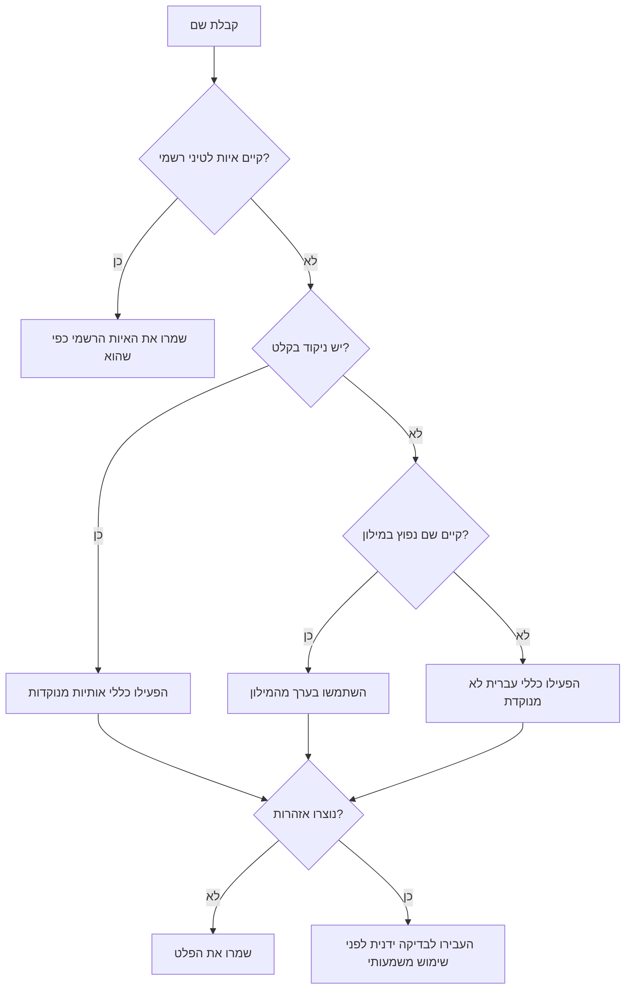
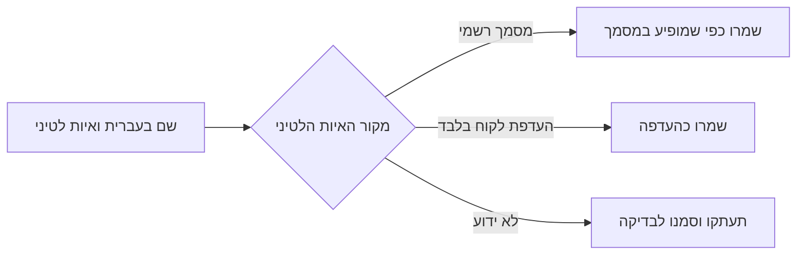
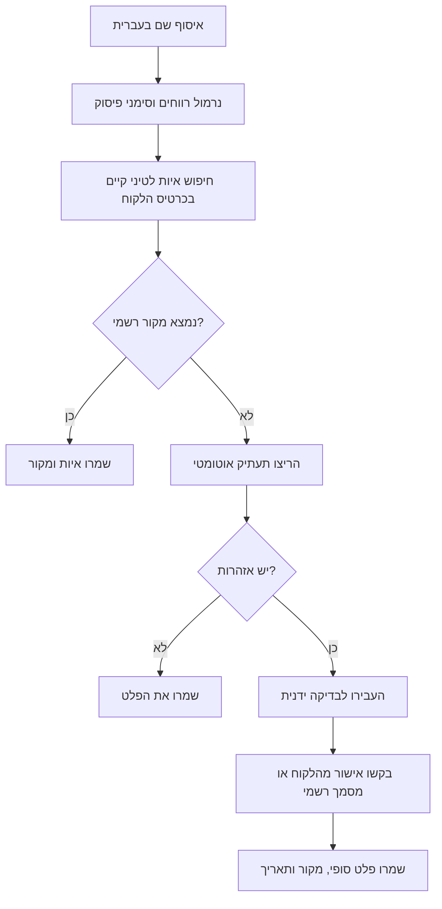

# מסייע תעתיק

השתמשו בכלי כדי לתעתק שמות בעברית לאותיות לטיניות לצורכי לקוחות, חשבוניות, קבלות, הצעות מחיר, טפסים, ייצוא ל-CRM, משלוחים, הזמנות, תשלומים ומסמכים דו-לשוניים. השתמשו כברירת מחדל בתעתיק שימושי למסמכים ולשדות לטיניים. התייחסו לכללי התעתיק הפשוט של האקדמיה כמקור רשמי אחד, ולא כאיות חובה יחיד לכל אדם. זכרו שעברית לא מנוקדת היא עמומה מטבעה, ולכן יש לשמור אזהרות ולבצע בדיקה ידנית לפני שימוש בעל משמעות כספית, משפטית או תפעולית.

הכלי פועל מקומית בלבד. הוא לא פונה למערכת ממשלתית, לא מאמת תעודות זהות, ולא קובע איות משפטי מחייב. כאשר ללקוח, ספק, עובד או בעל עסק כבר יש איות לטיני בדרכון, בחשבון בנק, בחוזה חתום, באישור רשמי או במסמך נסיעה, יש להשתמש באיות הקיים.

## תוצאה רצויה

קלט:

```text
דוד כהן
```

פלט טיפוסי:

```json
{
  "original": "דוד כהן",
  "normalized": "דוד כהן",
  "latin": "DAVID KOHEN",
  "warnings": [],
  "tokens": []
}
```

קלט עמום:

```json
{
  "original": "אבתיה",
  "normalized": "אבתיה",
  "latin": "ABTIA",
  "warnings": [
    "unpointed_hebrew_ambiguous_vowels",
    "unpointed_hebrew_dagesh_not_marked"
  ]
}
```

## שימושים נפוצים בישראל

השתמשו בכלי עבור:

- רישום לקוחות כאשר השם התקבל בעברית, אך מערכת תשלומים, משלוחים, הזמנות או שירות בינלאומי דורשים אותיות לטיניות.
- חשבוניות, קבלות, דרישות תשלום והצעות מחיר באנגלית עבור עוסק פטור, עוסק מורשה, חברה קטנה או עצמאי.
- ניקוי קובצי CSV לפני יבוא למערכת ניהול לקוחות, חנות מקוונת, מערכת חשבוניות או מערכת תיאום פגישות.
- הכנת רשימת בדיקה לפני שליחת נתונים לבנק, חברת ביטוח, חברת תעופה, ספק סליקה או פורטל ממשלתי.
- יצירת תור בדיקה ידנית לשמות שעלולים לקבל יותר מאיות לטיני אחד.

אל תשתמשו בכלי במקום דרכון, אישור רשמי, תרגום נוטריוני, ייעוץ משפטי או החלטה של רשות מוסמכת.

## ברירות מחדל

| הגדרה | ברירת מחדל | מטרה |
|---|---:|---|
| אותיות גדולות/קטנות | `upper` | מתאים לשדות רבים בדרכונים ובטפסים |
| מילון שמות נפוצים | פעיל | משלים תנועות חסרות בשמות ישראליים נפוצים |
| קלט מעורב עברית/לטינית | מותר עם אזהרה | שומר איות קיים של לקוח |
| תעתיק האות צ | `z` | מתאים לאיות ישראלי נפוץ; השתמשו ב-`ts` כאשר נדרש תעתיק פשוט בסגנון האקדמיה |
| עיבוד מקומי | חובה | מצמצם חשיפה של מידע אישי |

## תרשים החלטה



## התחלה מהירה

שם יחיד:

```bash
python scripts/transliteration-helper-cli.py transliterate "דוד כהן"
# DAVID KOHEN
```

פלט JSON עם הסבר:

```bash
python scripts/transliteration-helper-cli.py transliterate --format json --explain "בן־דוד"
```

קובץ אצווה:

```bash
python scripts/transliteration-helper-cli.py batch -i names.txt --format csv -o transliterated.csv
```

שימוש ב-Python:

```python
from transliteration_helper_client import TransliterationClient

client = TransliterationClient()
result = client.transliterate("שרה לוי")
print(result.latin)
```

שימוש אסינכרוני:

```python
import asyncio
from transliteration_helper_client import TransliterationClient

async def main():
    client = TransliterationClient()
    result = await client.transliterate_async("משה כהן")
    print(result.to_dict())

asyncio.run(main())
```

## טבלת תעתיק בסיסית

| אות בעברית | פלט לטיני כברירת מחדל | הערה |
|---|---:|---|
| א | שקטה / A בתחילת מילה | יש לאמת תנועה כאשר אין ניקוד |
| ב | B | ללא ניקוד לא רואים דגש |
| ג | G | `ג׳` הופך ל-J |
| ד | D |  |
| ה | H / A בסוף מילה | ה סופית מסמנת לעיתים תנועת A |
| ו | V / O לפי הקשר | יכולה להיות V, O או U |
| ז | Z | `ז׳` הופך ל-ZH |
| ח | H | תעתיק ישראלי נפוץ; שמרו איות רשמי אם קיים |
| ט | T |  |
| י | Y / I לפי הקשר | בתחילת מילה לרוב Y |
| כ/ך | KH / K בתחילת מילה | ללא דגש יש עמימות |
| ל | L |  |
| מ/ם | M |  |
| נ/ן | N |  |
| ס | S |  |
| ע | שקטה / A בתחילת מילה | יש לאמת תנועה כאשר אין ניקוד |
| פ/ף | F / P בתחילת מילה | ללא דגש יש עמימות |
| צ/ץ | Z | אפשר לבחור `tz` או `ts` במידת הצורך |
| ק | K |  |
| ר | R |  |
| ש | SH | ש מנוקדת הופכת ל-S |
| ת | T |  |

## מילון שמות נפוצים

| עברית | לטינית |
|---|---:|
| דוד | DAVID |
| שרה | SARA |
| משה | MOSHE |
| יוסף | YOSEF |
| יצחק | YIZHAK |
| חיים | HAIM |
| כהן | KOHEN |
| לוי | LEVI |
| בן-דוד | BEN-DAVID |
| ג׳ורג׳ | GEORGE |

כאשר לקוח משתמש באיות אחר במסמך רשמי, למשל `COHEN` במקום `KOHEN`, שמרו את האיות הרשמי. אל תדרסו איות מאומת באמצעות תעתיק אוטומטי.

## ניקוד

כאשר הקלט כולל סימני ניקוד, המנוע מתחשב בדגש, חולם, שורוק ונקודות שין/סין. במסמכי עבודה רגילים אל תוסיפו ניקוד רק כדי לכפות תוצאה אם המקור הרשמי אינו מנוקד. השתמשו בניקוד בעיקר לבדיקה פנימית או כאשר השם התקבל ממקור אמין.

| רכיב בקלט | השפעה אפשרית על הפלט | הערת שימוש |
|---|---|---|
| דגש באות ב | B במקום V | שימושי רק כשהדגש מופיע במקור |
| דגש באות כ | K במקום KH | ללא דגש יש עמימות |
| דגש באות פ | P במקום F | ללא דגש יש עמימות |
| חולם או שורוק | O או U | מסייע בשם לא מוכר |
| נקודת שין או סין | SH או S | דרושה רק כאשר המקור מסמן זאת |

## סימני פיסוק ומפרידים

| מקור | נרמול |
|---|---:|
| מקף עברי `־` | מקף רגיל `-` |
| קו מפריד ארוך | מקף רגיל `-` |
| רווחים כפולים | רווח אחד |
| גרש `׳` | אפוסטרוף `'` |
| גרשיים `״` | מירכאות `"` |

שמרו מקף בשמות משפחה כגון `בן-דוד`, `בר-און`, `כהן-לוי`.

## מקרי קצה

### קיים איות לטיני רשמי

כאשר יש דרכון, אישור בנק, חוזה חתום, פוליסת ביטוח או מסמך רשמי אחר עם איות לטיני, השתמשו בו במדויק. תעתיק אוטומטי מתאים רק כאשר אין מקור רשמי זמין.



### קלט מעורב

`דוד Cohen` יוחזר כ-`DAVID COHEN` עם אזהרת `mixed_hebrew_latin_input`. בדקו האם החלק הלטיני הוא איות רשמי או טעות הזנה.

### שמות עם כמה איותים מקובלים

| עברית | איותים אפשריים | פעולה מומלצת |
|---|---|---|
| כהן | KOHEN, COHEN | העדיפו מסמך רשמי |
| יצחק | YIZHAK, YITZHAK | שמרו איות דרכון אם קיים |
| צבי | ZVI, TZVI | ברירת המחדל היא ZVI |
| מיכאל | MICHAEL, MIKHAEL | בדקו מסמך לקוח |
| חנה | HANA, CHANA | ברירת המחדל היא HANA |

### עסקים קטנים, עוסק פטור ועוסק מורשה

הבחינו בין שם האדם לבין שם העסק או תיאור השירות. את שם האדם מתעתקים. תיאור מקצועי מתרגמים רק כשיש צורך במסמך באנגלית.

| מקור בעברית | טיפול נכון |
|---|---|
| `דוד כהן - חשמלאי מוסמך` | `DAVID KOHEN - Licensed Electrician` אם נדרש תיאור באנגלית |
| `סטודיו מרים` | `Studio Miriam` רק אם זה שם העסק באנגלית |
| `עוסק פטור: שרה לוי` | תעתוק האדם: `SARA LEVI` |

דוגמת ביקורת פנימית: `נבדק בתאריך 03/06/2026, סכום חשבונית ₪1,250, מקור האיות: אישור לקוח`.

## תהליך עבודה מומלץ



## טעויות נפוצות

| טעות | סיכון | דרך נכונה |
|---|---|---|
| כפיית איות אחד לכל הלקוחות | אי התאמה לדרכון או לבנק | שמרו איות רשמי לכל אדם |
| מחיקת אזהרות בקובץ אצווה | שמות עמומים עוברים למערכות קריטיות | שמרו עמודת אזהרות |
| תעתוק תיאור עסקי כשם | אנגלית לא טבעית או מטעה | תרגמו תיאור רק לפי צורך |
| שימוש בטבלאות אקראיות | חוסר עקביות | השתמשו במדיניות אחת ומתועדת |
| דריסת איות לטיני קיים | פגיעה באיכות הנתונים | שמרו איות מאומת |
| שימוש פעם ב-H ופעם ב-CH עבור ח | כפילויות בכרטיסי לקוחות | קבעו מדיניות חריגים |
| מחיקת מקפים בשם משפחה | שיבוש שם משפטי | שמרו מקפים |
| שליחת שמות לקוחות לכלים חיצוניים | חשיפת מידע אישי | עבדו מקומית |

## רשימת בדיקה לפני שימוש בייצור

- בדקו האם קיים איות לטיני רשמי.
- שמרו שם בעברית, שם מנורמל, פלט לטיני, אזהרות, סטטוס בדיקה, בודק ותאריך.
- השתמשו בתווית מקור כגון `passport`, `customer-confirmed`, `contract`, `system-generated`, `manual-review`.
- השתמשו בתאריכים בפורמט `DD/MM/YYYY` במסמכים ישראליים.
- שמרו תור בדיקה לשמות עם אזהרות.
- אל תדרסו איות שאושר על ידי לקוח.
- בדקו מדגם שמכיל ו, י, ה, ח, כ, פ, צ וקלט מעורב.
- ודאו מגבלות שדה במערכת היעד: אורך, אותיות גדולות, מקפים ואפוסטרופים.
- ייצאו קובץ גיבוי לפני עדכון המוני.
- איחדו כפילויות שנוצרו מאיותים שונים כגון `COHEN` ו-`KOHEN`.

## אינדקס קבצים

- `SKILL.md` — מדריך הפעלה באנגלית.
- `SKILL_HE.md` — מדריך הפעלה בעברית.
- `references/api-reference.md` — ממשקי שימוש וייחוס רגולטורי.
- `references/workflow-guide.md` — תהליכי עבודה מלאים.
- `references/troubleshooting.md` — פתרון תקלות ואזהרות.
- `references/test-scenarios.md` — תרחישי בדיקה.
- `references/migration-checklist.md` — מעבר מנתונים קיימים.
- `scripts/transliteration_helper_client.py` — לקוח Python סינכרוני ואסינכרוני.
- `scripts/transliteration-helper-cli.py` — ממשק שורת פקודה.
- `scripts/examples/` — דוגמאות הרצה.
