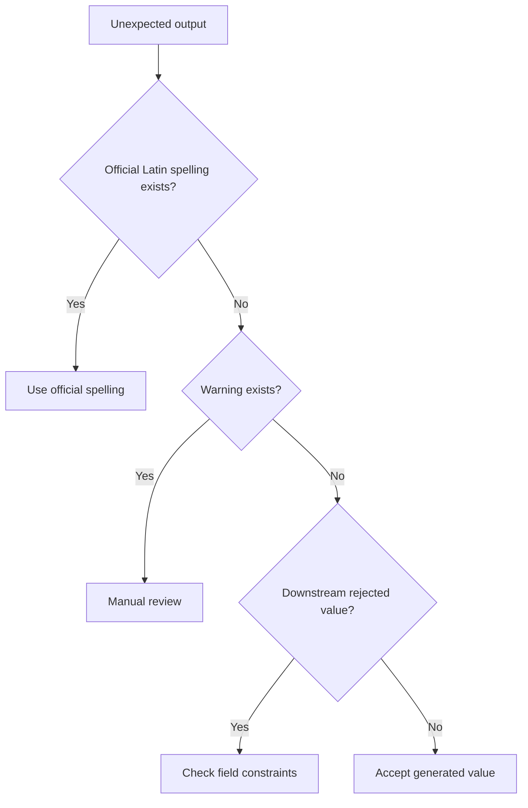

# Troubleshooting

Use this guide when output looks wrong, batch imports fail, or review queues become noisy.

## Warning codes

| Code | Meaning | Severity | Fix |
|---|---|---:|---|
| `no_hebrew_detected` | Input contains no Hebrew letters | Low | Treat as existing Latin spelling; confirm source if needed |
| `mixed_hebrew_latin_input` | Hebrew and Latin appear together | Medium | Verify whether Latin segment is official |
| `unpointed_hebrew_ambiguous_vowels` | Hebrew source has no niqqud and vowels are uncertain | Medium/High | Use official spelling, add niqqud, or ask customer |
| `unpointed_hebrew_dagesh_not_marked` | ב/כ/פ may be B/V, K/KH, P/F | Medium | Review names before high-impact use |
| `known-name-override` | Dictionary supplied common spelling | Low | Keep source note; override if customer document differs |

## Common problems

### Output is missing vowels

Cause: Hebrew names are usually written without niqqud. The helper cannot always infer A/E/I/O/U.

Example:

```bash
python scripts/transliteration-helper-cli.py validate "אבתיה"
```

Fixes:

1. Use an official Latin spelling when available.
2. Add a project-specific override.
3. Ask the customer to confirm.
4. Use niqqud for internal quality checks when available.

### `כהן` returns `KOHEN`, but the customer uses `COHEN`

Cause: the helper uses a passport-aware convention, while many people use established family spellings.

Fix: preserve the customer’s official or confirmed spelling. Store `latin_source=passport`, `contract`, or `customer-confirmed`.

### `צבי` returns `ZVI`, but another system expects `TZVI`

Cause: different systems use different צ conventions.

Fix:

```bash
python scripts/transliteration-helper-cli.py transliterate --strict --tzadi-style tz "צבי"
```

Use one policy per integration and document exceptions.

### Mixed Hebrew/Latin warnings appear often

Cause: input fields may contain notes, nicknames, or existing English spellings.

Fix:

1. Split notes from names.
2. Preserve existing Latin spellings when official.
3. Reject mixed input in strict pipelines:

```bash
python scripts/transliteration-helper-cli.py transliterate --reject-mixed "דוד Cohen"
```

### CLI cannot find the client

Cause: the project was not installed and the importable module is not available.

Fix: install the project or run commands from the package root:

```bash
pip install -e .
python scripts/transliteration-helper-cli.py transliterate "דוד"
```

### CSV batch says `CSV column not found`

Cause: the default column is `hebrew_name`.

Fix:

```bash
python scripts/transliteration-helper-cli.py batch -i customers.csv --input-column name_he
```

### Output case is wrong

Cause: default output is uppercase.

Fix:

```bash
python scripts/transliteration-helper-cli.py transliterate --case title "שרה לוי"
```

### Apostrophes break a downstream system

Cause: some legacy systems reject `'`.

Fix:

1. Keep the canonical transliteration in the source record.
2. Create a system-specific export transformation.
3. Document the transformation in the integration notes.

### Names become duplicates after import

Cause: generated transliteration and existing spelling differ.

Examples:

| Existing | Generated |
|---|---|
| COHEN | KOHEN |
| CHANA | HANA |
| TZVI | ZVI |

Fix: match customers using stable identifiers such as phone, email, customer ID, or tax/customer number. Do not merge only by name.

### Pointed Hebrew output differs from unpointed output

Cause: niqqud supplies vowels and dagesh information.

Fix: prefer pointed input when it is reliable, but confirm final spelling with official documents for high-impact use.

## Operational triage



## Support checklist

When opening an internal issue, include:

- Input value.
- Normalized value.
- Generated Latin output.
- Warning codes.
- Desired output.
- Source of desired output.
- Command or code path.
- Date in `DD/MM/YYYY`.
- Downstream system name and field limits.
