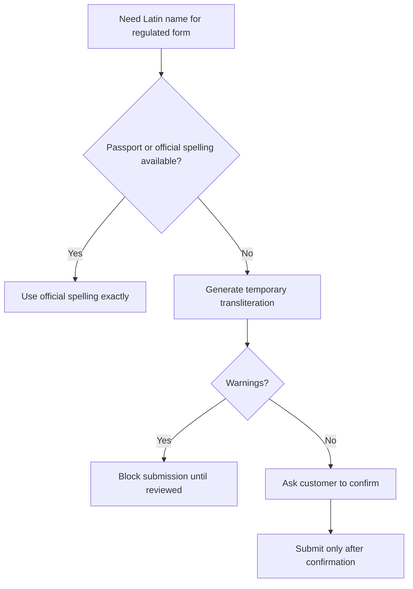

# Workflow guide

Use these workflows to add transliteration to day-to-day Israeli business and consumer processes.

## Workflow 1: New customer record

Goal: create a Latin-script customer name without losing the Hebrew source.

1. Capture the Hebrew name exactly as supplied.
2. Ask whether an official Latin spelling exists.
3. If an official spelling exists, store it and mark the source.
4. If no official spelling exists, run the transliteration helper.
5. Store `original`, `normalized`, `latin`, `warnings`, `source`, `review_status`, and `review_date`.
6. Send rows with warnings to manual review before using them in payments, travel, insurance, or bank forms.

Example:

```bash
python scripts/transliteration-helper-cli.py transliterate --format json "דוד כהן"
```

Recommended storage fields:

| Field | Example |
|---|---|
| `hebrew_name` | `דוד כהן` |
| `latin_name` | `DAVID KOHEN` |
| `latin_source` | `system-generated` |
| `review_status` | `not-required` |
| `review_date` | `03/06/2026` |

## Workflow 2: Freelancer invoice in English

Goal: issue an English invoice or receipt while preserving the legal Hebrew record.

1. Keep the Hebrew name in the accounting record.
2. Generate a title-case Latin spelling for the English-facing document.
3. Translate professional descriptions, not personal names.
4. Keep invoice amounts with Israeli currency formatting, for example `₪1,250`.
5. Store the transliteration output in a note or custom field.

Command:

```bash
python scripts/transliteration-helper-cli.py transliterate --case title "שרה לוי"
```

Document example:

```text
Customer: Sara Levi
Amount: ₪1,250
Issue date: 03/06/2026
Source: system-generated transliteration, no warnings
```

## Workflow 3: Batch CRM cleanup

Goal: import a Hebrew customer file into a CRM that requires Latin script.

Input `customers.csv`:

```csv
customer_id,hebrew_name,phone
1001,דוד כהן,050-0000000
1002,שרה לוי,052-0000000
1003,אבתיה,054-0000000
```

Run:

```bash
python scripts/transliteration-helper-cli.py batch \
  -i customers.csv \
  --input-column hebrew_name \
  --format csv \
  -o customers_latin.csv
```

Review every row where `warnings` is not empty. Do not overwrite a Latin name that already exists in the CRM unless the source is less reliable than the new value.

## Workflow 4: E-commerce shipping export

Goal: prepare shipping labels for a provider that accepts Latin characters only.

1. Export open orders.
2. Transliterate customer names only.
3. Leave addresses under the shipping provider’s rules; do not transliterate address fields unless the carrier requires it.
4. Preserve hyphens and apostrophes.
5. Run a sample through the shipping provider before bulk upload.

Recommended review triggers:

- Mixed Hebrew/Latin input.
- Names with ו, י, ה, כ, פ, צ where official spelling is unknown.
- Names longer than the carrier’s maximum field length.
- Apostrophes rejected by the carrier.

## Workflow 5: Form preparation for travel or regulated submission

Goal: avoid mismatch with official records.

1. Request passport spelling first.
2. If passport spelling is unavailable, use the helper only as a temporary placeholder.
3. Mark every generated spelling as `pending-customer-confirmation`.
4. Confirm with the customer before submission.
5. Keep a copy of the confirmation date and channel.

Do not submit generated spelling to high-impact workflows when warnings exist.



## Workflow 6: Duplicate detection after migration

Goal: detect duplicate customers caused by variant spelling.

1. Group records by normalized phone, email, or ID where available.
2. Compare Latin names within each group.
3. Flag common variants such as `COHEN/KOHEN`, `TZVI/ZVI`, `CHANA/HANA`.
4. Merge only after business approval.
5. Keep an audit record.

## Workflow 7: Adding local overrides

Goal: preserve customer-preferred or official spellings.

1. Export known official spellings from existing records.
2. Store overrides in the calling application.
3. Check the override map before calling the client.
4. Store `latin_source=override-official`.
5. Review overrides periodically.

Pseudo-code:

```python
overrides = {"כהן": "COHEN"}

def latin_for_customer(hebrew_name):
    if hebrew_name in overrides:
        return overrides[hebrew_name], "override-official"
    result = client.transliterate(hebrew_name)
    return result.latin, "system-generated"
```

## Workflow 8: Manual review queue

Goal: make warnings operationally useful.

Columns:

| Column | Purpose |
|---|---|
| `hebrew_name` | Source value |
| `latin_generated` | System output |
| `warnings` | Reason for review |
| `reviewer` | Person who approved |
| `review_status` | `pending`, `approved`, `changed`, `rejected` |
| `review_date` | `DD/MM/YYYY` |
| `final_latin_name` | Approved value |

Review rules:

- Approve generated output only when it matches a reliable source or customer confirmation.
- Change the output when a passport or contract shows a different spelling.
- Reject the row when the Hebrew source is not a personal name.
