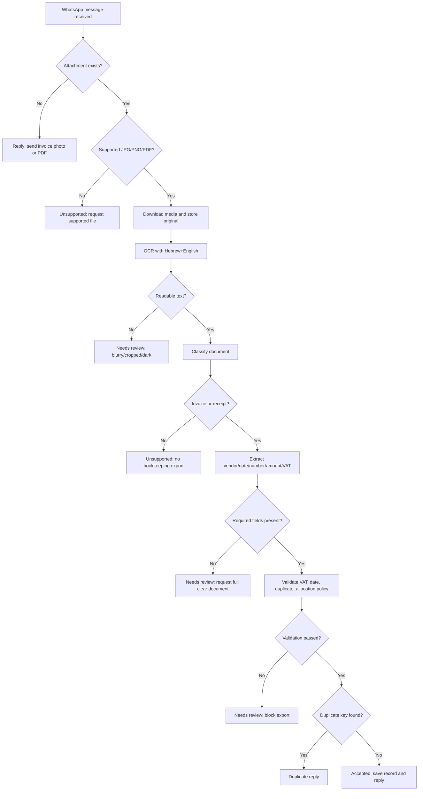

# WhatsApp Invoice Processor

Use this skill to build and operate a WhatsApp invoice intake flow for Israeli small businesses, freelancers, consumers, office managers, and bookkeeping teams. Treat WhatsApp as the capture channel, OCR as the extraction layer, validation as the control layer, and the chat reply as the receipt confirmation.

The package is provider-neutral. Use it with Meta WhatsApp Cloud API, an Israeli WhatsApp Business provider, a private webhook, a manual export from WhatsApp, or a secure folder containing invoice images and OCR text. Keep the original image/PDF, extract structured fields, route uncertainty to review, and send a short confirmation only after the document is safely classified.

> Example reply: נקלטה חשבונית מס/קבלה מ״א.ב. שירותים בע״מ״ על סך ₪117.00, כולל מע״מ ₪18.00, תאריך 14/02/2026. מספר מסמך: 8841. תודה.

## Core fields

| Field | Hebrew labels | Required | Handling rule |
|---|---|---:|---|
| `vendor_name` | שם עסק, שם ספק | Yes | Prefer the printed supplier header, not the WhatsApp display name. |
| `vendor_tax_id` | ח.פ., ע.מ., עוסק מורשה, עוסק פטור | Recommended | Preserve 8–9 digits; validate only with a trusted local validator. |
| `document_type` | חשבונית מס, חשבונית מס/קבלה, קבלה, חשבונית זיכוי | Yes | Reject pro forma, quote, and payment demand as unsupported. |
| `invoice_number` | מספר חשבונית, מס׳ מסמך, קבלה מס׳ | Recommended | Preserve leading zeros and alphanumeric prefixes. |
| `issue_date` | תאריך, תאריך הפקה | Yes | Parse Israeli dates as DD/MM/YYYY and store ISO internally. |
| `total_amount` | סה״כ לתשלום, סך הכול, כולל מע״מ | Yes | Normalize ₪, commas, and decimal points. |
| `vat_amount` | מע״מ, מס ערך מוסף, VAT | Conditional | Required for tax invoices unless clearly exempt or zero-rated. |
| `amount_before_vat` | לפני מע״מ, subtotal | Optional | Derive only when total and VAT are consistent. |
| `allocation_number` | מספר הקצאה, חשבונית ישראל | Conditional | Require only according to configured Israeli policy and threshold. |
| `status` | סטטוס | Yes | Use `accepted`, `needs_review`, `duplicate`, `unsupported`, or `rejected`. |

## Document classification

Classify **חשבונית מס** and **חשבונית מס/קבלה** as tax-significant documents that require VAT validation. Classify **קבלה** as a payment receipt; do not invent VAT if no VAT line is visible. Classify **חשבונית זיכוי** as a credit flow and preserve the sign. Classify **חשבונית פרופורמה**, **הצעת מחיר**, **דרישת תשלום**, card slips without supplier invoice details, and non-invoice screenshots as `unsupported`.

## Decision tree



## Extraction rules

1. Preserve the original WhatsApp media exactly as received.
2. Create a working copy for rotation, deskew, contrast, and OCR.
3. Enable Hebrew and English OCR; support mixed Hebrew/English invoices.
4. Normalize `מע"מ`, `מע״מ`, `מעמ`, `סה"כ`, `סה״כ`, `ש"ח`, `₪`, decimal comma, and thousands separators.
5. Prefer labelled totals over the largest numeric value.
6. Ignore phone numbers, dates, ID numbers, customer numbers, card suffixes, and item quantities when selecting amounts.
7. Store field evidence, OCR line, confidence, and validation warning for each extracted field.
8. Keep WhatsApp received date separate from the printed invoice date.

## Amount precedence

Use this order when amounts conflict: `סה״כ לתשלום` or `total due`; VAT line; subtotal line; payment amount for receipt; largest currency amount only as low-confidence fallback. For Israeli tax invoices, validate `subtotal + VAT = total` and validate VAT rate by document date. Use a rounding tolerance such as ₪0.02 for normal rounding, but route mixed-rate, exempt, or unclear documents to review.

## Edge cases

- **עוסק פטור receipt:** accept total without VAT and reply “לא זוהה מע״מ במסמך”.
- **Cropped image:** do not infer missing supplier, number, or total.
- **Forwarded screenshot:** ignore WhatsApp UI timestamps and phone numbers.
- **Credit invoice:** preserve negative amount or mark credit status according to accounting policy.
- **Foreign currency:** mark `needs_review` unless the target accounting system supports the currency workflow.
- **Allocation number:** check only when configured policy says it is required for that document type and amount.
- **Duplicate webhook:** use WhatsApp message ID and a document dedupe key.

## Confirmation templates

Accepted with VAT:

```text
נקלטה {document_type} מ״{vendor_name}״ על סך ₪{total_amount}, כולל מע״מ ₪{vat_amount}, תאריך {DD/MM/YYYY}. מספר מסמך: {invoice_number}. תודה.
```

Accepted without VAT:

```text
נקלטה {document_type} מ״{vendor_name}״ על סך ₪{total_amount}, תאריך {DD/MM/YYYY}. לא זוהה מע״מ במסמך. תודה.
```

Needs review:

```text
המסמך התקבל, אבל נדרש אימות ידני: {reason}. נא לשלוח צילום חד וברור של כל המסמך, כולל שם העסק, תאריך, מספר מסמך וסכום סופי.
```

Duplicate:

```text
המסמך כבר נקלט קודם: {document_type} מספר {invoice_number} מ״{vendor_name}״ על סך ₪{total_amount}, תאריך {DD/MM/YYYY}.
```

## Production checklist

- Verify WhatsApp webhook signatures and tokens.
- Download media immediately before provider URLs expire.
- Store originals in private encrypted storage.
- Mask phone numbers, personal IDs, bank details, card suffixes, and full OCR text in logs.
- Configure VAT rates by effective date, not as a constant.
- Configure invoice allocation-number policy by effective date and threshold.
- Block export for `needs_review`, `unsupported`, and unresolved duplicate records.
- Preserve audit events for corrections and manual overrides.
- Keep group-chat replies generic unless a documented business process permits details.
- Maintain regression fixtures for every production correction.
- Verify current Israel Tax Authority, privacy, and WhatsApp requirements before deployment.

## Anti-patterns

Do not book a quote as an invoice. Do not use WhatsApp contact name as vendor name. Do not silently “fix” VAT mismatch. Do not store invoice photos in public buckets. Do not send the full OCR text back in WhatsApp. Do not train external models on invoices without a lawful basis and contract. Do not delete original media before retention requirements are satisfied.

## Troubleshooting shortcuts

- No webhook: check callback URL, TLS, verification token, and provider configuration.
- Media not found: token expired or download delayed; ask sender to resend if the provider URL expired.
- Hebrew OCR gibberish: enable Hebrew OCR, rotate, deskew, and improve contrast on a working copy.
- Wrong total: prefer labelled totals and filter IDs/dates/phone numbers.
- VAT mismatch: check date-specific VAT rate and mixed/exempt lines.
- No reply: check WhatsApp service window, message templates, E.164 phone formatting, and rate limits.

## Local helper

Use `whatsapp_invoice_processor/client.py` for typed sync and async parsing of OCR text. Use `scripts/whatsapp-invoice-processor-cli.py` for parse, reply, batch, and demo commands.

```bash
python scripts/whatsapp-invoice-processor-cli.py parse sample.txt --json
python scripts/whatsapp-invoice-processor-cli.py reply sample.txt --lang he
python scripts/whatsapp-invoice-processor-cli.py batch ./incoming --out ./processed
pytest scripts/test_whatsapp_invoice_processor_client.py
```
