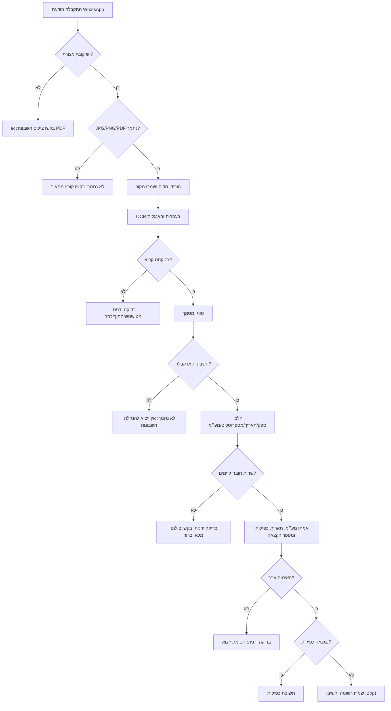

# WhatsApp Invoice Processor

השתמשו בסקיל לבניית תהליך קליטת חשבוניות דרך WhatsApp עבור עסקים קטנים, עצמאים, פרילנסרים, צרכנים, מנהלות משרד וצוותי הנהלת חשבונות בישראל. התייחסו ל-WhatsApp כערוץ קליטה, ל-OCR כשכבת חילוץ, לכללי אימות כשכבת בקרה, ולתשובת הצ׳אט כאישור קליטה.

הפתרון ניטרלי מבחינת ספק. הפעילו אותו עם WhatsApp Cloud API, ספק WhatsApp Business, webhook פרטי, ייצוא ידני מצ׳אט או תיקייה מאובטחת של קבצים. שמרו את הקובץ המקורי, חלצו שדות מובנים, העבירו אי-ודאות לבדיקה ידנית, ושלחו אישור קצר רק אחרי סיווג בטוח.

> דוגמה: נקלטה חשבונית מס/קבלה מ״א.ב. שירותים בע״מ״ על סך ₪117.00, כולל מע״מ ₪18.00, תאריך 14/02/2026. מספר מסמך: 8841. תודה.

## שדות מרכזיים

| שדה | תוויות נפוצות | חובה | כלל טיפול |
|---|---|---:|---|
| `vendor_name` | שם עסק, שם ספק | כן | העדיפו את כותרת הספק במסמך, לא את שם איש הקשר ב-WhatsApp. |
| `vendor_tax_id` | ח.פ., ע.מ., עוסק מורשה, עוסק פטור | מומלץ | שמרו 8–9 ספרות; בצעו אימות רק עם מנגנון אמין. |
| `document_type` | חשבונית מס, חשבונית מס/קבלה, קבלה, חשבונית זיכוי | כן | דחו פרופורמה, הצעת מחיר ודרישת תשלום כלא נתמכים. |
| `invoice_number` | מספר חשבונית, מס׳ מסמך, קבלה מס׳ | מומלץ | שמרו אפסים מובילים וקידומות. |
| `issue_date` | תאריך, תאריך הפקה | כן | פרשו תאריך ישראלי כ-DD/MM/YYYY ושמרו פנימית כ-ISO. |
| `total_amount` | סה״כ לתשלום, סך הכול, כולל מע״מ | כן | נרמלו ₪, פסיקים ונקודות עשרוניות. |
| `vat_amount` | מע״מ, מס ערך מוסף, VAT | מותנה | חובה בחשבונית מס, אלא אם מופיע פטור או שיעור אפס. |
| `amount_before_vat` | לפני מע״מ, subtotal | רשות | חשבו רק כשהסכום הכולל והמע״מ עקביים. |
| `allocation_number` | מספר הקצאה, חשבונית ישראל | מותנה | דרשו רק לפי מדיניות ישראלית מוגדרת וסף סכום. |
| `status` | סטטוס | כן | `accepted`, `needs_review`, `duplicate`, `unsupported`, `rejected`. |

## סיווג מסמכים

סווגו **חשבונית מס** ו-**חשבונית מס/קבלה** כמסמכים בעלי משמעות מס ודורשים בדיקת מע״מ. סווגו **קבלה** כאסמכתת תקבול; אל תוסיפו מע״מ אם אין שורה ברורה. סווגו **חשבונית זיכוי** כמסלול זיכוי ושמרו סימן שלילי. סווגו **חשבונית פרופורמה**, **הצעת מחיר**, **דרישת תשלום**, שובר אשראי ללא פרטי ספק וצילומי מסך שאינם חשבונית כ-`unsupported`.

## עץ החלטה



## כללי חילוץ

1. שמרו את קובץ ה-WhatsApp המקורי בדיוק כפי שהתקבל.
2. צרו עותק עבודה לסיבוב, יישור, שיפור ניגודיות ו-OCR.
3. הפעילו OCR בעברית ובאנגלית כדי לתמוך במסמכים מעורבים.
4. נרמלו `מע"מ`, `מע״מ`, `מעמ`, `סה"כ`, `סה״כ`, `ש"ח`, `₪`, פסיק עשרוני ומפרידי אלפים.
5. העדיפו סכומים עם תווית על פני המספר הגדול ביותר.
6. התעלמו ממספרי טלפון, תאריכים, מספרי זהות, מספרי לקוח, סיומות אשראי וכמויות פריטים.
7. שמרו ראיה לכל שדה: שורת OCR, רמת ודאות ואזהרת אימות.
8. שמרו בנפרד את תאריך הודעת WhatsApp ואת תאריך המסמך המודפס.

## סדר עדיפות לסכומים

העדיפו `סה״כ לתשלום`; אחר כך שורת מע״מ; אחר כך סכום לפני מע״מ; אחר כך סכום תקבול בקבלה; ורק בסוף הסכום הגדול ביותר עם סימן מטבע כברירת מחדל ברמת ודאות נמוכה. בחשבונית מס ישראלית אמתו `סכום לפני מע״מ + מע״מ = סה״כ` ואמתו שיעור מע״מ לפי תאריך המסמך. השתמשו בטולרנס כגון ₪0.02 לעיגול רגיל, אך העבירו מסמכים עם שיעורים מעורבים, פטורים או טקסט לא ברור לבדיקה.

## מקרי קצה

- **קבלה של עוסק פטור:** קבלו סכום ללא מע״מ והשיבו “לא זוהה מע״מ במסמך”.
- **צילום חתוך:** אל תנחשו ספק, מספר מסמך או סכום סופי.
- **צילום מסך מועבר:** התעלמו ממספרי טלפון ושעות מתוך ממשק WhatsApp.
- **חשבונית זיכוי:** שמרו סכום שלילי או סמנו מסלול זיכוי לפי מדיניות הנהלת חשבונות.
- **מטבע זר:** סמנו `needs_review` אלא אם מערכת היעד תומכת בכך.
- **מספר הקצאה:** בדקו רק כאשר המדיניות המוגדרת מחייבת זאת לפי סוג מסמך וסכום.
- **אירוע webhook כפול:** השתמשו במזהה הודעת WhatsApp ובמפתח כפילות של המסמך.

## תבניות תשובה

נקלט עם מע״מ:

```text
נקלטה {document_type} מ״{vendor_name}״ על סך ₪{total_amount}, כולל מע״מ ₪{vat_amount}, תאריך {DD/MM/YYYY}. מספר מסמך: {invoice_number}. תודה.
```

נקלט ללא מע״מ:

```text
נקלטה {document_type} מ״{vendor_name}״ על סך ₪{total_amount}, תאריך {DD/MM/YYYY}. לא זוהה מע״מ במסמך. תודה.
```

נדרשת בדיקה:

```text
המסמך התקבל, אבל נדרש אימות ידני: {reason}. נא לשלוח צילום חד וברור של כל המסמך, כולל שם העסק, תאריך, מספר מסמך וסכום סופי.
```

כפילות:

```text
המסמך כבר נקלט קודם: {document_type} מספר {invoice_number} מ״{vendor_name}״ על סך ₪{total_amount}, תאריך {DD/MM/YYYY}.
```

## רשימת בדיקה לייצור

- אמתו חתימות webhook וטוקנים.
- הורידו מדיה מיד כדי למנוע פקיעת URL אצל הספק.
- שמרו מקור באחסון פרטי ומוצפן.
- הסתירו בלוגים מספרי טלפון, תעודות זהות, פרטי בנק, סיומות כרטיסים וטקסט OCR מלא.
- הגדירו שיעורי מע״מ לפי תאריך תחולה.
- הגדירו מדיניות מספר הקצאה לפי תאריך תחולה וסף סכום.
- חסמו ייצוא עבור `needs_review`, `unsupported` וכפילות לא פתורה.
- שמרו אירועי ביקורת לתיקונים ולאישורים ידניים.
- בקבוצות WhatsApp שלחו תשובה כללית אלא אם קיים תהליך עסקי מתועד.
- החזיקו תרחישי רגרסיה לכל תיקון מהשטח.
- בדקו דרישות עדכניות של רשות המסים, פרטיות ו-WhatsApp לפני הפעלה.

## טעויות נפוצות

אל תרשמו הצעת מחיר כחשבונית. אל תשתמשו בשם איש הקשר כשם ספק. אל “תתקנו” בשקט אי התאמת מע״מ. אל תשמרו צילומי חשבוניות באחסון ציבורי. אל תחזירו בצ׳אט את כל טקסט ה-OCR. אל תאמנו מודלים חיצוניים על חשבוניות ללא בסיס חוקי והסכם עיבוד מידע. אל תמחקו קובץ מקור לפני סיום חובות שמירה.

## קיצור תקלות

- אין webhook: בדקו URL, TLS, טוקן אימות והגדרות ספק.
- מדיה לא יורדת: הטוקן פג או ההורדה התעכבה; בקשו שליחה חוזרת אם ה-URL פג.
- OCR עברית משובש: הפעילו עברית, סובבו, ישרו ושפרו ניגודיות בעותק עבודה.
- סכום שגוי: העדיפו תווית סה״כ וסננו מזהים/תאריכים/טלפונים.
- מע״מ לא תואם: בדקו שיעור לפי תאריך ושורות מעורבות או פטורות.
- אין תשובה: בדקו חלון שירות WhatsApp, תבניות הודעה, פורמט E.164 ומגבלות קצב.

## שימוש מקומי

```bash
python scripts/whatsapp-invoice-processor-cli.py parse sample.txt --json
python scripts/whatsapp-invoice-processor-cli.py reply sample.txt --lang he
python scripts/whatsapp-invoice-processor-cli.py batch ./incoming --out ./processed
pytest scripts/test_whatsapp_invoice_processor_client.py
```
