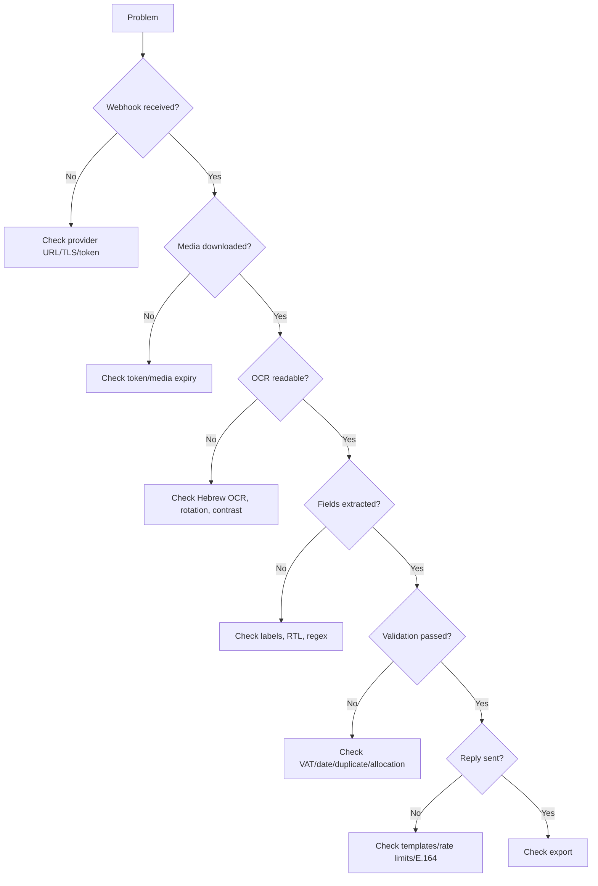

# Troubleshooting

## Fast triage

## Common symptoms

### Webhook verification fails
Check verify token, callback route, HTTPS certificate, and plain-text challenge response.

### Webhook arrives repeatedly
Acknowledge quickly, move processing to a queue, and use WhatsApp message ID as the idempotency key.

### Media download fails
Download immediately, use the right authorization header, rotate expired tokens, and ask for resend when media expired.

### Hebrew OCR is unreadable
Enable Hebrew and English OCR, detect rotation, deskew, improve contrast on a working copy, and route handwritten or thermal receipts to review.

### Vendor is wrong
Prefer top header lines and labels near ח.פ./ע.מ. Avoid lines near לכבוד, לקוח, customer, or billing address.

### Total is wrong
Prefer labelled totals. Filter phone numbers, ID numbers, dates, customer numbers, card suffixes, and quantities. Validate subtotal + VAT = total.

### VAT missing
Do not invent VAT. Support `מע"מ`, `מע״מ`, `מעמ`, and `מס ערך מוסף`. For קבלה from עוסק פטור, accept no VAT and reply clearly.

### VAT mismatch
Check date-specific VAT rate, decimal OCR errors, mixed rates, exempt lines, deposits, and rounding. Block export until reviewed.

### Date flips day/month
Default Hebrew documents to DD/MM/YYYY. Prefer printed invoice date near `תאריך` or `תאריך הפקה`; keep WhatsApp received date separately.

### Allocation number missing
Search `מספר הקצאה`, `מס׳ הקצאה`, `הקצאה`, and `חשבונית ישראל`. Block export only when configured policy requires the number.

### Duplicate missed
Normalize vendor aliases, currency, decimals, invoice number, and date. Use fuzzy matching only as a review trigger, not automatic rejection.

### Sender gets no reply
Check WhatsApp service window, approved templates, phone formatting, provider rate limits, and send-message permissions.

### Group privacy risk
Disable group processing by default. Use generic group replies unless a documented process permits invoice details.

### Export duplicates
Use message ID, document dedupe key, target external ID, and locked exported records.

## Safe logging

Log event time, message ID, tenant, MIME type, checksum, OCR confidence summary, warning codes, reply status, and export status. Do not log full phone numbers, full OCR text, access tokens, bank details, private URLs, or full IDs.

## Recovery playbooks

### Reprocess one message
Locate message ID, verify original checksum, rerun extraction, compare old/new results, keep both audit events, and avoid overwriting exported records without correction approval.

### Reprocess a month
Freeze export, snapshot records, reprocess to staging, compare totals/statuses/vendors, review differences, and export only approved corrections.

### Storage outage
Stop accepted acknowledgments if originals cannot be stored, queue metadata, resume before provider media expiry, request resends when needed, and document corrective action.
