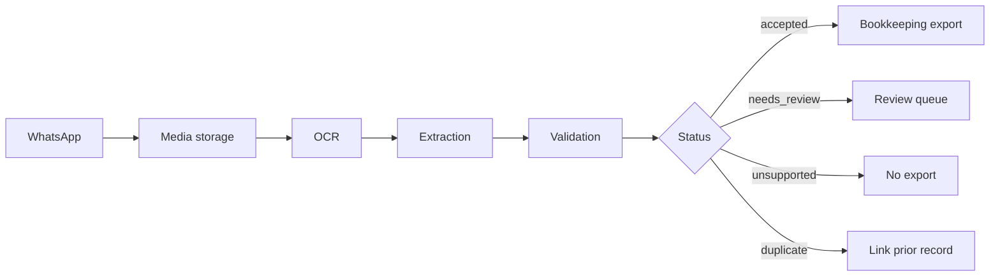
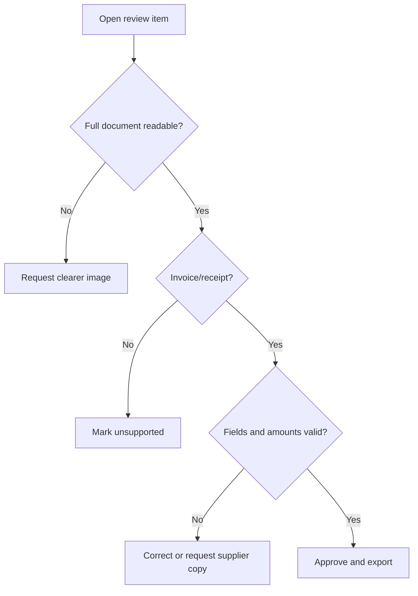

# Workflow Guide

## Workflow 1: Freelancer expense intake

Receive receipt photos from the owner or approved assistant. Download media, run Hebrew/English OCR, extract vendor/date/total/VAT if present, store by month, and reply in Hebrew with ₪ and DD/MM/YYYY.

Accepted reply:

```text
נקלטה קבלה מ״תחנת דלק המרכז״ על סך ₪248.60, תאריך 03/02/2026. לא זוהה מע״מ במסמך. תודה.
```

Review when the image is cropped, blurry, missing total, missing date, or likely not a tax document.

## Workflow 2: Small business supplier invoices

Receive invoices from vendors and employees. Require supplier identity, document number, issue date, final amount, VAT for tax invoices, and allocation number when policy requires it. Save raw media checksum, OCR evidence, validation warnings, and export state. Export accepted records nightly.



## Workflow 3: Consumer warranty archive

Accept retail receipts for warranty and reimbursement tracking. Extract vendor, date, total, and optional category. Skip tax-significant VAT validation unless explicitly needed. Store image and JSON summary privately.

## Workflow 4: Human review queue

Queue fields: received time, masked sender phone, reason, original file link, OCR text, field evidence, suggested reply, export-blocked flag. Reviewer actions: approve, correct field, request clearer image, request allocation number, mark unsupported, mark duplicate, reject.



## Workflow 5: Nightly export

Select `accepted` records with `export_status=pending`. Recompute dedupe key, verify original file checksum, map document type, send structured payload, attach original file when supported, save target external ID, and lock the record. Retry target API outages; move validation rejections to review.

## Workflow 6: Monthly reconciliation

Compare incoming attachments, accepted records, review queue, duplicates, unsupported items, exported records, and target accounting totals. Sample accepted records manually. Confirm private image links remain accessible.

```text
Month: 02/2026
Incoming: 318
Accepted: 271
Needs review: 24
Unsupported: 13
Duplicate: 10
Exported: 269
Export pending: 2
Action: inspect cropped supermarket receipt totals.
```

## Workflow 7: Local folder processing

Export WhatsApp media manually to a secure folder. Run OCR separately or place `.txt` fixtures beside images. Use the CLI batch command to produce JSON. Import accepted records to a spreadsheet or bookkeeping staging table.

```bash
python scripts/whatsapp-invoice-processor-cli.py batch ./incoming --out ./processed
```

## Workflow 8: Sender correction

When a sender replies “הסכום הוא 1,416 ולא 416”, link to the latest record from that sender, mark `needs_review`, do not overwrite exported amounts automatically, ask for a clearer full document if needed, and keep an audit event with before/after values.
