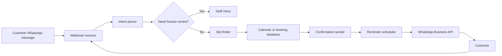
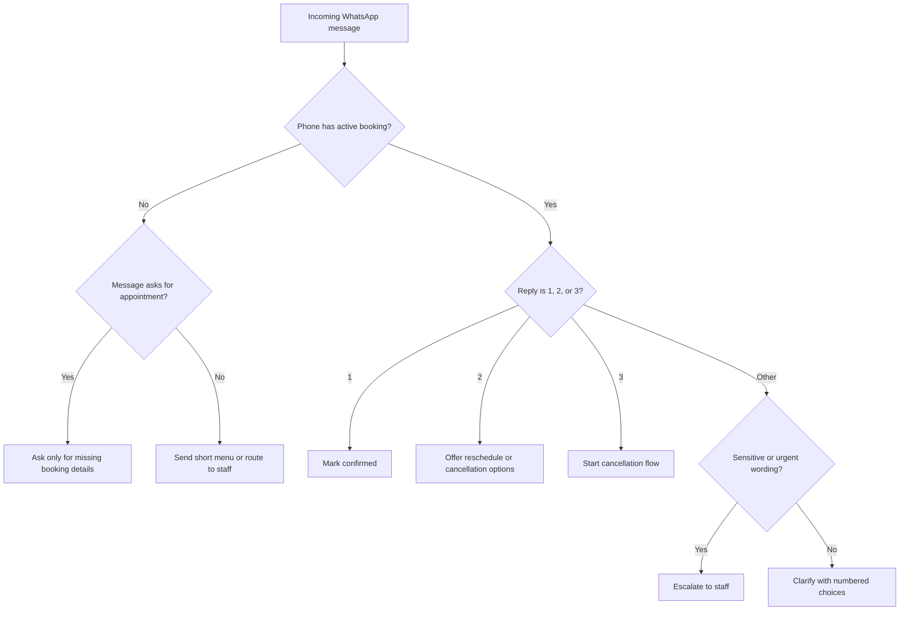
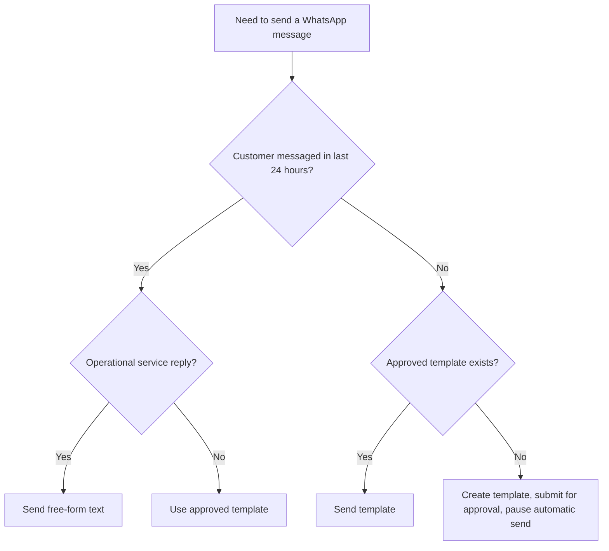
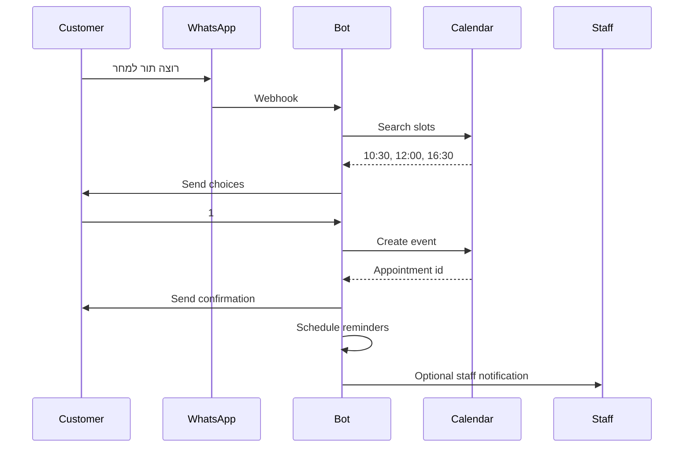
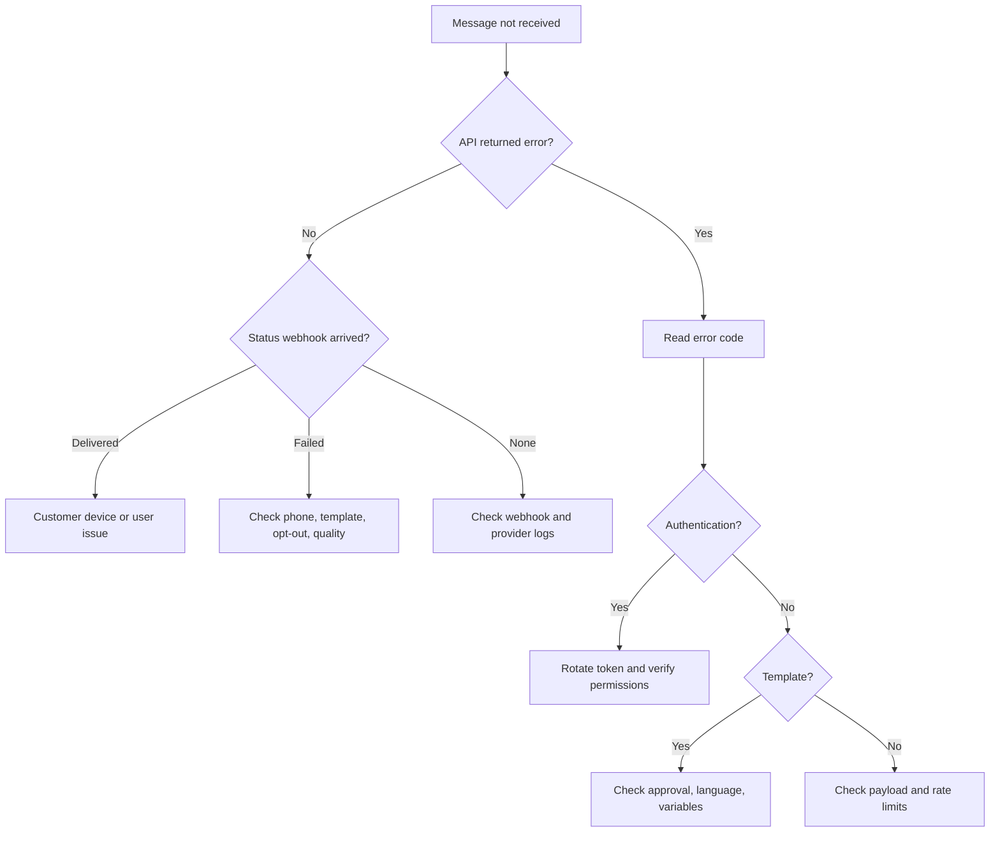

# WhatsApp Scheduling Bot

## Purpose

Build a practical appointment assistant for Israeli service businesses that use WhatsApp as the common customer-service channel. The bot books appointments, confirms reservations, sends Hebrew reminders, handles simple replies, and escalates ambiguous or sensitive cases to staff. Use Israel-local defaults: `Asia/Jerusalem`, `DD/MM/YYYY`, 24-hour time, prices with `₪`, Hebrew wording, Sunday-Thursday work week, Friday optional, Saturday closed by default.

Typical businesses include salons, barbers, cosmeticians, private clinics, tutors, driving instructors, consultants, accountants, photographers, technicians, repair services, trainers, and local freelancers.

## Scope

Use for:

- New appointment booking over WhatsApp.
- Confirmation, reminder, reschedule, cancellation, waiting-list, and opt-out flows.
- Hebrew WhatsApp templates for Israeli customers.
- Connection to a calendar, CRM, spreadsheet import, or custom booking database.
- Operational runbooks, tests, troubleshooting, and production readiness.

Do not use for:

- Unsolicited marketing or promotional blasts.
- Personal WhatsApp or unofficial WhatsApp Web automation.
- Circumventing template review, rate limits, opt-outs, or legal restrictions.
- Professional advice in medical, legal, financial, insurance, therapy, or minor-related contexts.

## Fast Start

1. Register a WhatsApp Business Platform sender.
2. Store `WHATSAPP_ACCESS_TOKEN` and `WHATSAPP_PHONE_ID` outside source control.
3. Create approved Hebrew templates:
   - `appointment_confirmation_he`
   - `appointment_reminder_he`
   - `appointment_reschedule_he`
   - `appointment_cancelled_he`
   - `appointment_waitlist_offer_he`
   - `opt_out_ack_he`
4. Connect an appointment store: calendar, CRM, database, or CSV import.
5. Install the package, run the client, and execute the tests.

```bash
export WHATSAPP_ACCESS_TOKEN="EAAB..."
export WHATSAPP_PHONE_ID="1234567890"
export WHATSAPP_API_VERSION="v25.0"
export BOT_BUSINESS_NAME="קליניקת הדוגמה"

pip install -e .
pip install -r requirements-dev.txt

python scripts/whatsapp-scheduling-bot-cli.py confirm \
  --to "054-123-4567" \
  --customer "דנה" \
  --service "ייעוץ ראשוני" \
  --start "2026-06-18T10:30:00+03:00" \
  --duration 45 \
  --business "קליניקת הדוגמה" \
  --price 250 \
  --location "רחוב הרצל 10, תל אביב" \
  --dry-run

pytest -q scripts
```

Expected preview:

```text
שלום דנה, נקבע לך תור לייעוץ ראשוני בקליניקת הדוגמה ביום 18/06/2026 בשעה 10:30.
משך התור: 45 דקות. מחיר: ₪250. כתובת: רחוב הרצל 10, תל אביב.
לאישור יש להשיב 1. לשינוי מועד יש להשיב 2. לביטול יש להשיב 3.
```

## Core Concepts

### Appointment State

| Status | Meaning | Messaging rule |
|---|---|---|
| `draft` | Slot suggested but not accepted | Do not send reminders |
| `pending_customer` | Customer must select or confirm | Send only clarification |
| `confirmed` | Appointment is booked | Send confirmation and reminders |
| `reschedule_requested` | Customer requested a change | Stop old reminders; offer slots |
| `cancelled` | Appointment cancelled | Stop reminders; send acknowledgement |
| `completed` | Appointment occurred | Do not send appointment reminders |
| `no_show` | Customer did not arrive | Optional neutral follow-up only |
| `blocked` | Internal calendar block | Never message a customer |

### Minimum Appointment Record

```json
{
  "appointment_id": "apt_20260618_1030_dana",
  "customer_name": "דנה",
  "customer_phone_e164": "972541234567",
  "service_name": "ייעוץ ראשוני",
  "staff_name": "נועה",
  "start_at": "2026-06-18T10:30:00+03:00",
  "duration_minutes": 45,
  "price_ils": 250,
  "location": "רחוב הרצל 10, תל אביב",
  "status": "confirmed",
  "consent_source": "customer_requested_appointment",
  "reminders": [
    {"offset_minutes": 1440, "status": "pending"},
    {"offset_minutes": 120, "status": "pending"}
  ]
}
```

## Architecture



Recommended modules:

- **Webhook receiver**: verify token, parse events, reject malformed payloads, and deduplicate provider message IDs.
- **Intent parser**: detect new appointment, reschedule, cancel, confirm, opt-out, and human-help requests.
- **Slot finder**: apply business hours, staff availability, duration, branch, buffers, holidays, and Friday/Saturday policy.
- **Calendar adapter**: write confirmed appointments to a durable calendar or database.
- **Message builder**: render Hebrew text and template parameters.
- **Reminder worker**: select due reminders and enforce idempotency.
- **Audit log**: store appointment changes, message IDs, template names, and opt-out events.

## Decision Tree: Incoming Message



## Decision Tree: Template or Free-Form Text



## Hebrew Message Templates

### Appointment Confirmation

```text
שלום {{1}}, נקבע לך תור ל{{2}} ב{{3}} ביום {{4}} בשעה {{5}}.
משך התור: {{6}} דקות. {{7}}
לאישור יש להשיב 1. לשינוי מועד יש להשיב 2. לביטול יש להשיב 3.
```

Variables: customer name, service, business, date `DD/MM/YYYY`, time `HH:MM`, duration, optional price/location/policy sentence.

### 24-Hour Reminder

```text
תזכורת: התור שלך ל{{1}} ב{{2}} נקבע למחר, {{3}}, בשעה {{4}}.
כתובת: {{5}}.
לאישור הגעה יש להשיב 1. לשינוי או ביטול יש להשיב 2.
```

### Same-Day Reminder

```text
שלום {{1}}, מזכירים שהתור שלך ל{{2}} מתקיים היום בשעה {{3}}.
אם צפוי איחור של יותר מ-10 דקות, נא לעדכן בהודעה חוזרת.
```

### Cancellation

```text
התור ל{{1}} בתאריך {{2}} בשעה {{3}} בוטל.
לקביעת מועד חדש יש להשיב "תור חדש".
```

### Reschedule Offer

```text
אפשר להזיז את התור. זמינים כרגע:
1. {{1}}
2. {{2}}
3. {{3}}
להמשך יש להשיב עם מספר האפשרות.
```

### Opt-Out Acknowledgement

```text
הבקשה התקבלה. לא יישלחו הודעות WhatsApp נוספות שאינן נדרשות לשירות שכבר הוזמן.
לקביעת תור בעתיד ניתן לפנות בטלפון {{1}}.
```

## Localization Rules

| Element | Rule | Example |
|---|---|---|
| Date | `DD/MM/YYYY` | `18/06/2026` |
| Time | 24-hour clock | `10:30` |
| Price | `₪` before amount | `₪250` |
| Phone display | Local Israeli format | `054-123-4567` |
| API phone | E.164 without `+` | `972541234567` |
| Day names | Hebrew when useful | `יום חמישי` |
| Tone | Warm, direct, concise | Avoid jokes in reminders |
| Gender | Prefer neutral wording when unknown | `נקבע לך תור` |
| Reply style | Numbered replies | `1`, `2`, `3` |
| Policy | Short and explicit | `ביטול עד 24 שעות לפני התור ללא חיוב` |

## Booking Flow



Implementation steps:

1. Parse requested service and preferred time.
2. Normalize the phone number.
3. Ask only for missing details.
4. Interpret common Hebrew expressions such as `מחר בבוקר`, `חמישי הקרוב`, and `אחרי החג`; require explicit date options for vague holiday references.
5. Apply service duration, buffers, staff availability, branch, and closing days.
6. Offer no more than three slots.
7. Create the calendar event only after a clear customer selection.
8. Send confirmation and schedule reminders.
9. Store an audit record.

## Reminder Flow

Reminder defaults:

| Offset | Purpose |
|---:|---|
| 1440 minutes | Give the customer time to reschedule |
| 120 minutes | Reduce same-day no-shows |
| 10 minutes | Use only for high-touch services where the customer opted in |

Idempotency key:

```text
{appointment_id}:{offset_minutes}:{template_name}
```

Skip reminder where:

- status is not `confirmed`;
- customer opted out;
- reminder already has a provider message ID;
- appointment start time has passed;
- phone validation fails;
- template is missing or not approved;
- current time is an unreasonable send hour and the appointment is not imminent.

## Edge Cases

### Reply is only “כן”

Use the previous bot prompt. If it requested confirmation, mark confirmed. If it offered slots, ask for a numbered choice.

### Voice note, image, sticker, or document

Store metadata and route to staff or transcription. Do not create or cancel appointments from unprocessed media.

### “אפשר היום?”

Search same-day slots. If unavailable, offer the nearest three future slots and include full dates.

### Non-Israeli phone

Accept only when the business serves the customer and WhatsApp delivery is supported. Store E.164 without forcing `+972`.

### Sensitive or regulated context

Route to staff for medical, legal, financial, therapy, insurance, minors, refunds, or cancellation-fee disputes. Keep automated text logistical and neutral.

### Multiple customers share one phone

Ask for the appointment name before changing or cancelling. Parent/child and office-admin cases are common.

### Daylight saving time

Store timezone-aware datetimes in `Asia/Jerusalem`. Recalculate reminders after every reschedule.

### No approved template

Use free-form text only inside a valid customer-service window. Otherwise submit a template and pause automatic sending.

## Anti-Patterns

Avoid:

- Mixing marketing with service reminders.
- Asking for sensitive data before a slot is available.
- Sending a reminder after the appointment starts.
- Offering too many options in one message.
- Using unofficial personal WhatsApp automation.
- Storing access tokens in source control.
- Logging full sensitive message bodies.
- Mixing `MM-DD-YYYY` and `DD/MM/YYYY`.
- Sending messages to customers who opted out.
- Treating failed API responses as delivery.
- Creating duplicate calendar events after webhook retries.
- Assuming Friday or Saturday availability.
- Accepting ambiguous replies without context.
- Letting staff edit calendar entries without syncing reminder jobs.

## Production Checklist

### Business

- [ ] Define services, durations, prices, locations, staff, buffers, cancellation rules, and late-arrival policy.
- [ ] Define work days, holiday policy, Friday hours, and Saturday closure.
- [ ] Define escalation rules for sensitive messages and payment disputes.
- [ ] Prepare customer-facing privacy and cancellation wording.

### WhatsApp

- [ ] Register WhatsApp Business Platform sender.
- [ ] Configure webhook URL and verification token.
- [ ] Subscribe to message and status events.
- [ ] Create approved Hebrew templates.
- [ ] Store access token in a secrets manager.
- [ ] Monitor template quality, delivery failures, and rate limits.

### Technical

- [ ] Use timezone-aware datetimes.
- [ ] Normalize phone numbers.
- [ ] Persist appointment and message states.
- [ ] Deduplicate webhooks and outgoing reminders.
- [ ] Add retries with exponential backoff.
- [ ] Add structured logs and alerts.
- [ ] Back up appointment data.
- [ ] Test restore and rollback.

### Compliance

- [ ] Store service relationship or opt-in source.
- [ ] Separate service reminders from marketing.
- [ ] Persist opt-out requests.
- [ ] Minimize personal data collection.
- [ ] Review Israeli anti-spam and privacy obligations.
- [ ] Review sector-specific rules for clinics, finance, insurance, education, minors, and regulated professions.

## Troubleshooting Map



## Developer Handoff

Provide:

- WhatsApp provider and phone number ID.
- Approved template names and language.
- Calendar system and event schema.
- Business hours and exception dates.
- Service catalog.
- Opt-out policy.
- Escalation rules.
- Runbook and rollback steps.
- Test scenario results.

## Source Notes

Verify public API and legal details before production. Useful sources include Meta WhatsApp Business Platform documentation, Meta Graph API documentation, Israeli Communications Law section 30A, Protection of Privacy Law, Consumer Protection Authority materials, and relevant sector regulators. See `references/api-reference.md` for URLs, request/response examples, and error tables.
