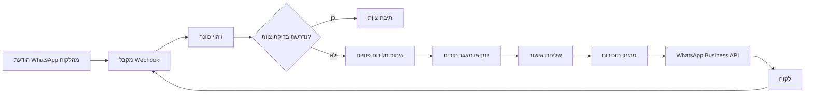
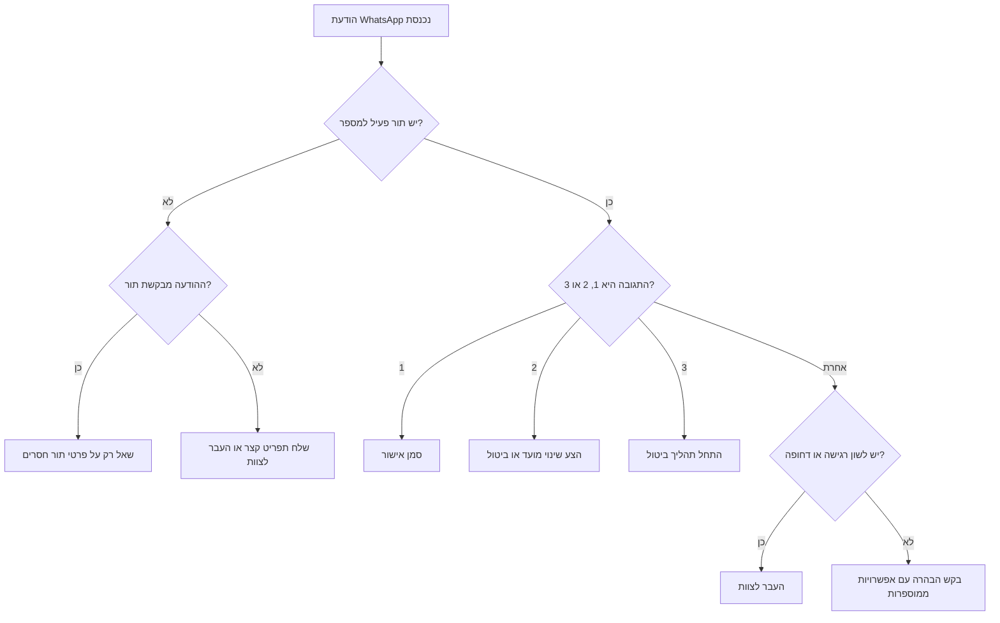
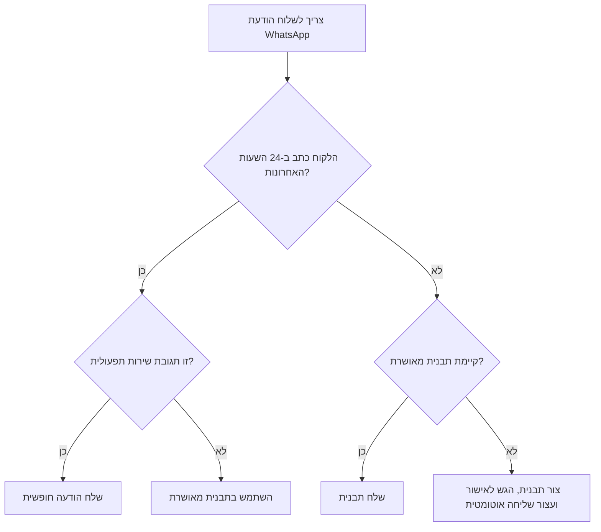
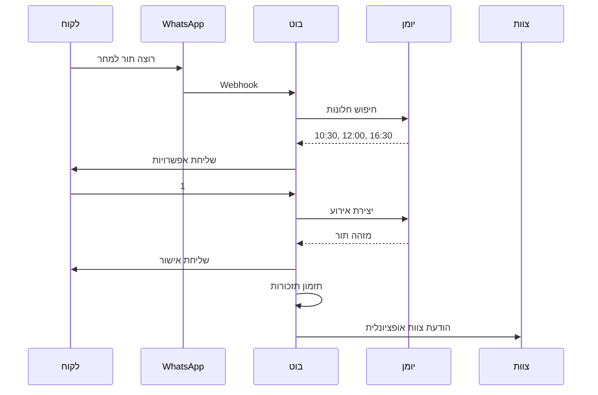
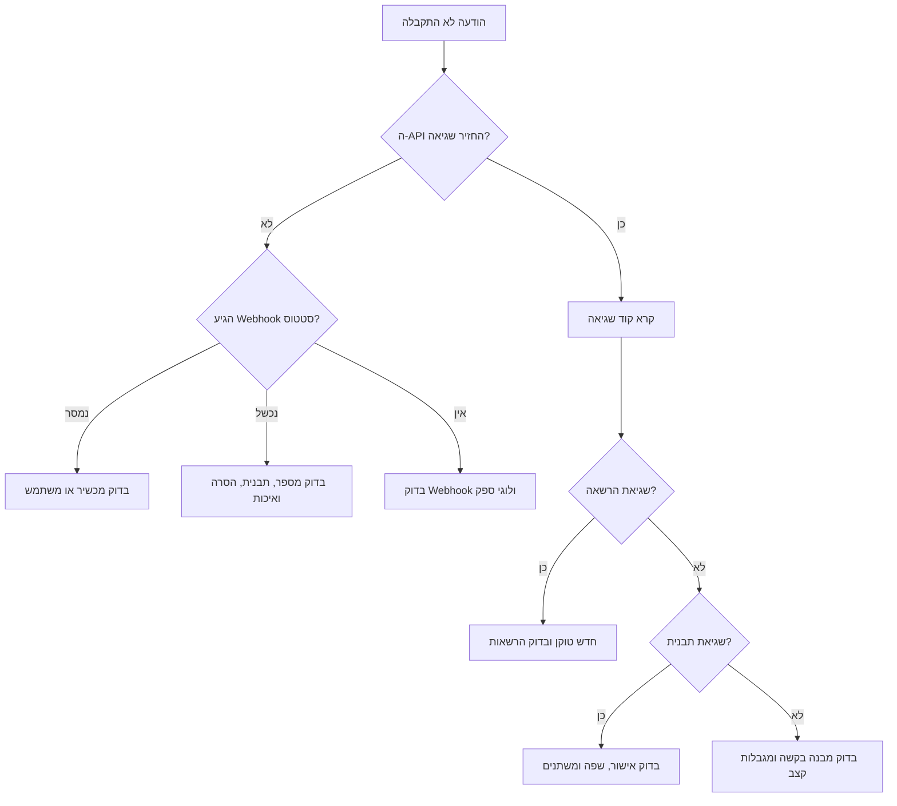

# בוט תורים ב-WhatsApp

## מטרה

בנה בוט תורים שימושי לעסקים ישראליים שמשתמשים ב-WhatsApp כערוץ שירות נפוץ. הבוט קובע תורים, מאשר הזמנות, שולח תזכורות בעברית, מטפל בתשובות פשוטות ומעביר מקרים רגישים או לא ברורים לצוות. השתמש בברירות מחדל ישראליות: `Asia/Jerusalem`, תאריך `DD/MM/YYYY`, שעון 24 שעות, מחירים עם `₪`, עברית טבעית, ראשון-חמישי כשבוע עבודה, שישי לפי החלטת העסק ושבת סגורה כברירת מחדל.

הבוט מתאים למספרות, ברבריות, מכוני יופי, קוסמטיקאיות, קליניקות פרטיות, מורים פרטיים, מורי נהיגה, יועצים, רואי חשבון, צלמים, טכנאים, מתקנים, מאמנים ונותני שירות מקומיים.

## מתי להשתמש

השתמש עבור:

- קביעת תור חדש דרך WhatsApp.
- אישור, תזכורת, שינוי מועד, ביטול, רשימת המתנה ובקשת הסרה.
- תבניות WhatsApp בעברית ללקוחות בישראל.
- חיבור ליומן, CRM, ייבוא גיליון או בסיס נתונים.
- תיק תפעול, בדיקות, פתרון תקלות והכנה לפרודקשן.

אל תשתמש עבור:

- מסרים שיווקיים לא מוזמנים.
- WhatsApp אישי או אוטומציה לא רשמית של WhatsApp Web.
- עקיפת אישור תבניות, מגבלות שליחה, בקשות הסרה או מגבלות דין.
- ייעוץ רפואי, משפטי, פיננסי, ביטוחי, טיפולי או הקשור לקטינים.

### ברירות מחדל שאומתו ברשת

השתמש ב-Graph API `v25.0` אלא אם ספק השירות דורש גרסה נתמכת אחרת. השאר את הגרסה ניתנת להגדרה. התייחס לתמחור WhatsApp Business Platform כתמחור לפי הודעה, לפי מדינה וקטגוריה. השתמש במע"מ ישראלי בשיעור `18%` מ-`01/01/2025` רק כאשר מציגים מחיר כולל מס או הנחיית חשבונית; הבוט לא צריך לחשב מסים אלא אם העסק ביקש זאת במפורש.

## התחלה מהירה

1. רשום מספר שולח ב-WhatsApp Business Platform.
2. שמור `WHATSAPP_ACCESS_TOKEN` ו-`WHATSAPP_PHONE_ID` מחוץ לקוד.
3. צור תבניות עבריות מאושרות:
   - `appointment_confirmation_he`
   - `appointment_reminder_he`
   - `appointment_reschedule_he`
   - `appointment_cancelled_he`
   - `appointment_waitlist_offer_he`
   - `opt_out_ack_he`
4. חבר מאגר תורים: יומן, CRM, בסיס נתונים או ייבוא CSV.
5. התקן את החבילה, הרץ את הלקוח ואת הבדיקות.

```bash
export WHATSAPP_ACCESS_TOKEN="EAAB..."
export WHATSAPP_PHONE_ID="1234567890"
export WHATSAPP_API_VERSION="v25.0"
export BOT_BUSINESS_NAME="קליניקת הדוגמה"

pip install -e .
pip install -r requirements-dev.txt

python scripts/whatsapp-scheduling-bot-cli.py confirm \
  --to "054-123-4567" \
  --customer "דנה" \
  --service "ייעוץ ראשוני" \
  --start "2026-06-18T10:30:00+03:00" \
  --duration 45 \
  --business "קליניקת הדוגמה" \
  --price 250 \
  --location "רחוב הרצל 10, תל אביב" \
  --dry-run

pytest -q scripts
```

פלט לדוגמה:

```text
שלום דנה, נקבע לך תור לייעוץ ראשוני בקליניקת הדוגמה ביום 18/06/2026 בשעה 10:30.
משך התור: 45 דקות. מחיר: ₪250. כתובת: רחוב הרצל 10, תל אביב.
לאישור יש להשיב 1. לשינוי מועד יש להשיב 2. לביטול יש להשיב 3.
```

## מושגי בסיס

### סטטוס תור

| סטטוס | משמעות | כלל שליחה |
|---|---|---|
| `draft` | חלון זמן הוצע אך לא אושר | לא לשלוח תזכורות |
| `pending_customer` | הלקוח צריך לבחור או לאשר | לשלוח רק הבהרה |
| `confirmed` | התור נקבע | לשלוח אישור ותזכורות |
| `reschedule_requested` | הלקוח ביקש שינוי מועד | לעצור תזכורות ישנות ולהציע מועדים |
| `cancelled` | התור בוטל | לעצור תזכורות ולשלוח אישור ביטול |
| `completed` | התור התקיים | לא לשלוח תזכורות |
| `no_show` | הלקוח לא הגיע | הודעת המשך ניטרלית בלבד, אם מתאים |
| `blocked` | חסימת יומן פנימית | לעולם לא לשלוח ללקוח |

### רשומת תור מינימלית

```json
{
  "appointment_id": "apt_20260618_1030_dana",
  "customer_name": "דנה",
  "customer_phone_e164": "972541234567",
  "service_name": "ייעוץ ראשוני",
  "staff_name": "נועה",
  "start_at": "2026-06-18T10:30:00+03:00",
  "duration_minutes": 45,
  "price_ils": 250,
  "location": "רחוב הרצל 10, תל אביב",
  "status": "confirmed",
  "consent_source": "customer_requested_appointment",
  "reminders": [
    {"offset_minutes": 1440, "status": "pending"},
    {"offset_minutes": 120, "status": "pending"}
  ]
}
```

## ארכיטקטורה



רכיבים מומלצים:

- **מקבל Webhook**: אמת טוקן, פענח אירועים, דחה מטענים לא תקינים ומנע כפילות לפי מזהה הודעה.
- **זיהוי כוונה**: אתר קביעת תור, שינוי, ביטול, אישור, הסרה ובקשת עזרה.
- **איתור חלונות פנויים**: החל שעות פעילות, זמינות צוות, משך שירות, סניף, מרווחים, חגים ומדיניות שישי/שבת.
- **מתאם יומן**: כתוב תורים מאושרים ליומן או למסד נתונים.
- **בונה הודעות**: צור טקסט עברי ופרמטרים לתבניות.
- **מנגנון תזכורות**: בחר תזכורות שהגיע זמנן ומנע כפילויות.
- **יומן ביקורת**: שמור שינויי תור, מזהי הודעות, שמות תבניות ובקשות הסרה.

## עץ החלטה: הודעה נכנסת



## עץ החלטה: תבנית או הודעה חופשית



## תבניות הודעה בעברית

### אישור תור

```text
שלום {{1}}, נקבע לך תור ל{{2}} ב{{3}} ביום {{4}} בשעה {{5}}.
משך התור: {{6}} דקות. {{7}}
לאישור יש להשיב 1. לשינוי מועד יש להשיב 2. לביטול יש להשיב 3.
```

משתנים: שם לקוח, שירות, עסק, תאריך `DD/MM/YYYY`, שעה `HH:MM`, משך, משפט אופציונלי על מחיר/כתובת/מדיניות.

### תזכורת 24 שעות לפני

```text
תזכורת: התור שלך ל{{1}} ב{{2}} נקבע למחר, {{3}}, בשעה {{4}}.
כתובת: {{5}}.
לאישור הגעה יש להשיב 1. לשינוי או ביטול יש להשיב 2.
```

### תזכורת באותו יום

```text
שלום {{1}}, מזכירים שהתור שלך ל{{2}} מתקיים היום בשעה {{3}}.
אם צפוי איחור של יותר מ-10 דקות, נא לעדכן בהודעה חוזרת.
```

### ביטול

```text
התור ל{{1}} בתאריך {{2}} בשעה {{3}} בוטל.
לקביעת מועד חדש יש להשיב "תור חדש".
```

### הצעת שינוי מועד

```text
אפשר להזיז את התור. זמינים כרגע:
1. {{1}}
2. {{2}}
3. {{3}}
להמשך יש להשיב עם מספר האפשרות.
```

### אישור בקשת הסרה

```text
הבקשה התקבלה. לא יישלחו הודעות WhatsApp נוספות שאינן נדרשות לשירות שכבר הוזמן.
לקביעת תור בעתיד ניתן לפנות בטלפון {{1}}.
```

## כללי לוקליזציה

| רכיב | כלל | דוגמה |
|---|---|---|
| תאריך | `DD/MM/YYYY` | `18/06/2026` |
| שעה | שעון 24 שעות | `10:30` |
| מחיר | `₪` לפני הסכום | `₪250` |
| הצגת טלפון | פורמט ישראלי מקומי | `054-123-4567` |
| טלפון API | E.164 ללא `+` | `972541234567` |
| ימי שבוע | עברית כאשר מועיל | `יום חמישי` |
| טון | נעים, ישיר וקצר | בלי בדיחות בתזכורות |
| מגדר | ניסוח ניטרלי כשלא ידוע | `נקבע לך תור` |
| תשובות | אפשרויות ממוספרות | `1`, `2`, `3` |
| מדיניות | קצרה ומפורשת | `ביטול עד 24 שעות לפני התור ללא חיוב` |

## תהליך קביעת תור



בצע:

1. זהה שירות ומועד מועדף.
2. נרמל מספר טלפון.
3. שאל רק על פרטים חסרים.
4. פרש ביטויי זמן כמו `מחר בבוקר`, `חמישי הקרוב` ו-`אחרי החג`; בביטוי עמום הצע תאריכים מפורשים.
5. החל משך שירות, מרווחים, זמינות צוות, סניף וימי סגירה.
6. הצע עד שלושה מועדים.
7. צור אירוע ביומן רק אחרי בחירה ברורה.
8. שלח אישור ותזמן תזכורות.
9. שמור רישום ביקורת.

## תהליך תזכורות

ברירות מחדל:

| זמן לפני התור | מטרה |
|---:|---|
| 1440 דקות | לאפשר שינוי מועד בזמן |
| 120 דקות | לצמצם אי-הגעה באותו יום |
| 10 דקות | להשתמש רק בשירותים שמצדיקים זאת ובהסכמה |

מפתח מניעת כפילות:

```text
{appointment_id}:{offset_minutes}:{template_name}
```

דלג על תזכורת כאשר:

- סטטוס התור אינו `confirmed`;
- הלקוח ביקש הסרה;
- לתזכורת כבר יש מזהה הודעה;
- מועד התור עבר;
- מספר הטלפון לא תקין;
- התבנית חסרה או לא מאושרת;
- השעה אינה סבירה לשליחה והתור אינו קרוב.

## מקרי קצה

### תגובה היא רק “כן”

בדוק את ההודעה הקודמת של הבוט. אם היא ביקשה אישור, סמן אישור. אם היא הציעה מועדים, בקש לבחור מספר.

### הודעה קולית, תמונה, מדבקה או מסמך

שמור מטא-דאטה והעבר לצוות או לתמלול. אל תקבע ואל תבטל תור מתוך מדיה שלא עובדה.

### “אפשר היום?”

חפש חלונות לאותו יום. אם אין, הצע את שלושת המועדים העתידיים הקרובים וציין תאריכים מלאים.

### מספר לא ישראלי

קבל רק אם העסק נותן שירות ללקוח והמספר נתמך לשליחה. שמור E.164 בלי לכפות `+972`.

### הקשר רגיש או מוסדר

העבר לצוות בנושאי רפואה, משפט, פיננסים, ביטוח, טיפול, קטינים, החזר כספי או מחלוקת על דמי ביטול. השאר את הטקסט האוטומטי לוגיסטי וניטרלי.

### כמה לקוחות באותו מספר

בקש שם לפני שינוי או ביטול. זה נפוץ אצל הורים, בני זוג ומנהלות משרד.

### שעון קיץ או חורף

שמור תאריכים מודעי אזור זמן ב-`Asia/Jerusalem`. חשב תזכורות מחדש אחרי כל שינוי מועד.

### אין תבנית מאושרת

שלח הודעה חופשית רק בתוך חלון שירות תקף. אחרת הגש תבנית לאישור ועצור שליחה אוטומטית.

## טעויות נפוצות

הימנע מ:

- ערבוב שיווק עם תזכורת שירות.
- בקשת מידע רגיש לפני שקיים חלון תור.
- שליחת תזכורת אחרי שהתור התחיל.
- הצעת יותר מדי אפשרויות בהודעה אחת.
- שימוש באוטומציה לא רשמית של WhatsApp אישי.
- שמירת טוקנים בקוד.
- שמירת גוף הודעה רגיש בלוגים.
- ערבוב `MM-DD-YYYY` עם `DD/MM/YYYY`.
- שליחת הודעות ללקוח שביקש הסרה.
- התייחסות לתשובת API שנכשלה כמסירה.
- יצירת אירועי יומן כפולים אחרי ניסיונות Webhook חוזרים.
- הנחה ששישי או שבת זמינים.
- קבלת תגובה עמומה בלי הקשר.
- עריכת תורים ידנית בלי סנכרון תזכורות.

## רשימת בדיקה לפרודקשן

### עסק

- [ ] הגדר שירותים, משכים, מחירים, מיקומים, צוות, מרווחים, מדיניות ביטול ומדיניות איחור.
- [ ] הגדר ימי פעילות, חגים, שעות שישי וסגירת שבת.
- [ ] הגדר כללי העברה לצוות להודעות רגישות ומחלוקות תשלום.
- [ ] הכן נוסח פרטיות וביטול שמוצג ללקוחות.

### WhatsApp

- [ ] רשום מספר שולח ב-WhatsApp Business Platform.
- [ ] הגדר Webhook וטוקן אימות.
- [ ] הירשם לאירועי הודעות וסטטוס.
- [ ] צור תבניות עבריות מאושרות.
- [ ] שמור טוקן במנהל סודות.
- [ ] עקוב אחר איכות תבניות, כשלי מסירה ומגבלות קצב.

### טכני

- [ ] השתמש בתאריכים מודעי אזור זמן.
- [ ] נרמל מספרי טלפון.
- [ ] שמור סטטוס תורים והודעות.
- [ ] מנע כפילות ב-Webhooks ובתזכורות יוצאות.
- [ ] הוסף ניסיונות חוזרים עם backoff.
- [ ] הוסף לוגים מובנים והתראות.
- [ ] גבה נתוני תורים.
- [ ] בדוק שחזור ונסיגה.

### פרטיות ודין

- [ ] שמור מקור קשר שירותי או הסכמה.
- [ ] הפרד תזכורות שירות מתוכן שיווקי.
- [ ] שמור בקשות הסרה.
- [ ] צמצם איסוף מידע אישי.
- [ ] בדוק חובות לפי חוק התקשורת וחוק הגנת הפרטיות.
- [ ] בדוק כללים ענפיים לקליניקות, פיננסים, ביטוח, חינוך, קטינים ומקצועות מוסדרים.

## מפת תקלות



## מסירה לפיתוח

כלול:

- ספק WhatsApp ומזהה מספר.
- שמות תבניות מאושרות ושפה.
- מערכת יומן וסכמת אירועים.
- שעות פעילות ותאריכים חריגים.
- קטלוג שירותים.
- מדיניות הסרה.
- כללי הסלמה.
- נוהל תפעול ונסיגה.
- תוצאות תרחישי בדיקה.

## מקורות

לפני עלייה לאוויר, אמת פרטי API ודין. מקורות שימושיים: תיעוד Meta WhatsApp Business Platform, תיעוד Meta Graph API, חוק התקשורת סעיף 30א, חוק הגנת הפרטיות, פרסומי הרשות להגנת הצרכן ולסחר הוגן ורגולטורים ענפיים. ראה `references/api-reference.md` לקישורים, דוגמאות בקשה/תגובה וטבלאות שגיאה.
